모델링 관련
+++++++++++++++++++

.. toctree::
   :maxdepth: 1
   :hidden:

.. raw:: html

    

.. role:: orangecircle
.. role:: blackcircle
.. role:: bluecircle
.. role:: skybluecircle
.. role:: yellowcircle
.. role:: subtitle
.. role:: subtitlesmall
.. role:: blackbold
.. role:: redbold

.. _hoverxref:generateSketch:

스케치 생성
^^^^^^^^^^^^^^^^^^^^^^^^^^^^^^^^^^^^

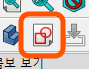

|
| 스케치를 생성해줍니다.
|

.. _hoverxref:generatePlane:

평면 생성
^^^^^^^^^^^^^^^^^^^^^^^^^^^^^^^^^^^^

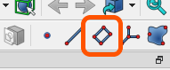

|
| 평면을 생성해줍니다.
|

.. _hoverxref:extrude:

돌출
^^^^^^^^^^^^^^^^^^^^^^^^^^^^^^^^^^^^

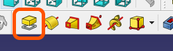

|
| 스케치의 모양대로 높이를 만들어 줍니다.
|

.. _hoverxref:revolution:

회전
^^^^^^^^^^^^^^^^^^^^^^^^^^^^^^^^^^^^

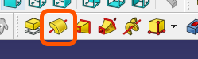

|
| 스케치의 모양을 특정 축을 기준으로 회전시켜 부피를 생성해 줍니다.
|

.. _hoverxref:extrudeCut:

돌출 컷
^^^^^^^^^^^^^^^^^^^^^^^^^^^^^^^^^^^^

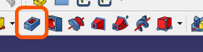

|
| 스케치의 모양대로 부피를 제거하는 방향으로 높이를 만들어 줍니다.
|

.. _hoverxref:groove:

그루브
^^^^^^^^^^^^^^^^^^^^^^^^^^^^^^^^^^^^

.. image:: ../images/Modeling_Index/Icon_Groove.png
   :width: 400
   :align: center

|
| 스케치의 모양을 특정 축을 기준으로 회전시켜 부피를 제거해 줍니다.
|

.. _hoverxref:linearPattern:

선형 패턴
^^^^^^^^^^^^^^^^^^^^^^^^^^^^^^^^^^^^

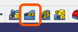

|
| 만들어진 도형을 직선 방향으로 복사 이동 해줍니다.
|

.. _hoverxref:fillet:

필렛
^^^^^^^^^^^^^^^^^^^^^^^^^^^^^^^^^^^^

.. image:: ../images/Modeling_Index/Icon_Fillet.png
   :width: 400
   :align: center

|
| 모서리를 둥그렇게 만들어 줍니다.
|

.. _hoverxref:chamfer:

모따기
^^^^^^^^^^^^^^^^^^^^^^^^^^^^^^^^^^^^

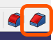

|
| 모서리를 깍아 각지게 만들어 줍니다.
|

.. _hoverxref:createCircle:

원 생성
^^^^^^^^^^^^^^^^^^^^^^^^^^^^^^^^^^^^

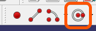

|
| 원을 그려줍니다.
|

.. _hoverxref:createLines:

자유곡선 생성
^^^^^^^^^^^^^^^^^^^^^^^^^^^^^^^^^^^^

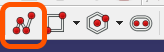

|
| 이어진 직선을 그려줍니다.
|

.. _hoverxref:createRectangle:

사각형 생성
^^^^^^^^^^^^^^^^^^^^^^^^^^^^^^^^^^^^

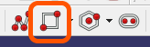

|
| 사각형을 그려줍니다.
|

.. _hoverxref:createPloygon:

다각형 생성
^^^^^^^^^^^^^^^^^^^^^^^^^^^^^^^^^^^^

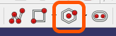

|
| 다각형을 그려줍니다.
|

.. _hoverxref:createSlot:

직선 홈 생성
^^^^^^^^^^^^^^^^^^^^^^^^^^^^^^^^^^^^

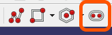

|
| 직선 홈(Slot)을 그려줍니다.
|

.. _hoverxref:trim:

잘라내기
^^^^^^^^^^^^^^^^^^^^^^^^^^^^^^^^^^^^

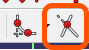

|
| 그려진 스케치의 일부를 잘라내줍니다.
|

.. _hoverxref:externalGeometry:

외부 Geometry
^^^^^^^^^^^^^^^^^^^^^^^^^^^^^^^^^^^^

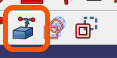

|
| 만들어진 도형의 외형을 스케치로 투영합니다.
|

.. _hoverxref:changeGeometryType:

Geometry 타입 변경
^^^^^^^^^^^^^^^^^^^^^^^^^^^^^^^^^^^^

.. image:: ../images/Modeling_Index/Icon_Change_GeometryType.png
   :width: 400
   :align: center

|
| 스케치에 그려진 객체의 타입을 변경합니다.
| 실선 <-> 보조선
|

.. _hoverxref:arrayPoints:

제약조건 : 점 일치
^^^^^^^^^^^^^^^^^^^^^^^^^^^^^^^^^^^^

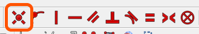

|
| 스케치의 점과 점을 일치시켜 줍니다.
|

.. _hoverxref:arrayPointLine:

제약조건 : 점을 선에 일치
^^^^^^^^^^^^^^^^^^^^^^^^^^^^^^^^^^^^

.. image:: ../images/Modeling_Index/Icon_Array_Point_Line.png
   :width: 400
   :align: center

|
| 스케치의 점을 선에 일치시켜 줍니다.
|

.. _hoverxref:vertical:

제약조건 : 수직
^^^^^^^^^^^^^^^^^^^^^^^^^^^^^^^^^^^^

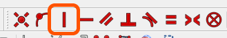

|
| 스케치의 선을 수직으로 만들어 줍니다.
|

.. _hoverxref:horizontal:

제약조건 : 수평
^^^^^^^^^^^^^^^^^^^^^^^^^^^^^^^^^^^^

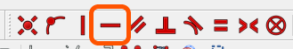

|
| 스케치의 선을 수평으로 만들어 줍니다.
|

.. _hoverxref:parallel:

제약조건 : 평행
^^^^^^^^^^^^^^^^^^^^^^^^^^^^^^^^^^^^

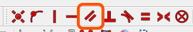

|
| 두개의 선을 평행으로 만들어 줍니다.
|

.. _hoverxref:rightAngle:

제약조건 : 수직(직각)
^^^^^^^^^^^^^^^^^^^^^^^^^^^^^^^^^^^^

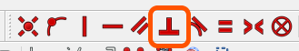

|
| 두개의 선을 직각으로 만들어 줍니다.
|

.. _hoverxref:tangent:

제약조건 : 접함(탄젠트)
^^^^^^^^^^^^^^^^^^^^^^^^^^^^^^^^^^^^

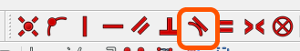

|
| 곡선과 직선이 접하도록 만들어 줍니다.
|

.. _hoverxref:equal:

제약조건 : 동일
^^^^^^^^^^^^^^^^^^^^^^^^^^^^^^^^^^^^

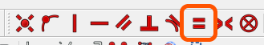

|
| 두 개의 객체를 동일한 치수로 변경해줍니다.
|

.. _hoverxref:symmetric:

제약조건 : 대칭
^^^^^^^^^^^^^^^^^^^^^^^^^^^^^^^^^^^^

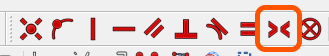

|
| 두 개의 객체를 한 축을 기준으로 대칭되게 합니다.
|

.. _hoverxref:h_Distance:

제약조건 : 수평 거리
^^^^^^^^^^^^^^^^^^^^^^^^^^^^^^^^^^^^

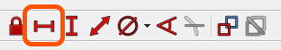

|
| 두 지점의 수평거리를 측정, 설정합니다.
|

.. _hoverxref:v_Distance:

제약조건 : 수직 거리
^^^^^^^^^^^^^^^^^^^^^^^^^^^^^^^^^^^^

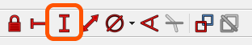

|
| 두 지점의 수직 거리를 측정, 설정합니다.
|

.. _hoverxref:diameter:

제약조건 : 지름
^^^^^^^^^^^^^^^^^^^^^^^^^^^^^^^^^^^^

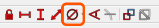

|
| 원의 지름을 설정해줍니다.
|

.. _hoverxref:angle:

제약조건 : 각도
^^^^^^^^^^^^^^^^^^^^^^^^^^^^^^^^^^^^

.. image:: ../images/Modeling_Index/Icon_Angle.png
   :width: 400
   :align: center

|
| 두 선의 사잇각을 설정해줍니다.
|