조립 과정
+++++++++++++++++++

.. raw:: html

    

.. role:: orangecircle
.. role:: blackcircle
.. role:: bluecircle
.. role:: skybluecircle
.. role:: yellowcircle
.. role:: subtitle
.. role:: blackbold
.. role:: redbold

| 3D 프린터의 부품들이 어떻게 배치되고, 어떤 식으로 되어 있는지 알기 위해 간단하게 3D 펜을 조립해 봅니다.
|

| :subtitle:`Step.1`

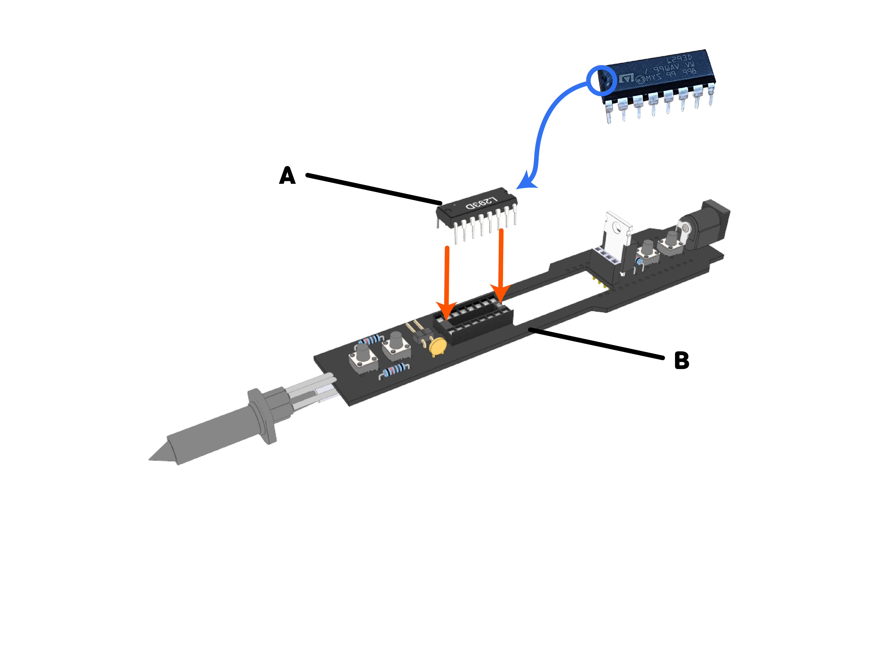

| :orangecircle:`●` L293D 모터드라이버(A)를 보드 기판(B)의 홈 부분에 삽입시켜 줍니다.
| :bluecircle:`●` L293D에는 반원 모양의 홈이 있는데, 이것이 그림과 같이 뒷편을 바라보도록 삽입해 줍니다.
| :blackcircle:`●` L293D는 모터를 조종할 수 있게 해주는 부품입니다.
|

| :subtitle:`Step.2`

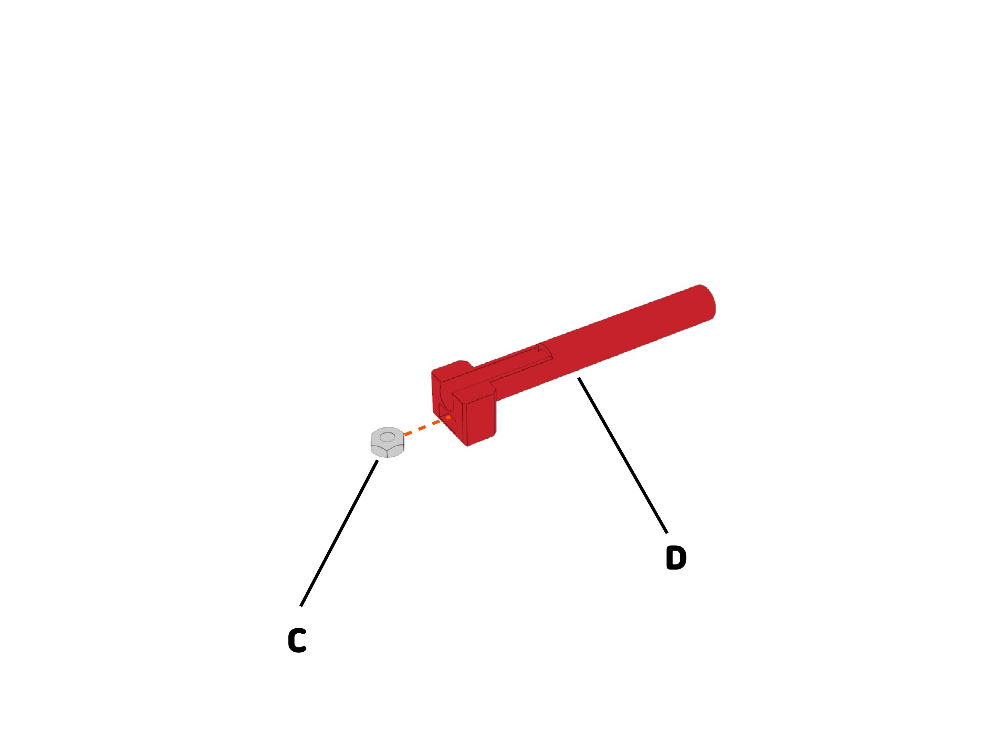

| :orangecircle:`●` M3너트(C)를 3번 케이스(D)의 너트 삽입홀에 넣어 줍니다.
|

| :subtitle:`Step.3`

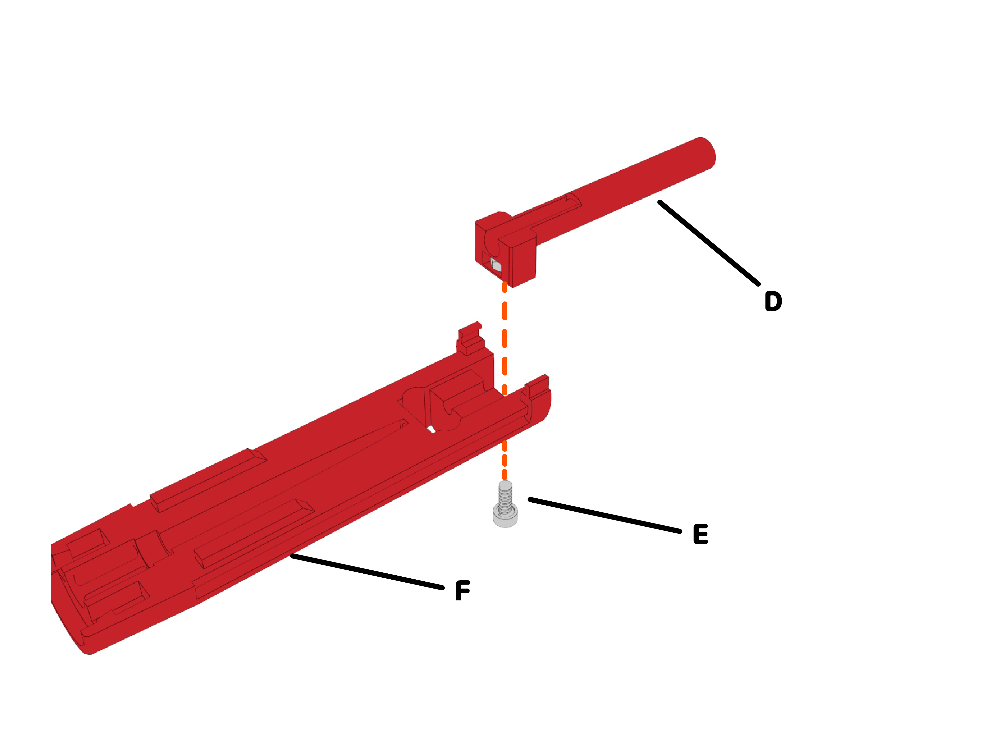

| :orangecircle:`●` M3-6볼트(E)를 사용하여 step2에서 조립한 부품과 하단 케이스(F)를 서로 체결해 줍니다.
|

| :subtitle:`Step.4`

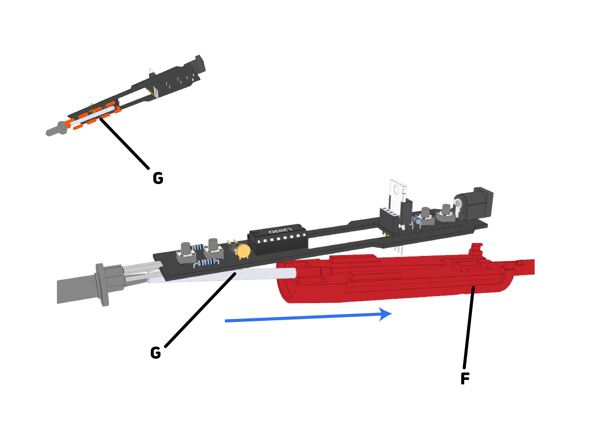

| :orangecircle:`●` 보드 기판 아래에는 테프론 튜브(G)가 연결되어 있습니다.
| :bluecircle:`●` 하단 케이스(F) 앞 부분에는 긴 홈이 있습니다. 이 긴 홈에 튜브를 끼워 넣어 줍니다.
|

| :subtitle:`Step.5`

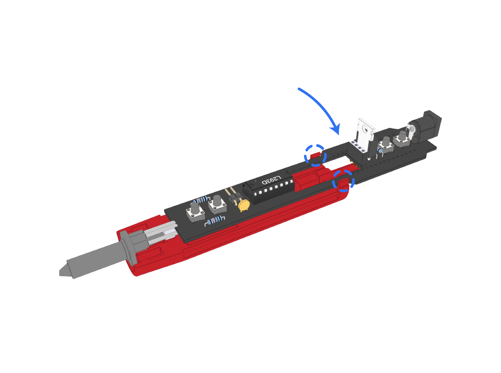

.. image:: ../images/Lv1/Chapter_3/Case_Board_Assemble.gif
   :width: 400
   :align: center   

| :bluecircle:`●` 하단 케이스 홈에 맞추어 보드를 조립해 줍니다.
|

| :subtitle:`Step.6`

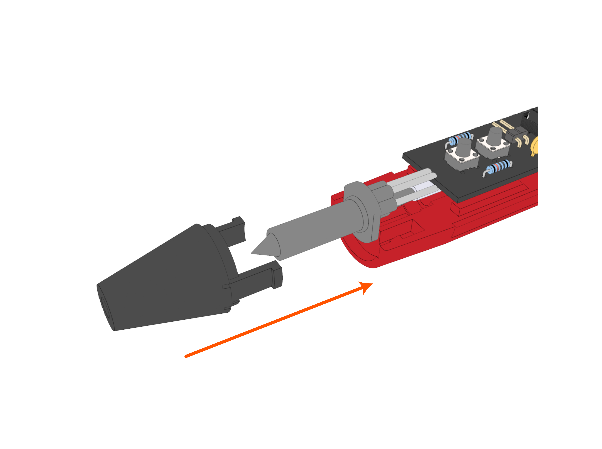

| :orangecircle:`●` 노즐 커버를 앞에서 삽입시켜줍니다.
|

| :subtitle:`Step.7`

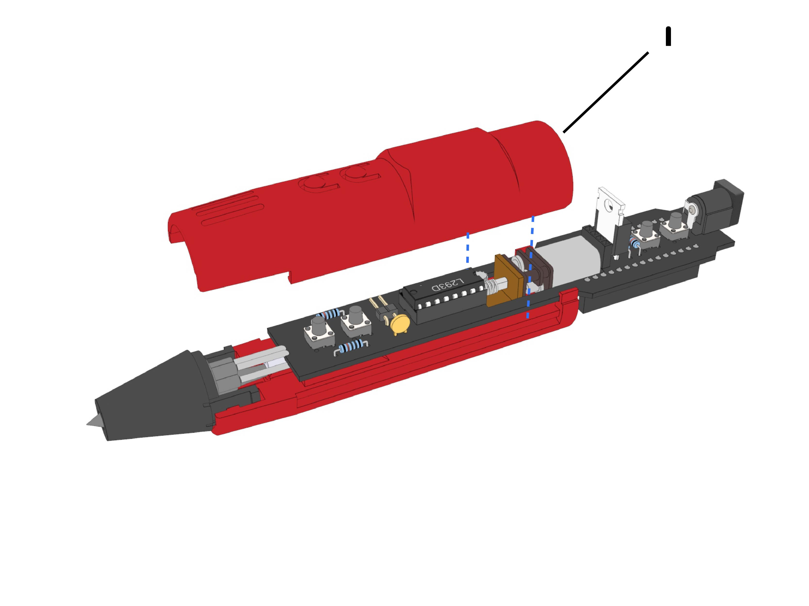

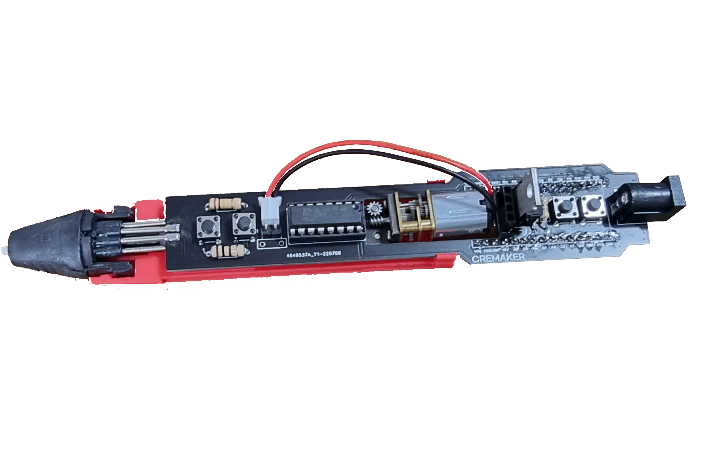

| :bluecircle:`●` 이어서 DC모터(H)를 보드기판 중앙에 삽입시켜 줍니다.
| :bluecircle:`●` 모터 방향에 주의합니다.
| :bluecircle:`●` 이후 모터를 사진과 같이 연결해 줍니다.
|

| :subtitle:`Step.8`

.. image:: ../images/Lv1/Chapter_3/Step8.jpg
   :width: 800
   :align: center

| :bluecircle:`●` 1번 케이스(I)를 홈에 맞추어 조립해 줍니다.
| :blackcircle:`●` 모터선이 끼여서 조립이 안될 수 있으니 모터선을 정리한 상태로 조립해줍니다.
| 

| :subtitle:`Step.9`

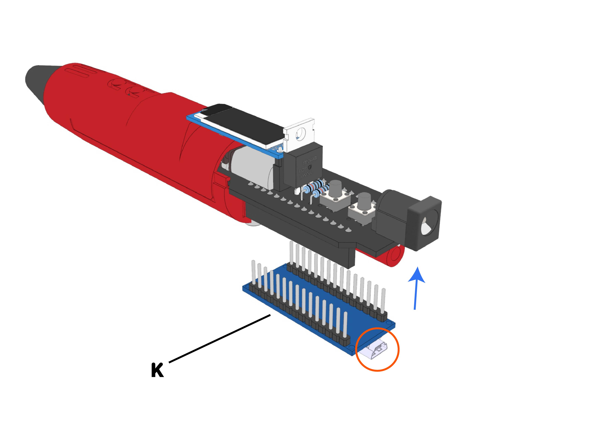

| :bluecircle:`●` 디스플레이(J)를 홈에 맞추어 조립해 줍니다. 
| 

| :subtitle:`Step.10`

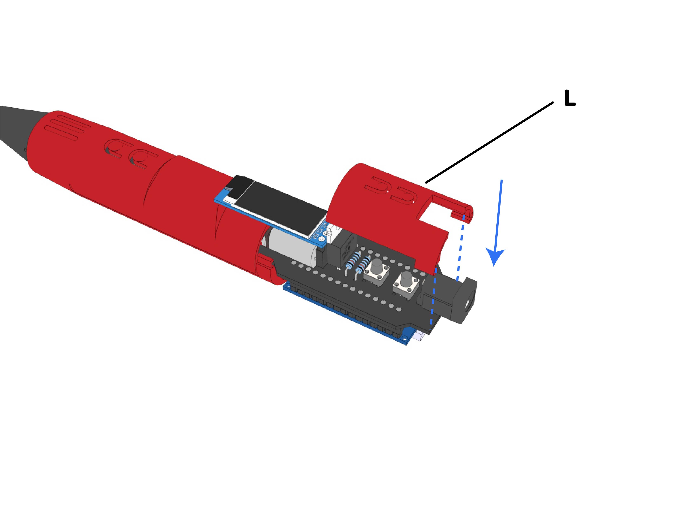

| :bluecircle:`●` 아두이노(J)를 아래에서 위로 삽입시켜줍니다.
| :orangecircle:`●` 커넥터 단자가 뒤로 오도록 삽입시켜줍니다.
|

| :subtitle:`Step.11`

| :bluecircle:`●` 4번 케이스(L)를 삽입시켜줍니다.
|

| :subtitle:`전체 모습`

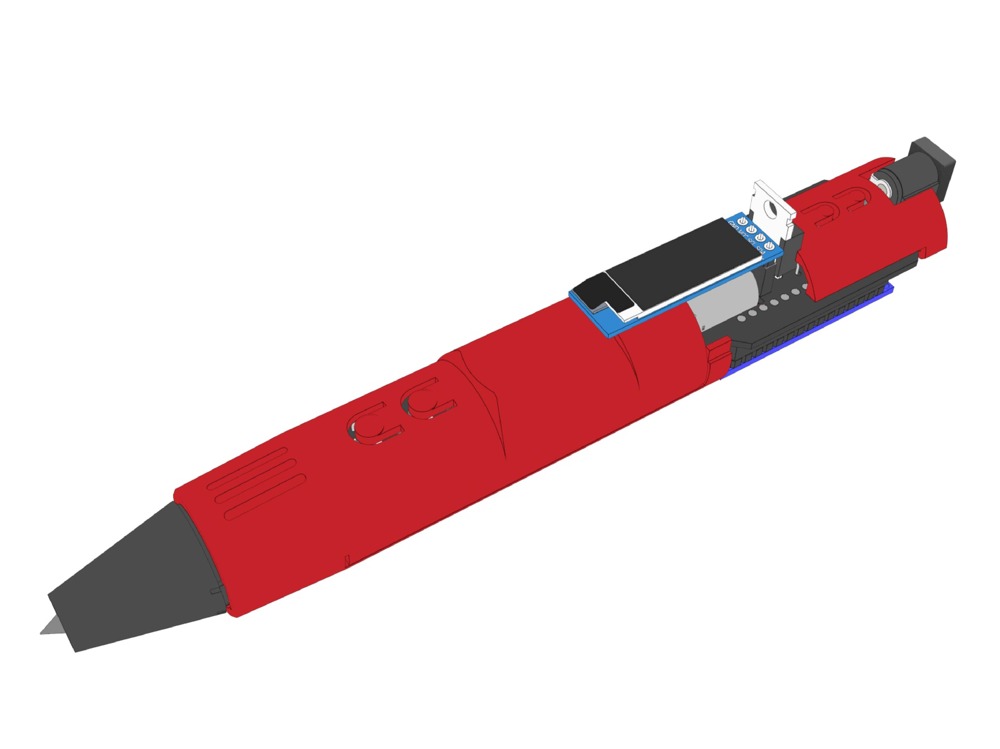

|
| 교육과정없이 바로 사용을 원하시면 :ref:`매뉴얼 <targetUseManual>` 을 참고해주세요.