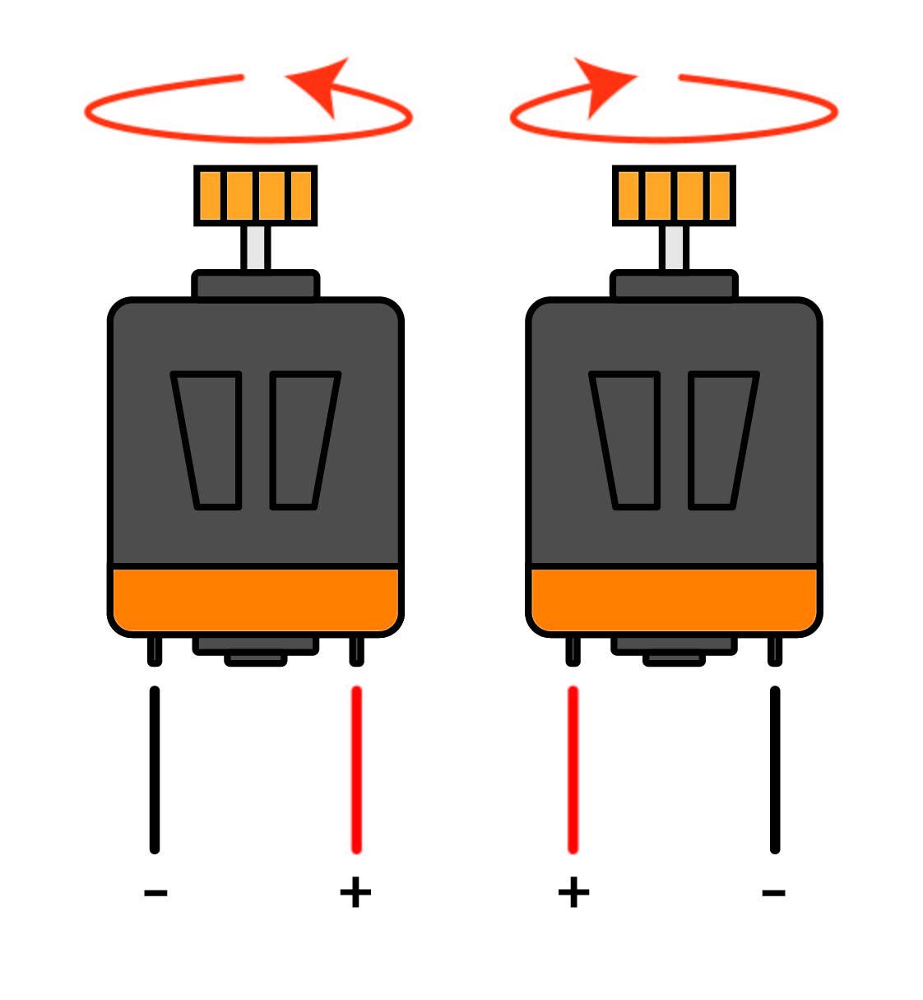

Step.1 모터 작동원리
^^^^^^^^^^^^^^^^^^^^^^^^^^^^^^^^^^^^

.. raw:: html

    

.. role:: orangecircle
.. role:: blackcircle
.. role:: bluecircle
.. role:: skybluecircle
.. role:: yellowcircle
.. role:: subtitle
.. role:: blackbold
.. role:: redbold

| 레벨1 에서는 모터의 작동원리를 간단하게 설명드립니다.
|

|
| DC 모터에는 2개의 단자가 있으며 이 단자에 +, - 의 전원을 연결하면 회전하기 시작합니다. 전원을 반대로 주면 반대방향으로 회전을 합니다.
| DC 모터의 방향, 속도를 바꾸기 위해 이전에 조립한 칩이 필요합니다.
| DC 모터를 방향, 속도를 자유자재로 작동시키기 위해서는 3가지가 필요합니다.
|
| 1. 모터 On, Off
| 2. 모터 방향
| 3. 모터 속도
|
| 이 3가지를 모두 설정해줘야 방향, 속도를 조절할 수 있습니다.
| 다음 스텝에서는 이 3가지를 설정하여, 모터를 직접 조절해보는 과정을 진행해보겠습니다.
|

