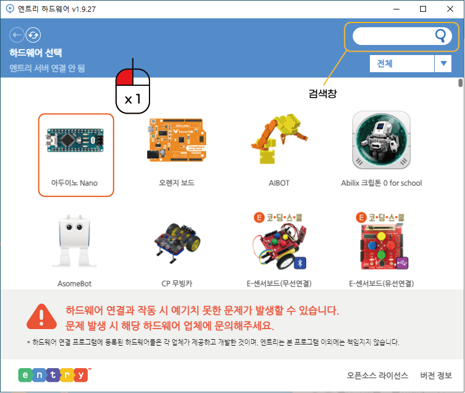
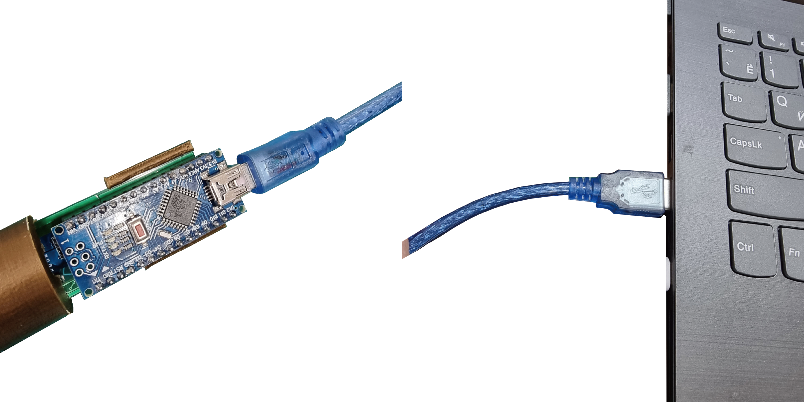
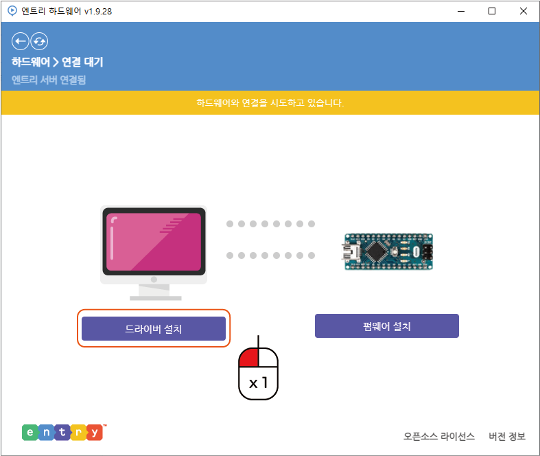
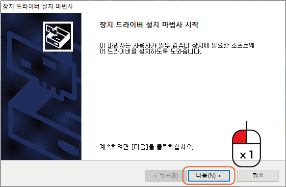
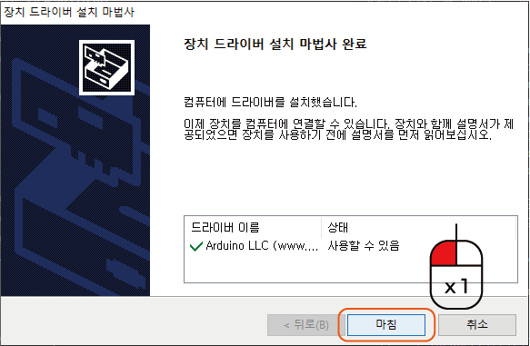
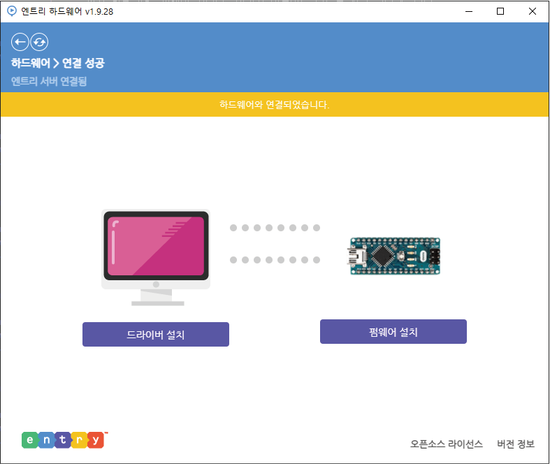
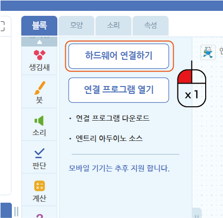
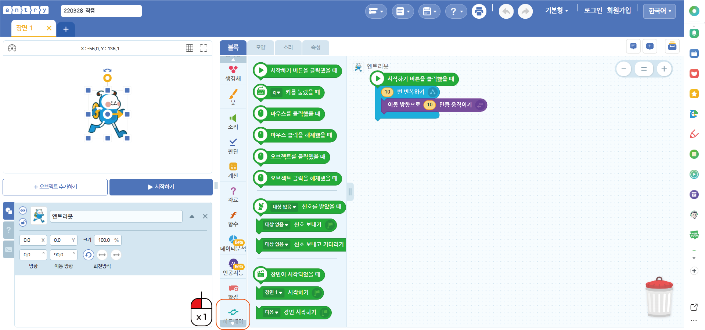
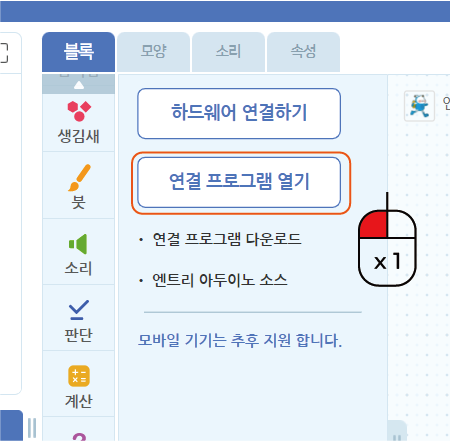
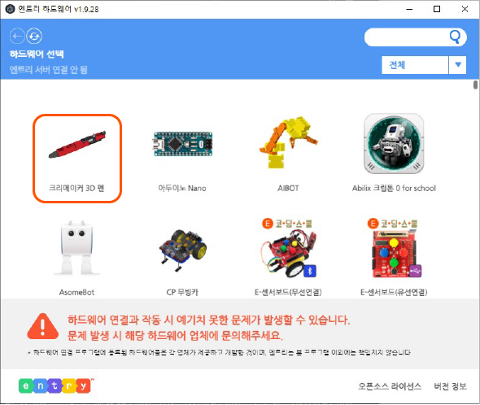

Step.2 설정
^^^^^^^^^^^^^^^^^^^^^^^^^^^^^^^^^^^^

.. raw:: html

    

.. role:: orangecircle
.. role:: blackcircle
.. role:: bluecircle
.. role:: skybluecircle
.. role:: yellowcircle
.. role:: subtitle
.. role:: blackbold
.. role:: redbold

| 설치가 완료되었으면, 3D 펜과 컴퓨터가 연결되도록 설정을 해주어야 합니다.
| 아래 과정을 진행해주시기 바랍니다.

|
| :orangecircle:`●` 설치 완료하면, 실행이 됩니다. 여기서 아두이노 나노를 찾고 클릭해줍니다.
| :yellowcircle:`●` 찾아도 보이지 않는다면, 오른쪽 상단에 검색창에 '아두이노'를 검색합니다.
|
|

|
| :blackcircle:`●` USB 케이블을 이용하여, 컴퓨터와 3D 펜의 보드를 연결시켜줍니다.
|
|

|
| :orangecircle:`●` 왼편의 '드라이버 설치' 버튼을 클릭해줍니다.
|
|

|
| :orangecircle:`●` 드라이버 설치 창이 나타나고, 여기에서 '다음' 버튼을 클릭해줍니다.
|
|

|
| :orangecircle:`●` 설치가 완료되면, '마침' 버튼을 클릭해줍니다.
|
|

|
|
|
| :redbold:`※베타 테스터 분들은 다음과 같은 과정을 진행해주세요`
| 아래 파일을 다운로드하여, 압축을 풀어줍니다.
|
| :download:`엔트리 펌웨어 파일 <../../codefile/cremaker_3Dpen_E.hex>`
| :download:`실사용 펌웨어 파일 <../../codefile/cremaker_3Dpen_R.hex>`
|
| 압축을 푼 파일을 EntryHw가 설치된 폴더에서 resources/firmwares 폴더에(ex :blackbold:`C:\\Entry_HW\\resources\\firmwares` ) 복사&덮어씌워 줍니다.
| 네이버 entry가 한 달마다 업데이트를 하기 때문에 이번 10월말에 있을 업데이트에 적용되는 부분입니다. 현재는 적용되지 않았기 때문이 이 과정을 필수로 진행해주세요.
| :redbold:`※그렇지 않으면 작동 오류가 발생합니다.`
|
|
|

.. image:: ../../images/Lv1/Chapter_4/Step2_6.png
   :width: 600
   :align: center

|
| :orangecircle:`●` 오른편의 '펌웨어 설치' 버튼을 클릭해줍니다.
|
|

|
| :blackcircle:`●` 설치가 완료되면, 위 사진과 같이 '연결 성공'이라는 표시가 나타납니다.
|
|

|
| :orangecircle:`●` 이제 다시 엔트리로 이동합니다.
| :orangecircle:`●` 이동하고, 이 화면에서 ‘하드웨어 연결하기’ 버튼을 눌러줍니다.
| :blackcircle:`●` 여기까지 진행하였으면, SW 코딩을 하기 위한 설정은 완료됩니다.
|
|

|
|
|
| :blackbold:`※ 다시 진행하려 할 경우에는 다음과 같은 순서대로 진행해주시면 됩니다.`

|
| :orangecircle:`●` 하드웨어 블록을 클릭합니다.
|
|

|
| :orangecircle:`●` '연결 프로그램 열기' 버튼을 클릭합니다.
|
|

|
| :orangecircle:`●` 크리메이커 3D 펜을 찾고 클릭해줍니다.
|

| :orangecircle:`●` 이후 연결 성공이 되면, 네이버 엔트리 사이트로 돌아옵니다.