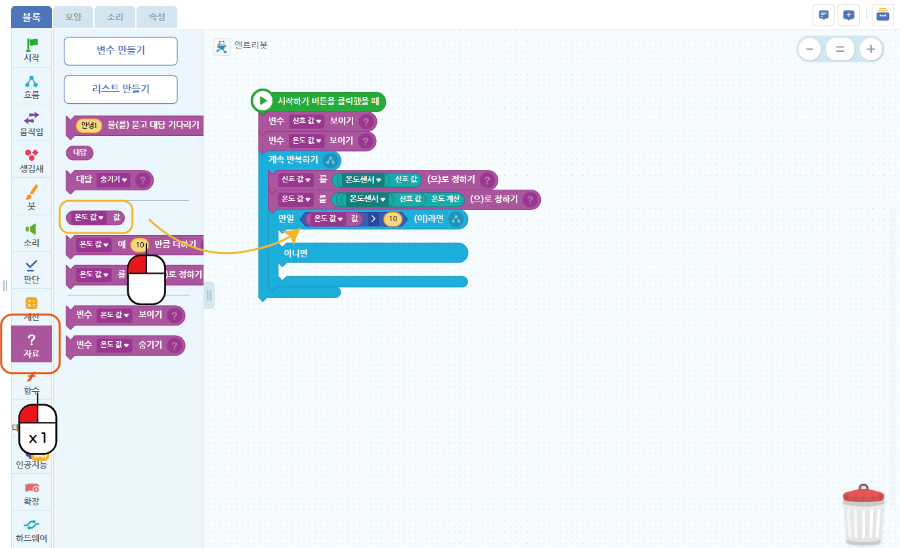
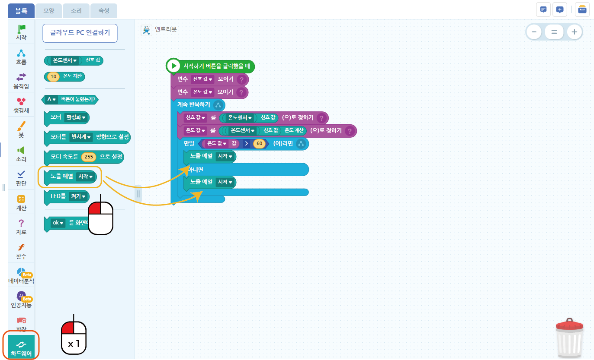

Step.3 예열하기
^^^^^^^^^^^^^^^^^^^^^^^^^^^^^^^^^^^^

.. raw:: html

    

.. role:: orangecircle
.. role:: blackcircle
.. role:: bluecircle
.. role:: skybluecircle
.. role:: yellowcircle
.. role:: subtitle
.. role:: blackbold
.. role:: redbold

| Step2에 이어서 예열을 시작하고 온도가 60도가 되면 멈추는 블록을 만들어 보겠습니다.
|

| 열선을 가열을 하는 방법은 간단합니다. 예열을 시작하고 멈추는 블록을 사용하면 됩니다.
|

|
| :orangecircle:`●` 흐름 블록으로 이동합니다.
| :yellowcircle:`●` :blackbold:`만일 참 (이)라면 ~ 아니면 ~` 블록을 계속 반복하기안에 이동시켜줍니다. 
|
|

|
| :orangecircle:`●` 판단 블록으로 이동합니다.
| :yellowcircle:`●` :blackbold:`10 > 10` 블록을 :blackbold:`만일 참 (이)라면 ~ 아니면 ~` 블록의 '참' 부분에 이동시켜줍니다.
|
|

|
| :orangecircle:`●` 자료 블록으로 이동합니다.
| :yellowcircle:`●` :blackbold:`온도 값 값` 블록을 :blackbold:`10>10` 블록으로 이동시켜줍니다.
|
|

|
| :orangecircle:`●` :blackbold:`온도 값 값 > 10` 블록의 오른편 값 10을 60으로 변경해줍니다.
|
|

|
| :orangecircle:`●` 하드웨어 블록으로 이동합니다.
| :yellowcircle:`●` :blackbold:`노즐 예열 시작` 블록 2개를 :blackbold:`만일 참 (이)라면 ~ 아니면 ~` 블록의 각각의 칸으로 이동시켜줍니다.
|
|

|
| :orangecircle:`●` 위쪽에 있는 :blackbold:`노즐 예열 시작` 블록을 종료로 변경합니다.
| :blackcircle:`●` :blackbold:`만일 참 (이)라면 ~ 아니면 ~` 블록에서 현재 온도가 60도 이하면, 60도로 올리기 위해 예열을 시작하고, 그렇지 않으면 종료를 하게 합니다.
| :blackcircle:`●` 이 과정을 계속하기로 반복하게 되면, 온도를 60도를 유지하게 됩니다.
|
|

| 여기까지가 실제 온도측정하고 온도에 따라 다른 작동을 하도록 블록을 만들었습니다.
| 예열을 하려면 전원을 연결해야 합니다. 
| ※엔트리 사용시 USB도 연결되어야 합니다.
|

.. image:: ../../images/Lv3/Chapter_6/Step3_1.png
   :width: 800
   :align: center

| 
| 전원을 연결하고, 시작하기 버튼을 누르면 실제로 온도가 올라가기 시작합니다. 고온으로 올라가면, 뜨겁기 때문에 주의하시기 바랍니다.

|
| 이제 모터 작동을 했던 것과, 온도를 올리는 것과 함께 사용해 볼 것입니다.
| 현재 작성된 코드를 지우지 않고, 다음 과정을 넘어갑니다.