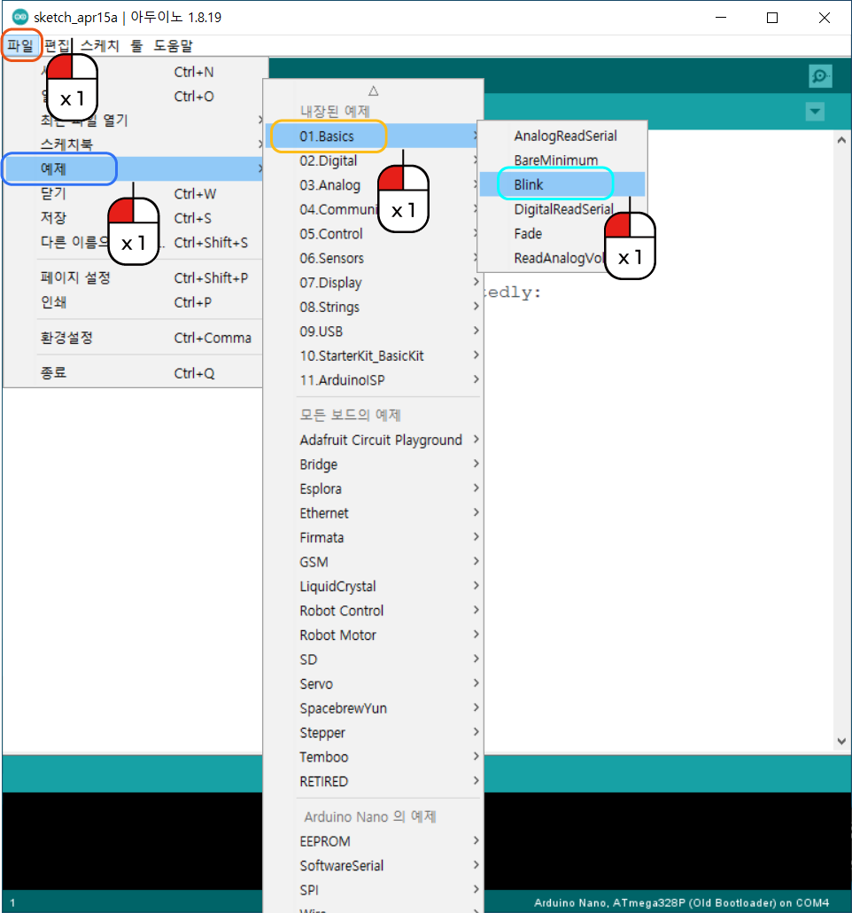
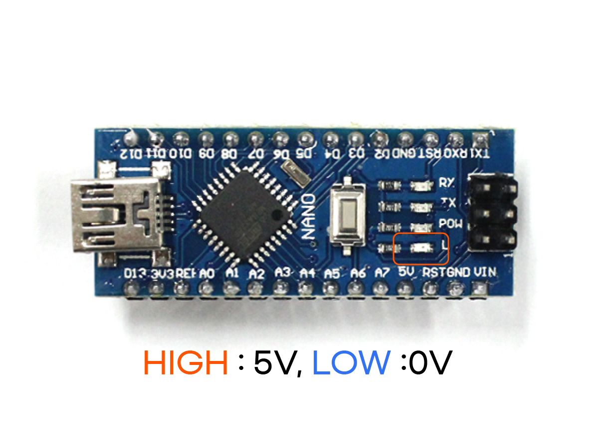
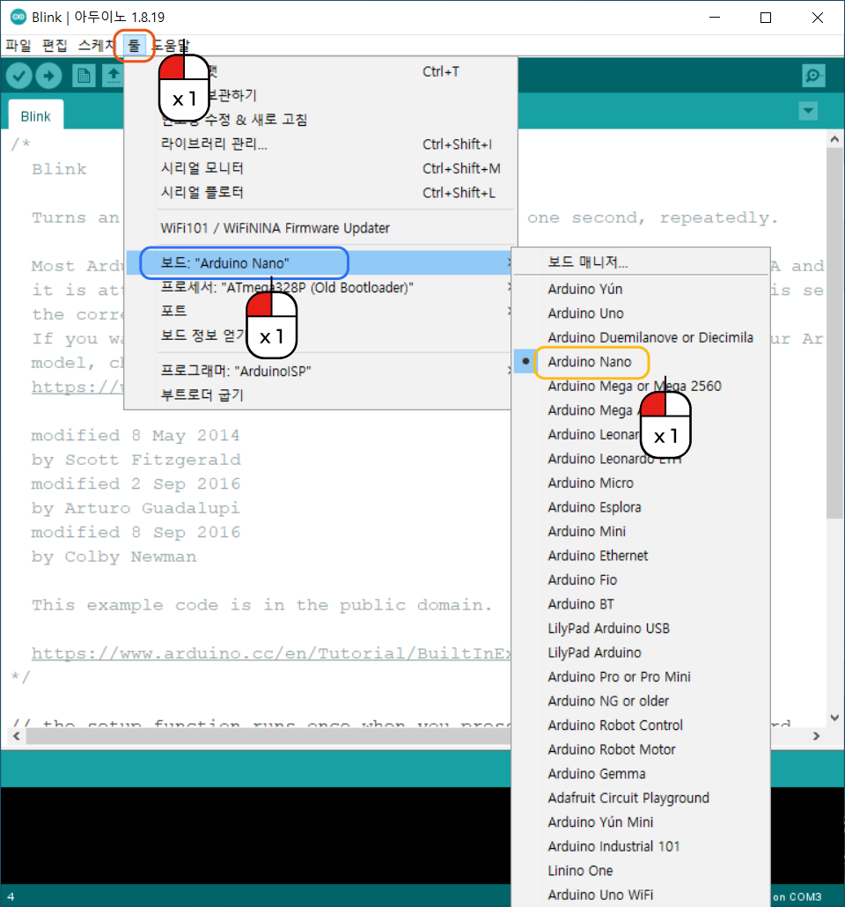
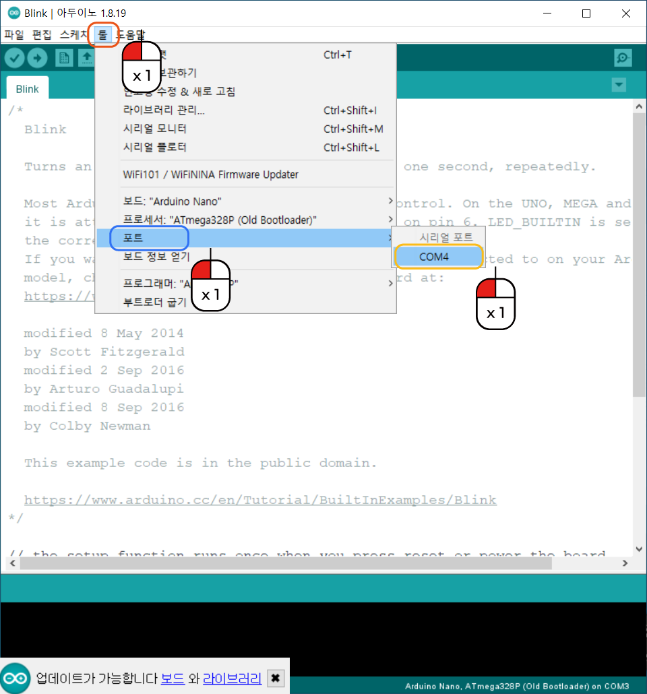

LED 전구 On, Off
+++++++++++++++++++

.. raw:: html

    

.. role:: orangecircle
.. role:: blackcircle
.. role:: bluecircle
.. role:: skybluecircle
.. role:: yellowcircle
.. role:: subtitle
.. role:: blackbold
.. role:: redbold

| 아두이노에 기본적으로 부착되어 있는 LED 전구를 껏다 켜보는 예제를 해보도록 하겠습니다.
|
| ※처음에는 코드 자체를 :blackbold:`완전히` 이해하려고 하지 않으셔도 됩니다.
| 깊이 원리를 파악하는 것은 난이도가 있습니다. 
| 이 스텝에서는 간단하게 맛본다는 느낌으로 진행합니다.
| 여러분들이 키보드 타자를 치는 방법만 알면 컴퓨터를 어느 정도 사용할 수 있듯이, 아두이노 코드에 대해 다 알려고 하지 않으셔도 된다는 점을 기억해주세요.
|
|

.. image:: ../images/Lv2/Chapter_5/Step1_1.jpg
   :width: 500
   :align: center

|
| :blackcircle:`●` 이전 단계를 마쳣다면, 위와 같은 화면이 나타날 것입니다.
| :blackcircle:`●` 현재 미리 작성된 코드가 어떤건지 알기전에, 예제를 하나 불러오도록 하겠습니다.
|
|

|
| :orangecircle:`●` 메뉴중 파일을 클릭합니다.
| :bluecircle:`●` 예제를 클릭합니다.
| :yellowcircle:`●` 0.1Basic을 클릭합니다.
| :skybluecircle:`●` Blink 예제를 클릭합니다.
|
|

.. image:: ../images/Lv2/Chapter_5/Step1_3.png
   :width: 800
   :align: center

|
| :blackcircle:`●` 미리 작성된 Blink 예제가 나타납니다.
| :orangecircle:`●` 여기에서 회색표시로 되어 있고 :blackbold:`/*` 와 :blackbold:`*/` 사이에 있는 코드들은 주석입니다.
|

| ※ 주석은 직접적인 기능이나 역할을 하지 않습니다. 해당 코드에 대한 설명을 적어두거나 코드 변경시 주의사항 같은 부분을 설명해주는 역할을 합니다.
| 보통 주석은 // 뒤에 나오는 코드들이나 :blackbold:`/*` 와 :blackbold:`*/` 사이에 나오는 코드들이 해당됩니다. 
| 현재 아두이노에서는 주석을 보기 쉽도록 :blackbold:`회색표시` 가 됩니다.
|
|

.. code-block:: c++

   // the setup function runs once when you press reset or power the board
   void setup() {
      // initialize digital pin LED_BUILTIN as an output.
      pinMode(LED_BUILTIN, OUTPUT);
   }

|
| :blackcircle:`●` 첫 주석을 건너띄고, 아래에는 코드와 함께 주석이 있습니다.
|
| 주석을 먼저 살펴봅니다.
| :blackbold:`the setup function runs once when you press reset or power the board`
| : 보드에 전원이 켜지면, 이 부분은 한번만 실행됩니다.
| :blackbold:`initialize digital pin LED_BUILTIN as an output`
| : LED_BUILTIN 디지털 핀을 출력으로 설정합니다.
|
| :blackcircle:`●` 어떤 동작, 설정이 코드에 있는지 주석을 통해 알 수 있습니다.
| :blackcircle:`●` setup() { } 코드에서 { 와 } 사이에 있는 코드는 :blackbold:`한번만 실행` 되는 것 을 알 수 있습니다.
| :blackcircle:`●` void 라고 적힌 부분은 추후 내용에서 설명하겠습니다.
| :blackcircle:`●` 실제 코드만 보면 아래와 같습니다.
|

.. _targetL2C5S1_5:

.. code-block:: c++

   void setup() {      
      pinMode(LED_BUILTIN, OUTPUT);
   }

|
| 아직 뭐가 뭔지 모르지만 실제 코드는 간단해 보입니다.
| pinMode라는 것은 디지털핀의 상태를 출력 혹은 입력으로 사용한다고 설정해주는 것입니다.
| OUTPUT은 출력, INPUT은 입력을 의미합니다.
| 즉, 위 코드는 :blackbold:`LED_BUILTIN 핀` 을 :blackbold:`출력` 으로 사용하겠다고 메인 보드에게 알려주는 것입니다.
| 문장의 마지막에 ; 는 코드가 끝났음을 알려주는 기호입니다.
|
| 예를 들어 디지털 3번핀을 출력으로 사용하려면, 
| :blackbold:`pinMode(3, OUTPUT);` 을 입력해야합니다.
|
| ※ 출력핀으로 사용하겠다는 뜻이지 출력신호를 보내겠다는 것은 아닙니다.
|
|

.. _targetL2C5S1_6 to paragraph:

.. code-block:: c++

   // the loop function runs over and over again forever
   void loop() {
      digitalWrite(LED_BUILTIN, HIGH);   // turn the LED on (HIGH is the voltage level)
      delay(1000);                       // wait for a second
      digitalWrite(LED_BUILTIN, LOW);    // turn the LED off by making the voltage LOW
      delay(1000);                       // wait for a second
   }

| 
| :blackcircle:`●` 다음 부분에도 주석이 있습니다.
|
| :blackbold:`the loop function runs over and over again forever`
| : 이 루프(loop)는 무한히 반복됩니다.
|
| :blackcircle:`●` loop() {}에서는 { 와 } 사이에 있는 코드는 :blackbold:`무한히 반복` 됩니다.
| :blackcircle:`●` 실제 코드만 보면 아래와 같습니다.
|

.. code-block:: c++

   void loop() {
      digitalWrite(LED_BUILTIN, HIGH);   
      delay(1000);                       
      digitalWrite(LED_BUILTIN, LOW);    
      delay(1000);                       
   }

.. image:: ../images/Lv2/Chapter_5/Step1_7.jpg
   :width: 800
   :align: center

| 
| 이 부분이 실제 작동 코드입니다. digitalWrite는 digitalWrite(사용할 디지털핀, 출력 상태)입니다.
| 따라서 첫 코드를 해석해보자면, :blackbold:`LED_BUILTIN 핀을 HIGH로 변경한다` 입니다.
| digitalWrite(LED_BUILTIN, LOW); 는 :blackbold:`LED_BUILTIN 핀을 LOW로 변경한다` 입니다.
|
| HIGH 상태가 되면, 출력을 내보내는 것이고, LOW는 출력하지 않는 상태라고 보시면 됩니다.
|

|
| 그렇다면 LED_BUILTIN 핀 출력을 HIGH로 바꾸면, 무슨 변화가 있나? 라는 궁금증도 생기실 겁니다.
| LED_BUILTIN 핀은 아두이노 나노에 부착된 LED 에 연결되어 있고, 아두이노 나노에서 HIGH 는 5V가 LOW는 0V가 공급됩니다. 즉 :blackbold:`HIGH가 되면, LED가 켜지게` 됩니다.
| 
| 결국 digitalWrite(LED_BUILTIN, HIGH); 와 digitalWrite(LED_BUILTIN, LOW);는
| LED를 켜고 끄는 것을 의미합니다.
|

.. code-block:: c++

   void loop() {
      digitalWrite(LED_BUILTIN, HIGH);   
      delay(1000);                       
      digitalWrite(LED_BUILTIN, LOW);    
      delay(1000);                       
   }

.. _targetL2C5S1_9:

|
| 그러면 delay(1000); 는 무슨 의미인가 하면, delay의 뜻대로 1000ms(=1초) 동안 시간을 기다리라는 의미입니다.
|
| 최종적으로는 :blackbold:`LED가 켜짐 -> 1초 기다리기 -> LED가 꺼짐 -> 1초 기다리기` 를 진행됩니다.
| :ref:`이전 주석 <targetL2C5S1_6 to paragraph>` 에서 Loop는 무한히 반복된다 하였으므로, 이 코드가 업로드된 상태로 전원을 켜면, :blackbold:`LED가 켜짐 -> 1초 기다리기 -> LED가 꺼짐 -> 1초 기다리기` 가 무한히 반복되게 됩니다.
|
|
| 어느정도 이해가 되셨나요?
| 아두이노를 배울 때 대부분이 접하는 첫 코드입니다.
| 이제 실제로 업로드를 해봅니다.
|
|

|
| :blackcircle:`●` 업로드전 보드의 종류를 선택을 해야 합니다.
| :orangecircle:`●` 메뉴중 툴을 클릭합니다.
| :bluecircle:`●` 보드 항목을 클릭합니다.
| :yellowcircle:`●` Arduino Nano 를 선택해줍니다.
|
|

|
| :blackcircle:`●` 이제는 USB 포트를 선택해야 합니다. 포트 번호는 USB 소켓 위치에 따라 다릅니다.
| :orangecircle:`●` 메뉴중 툴을 클릭합니다.
| :bluecircle:`●` 포트 항목을 클릭합니다.
| :yellowcircle:`●` 현재 활성화된 포트를 클릭합니다.
| ※다른 USB 연결된 것이 있으면 포트가 여러개 일 수 있습니다.
|
|

.. image:: ../images/Lv2/Chapter_5/Step1_12.png
   :width: 600
   :align: center

|
| :orangecircle:`●` 마지막으로 왼편 상단의 :blackbold:`화살표 모양의 업로드 버튼` 을 눌러줍니다.
| :blackcircle:`●` 업로드 후 아래와 같이 작동하는지 확인합니다.
|
|

.. image:: ../images/Lv1/Chapter_4/Step3_11.gif
   :width: 500
   :align: center

|
| 정상적으로 작동한다면, 코드를 일부 수정하여, 2초마다 켜지고, 꺼지도록 해봅니다.
| 

