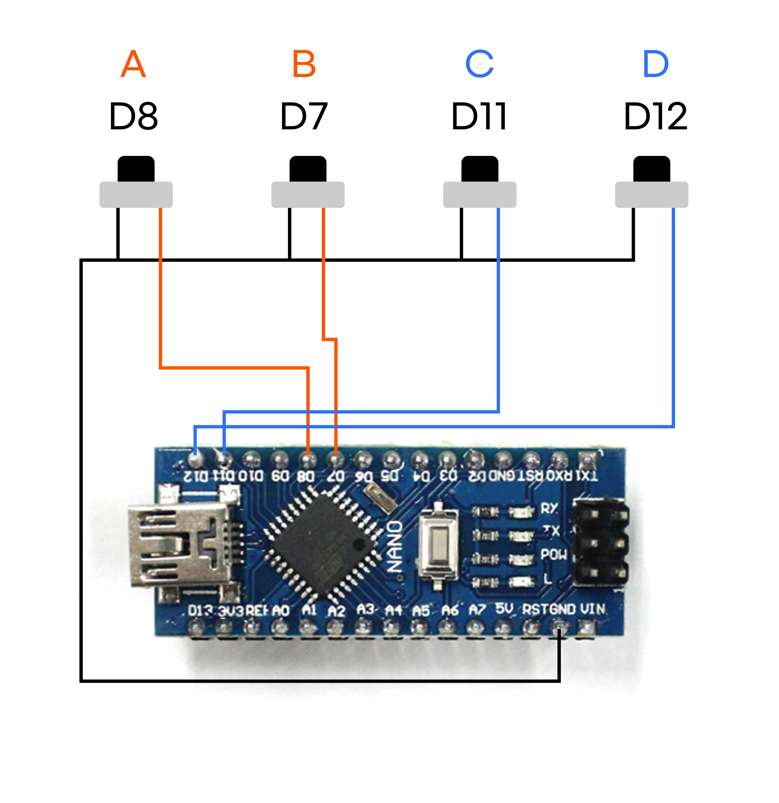
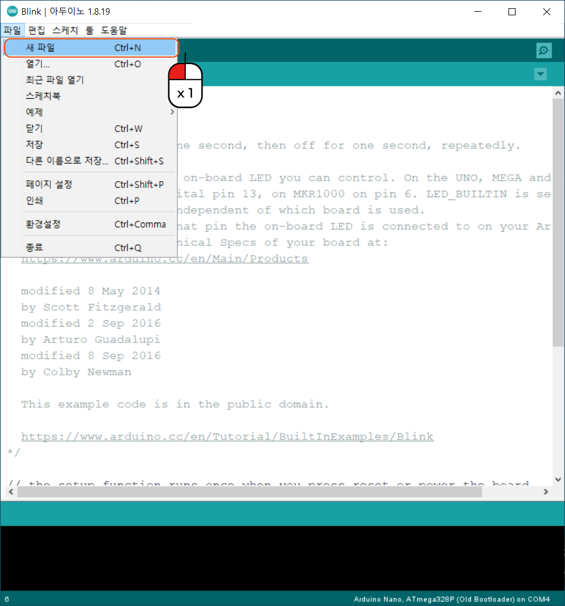
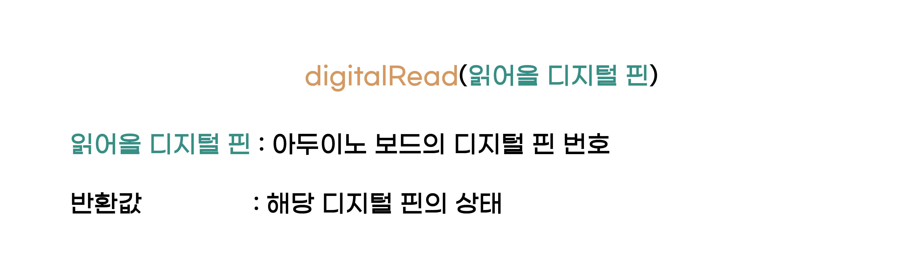
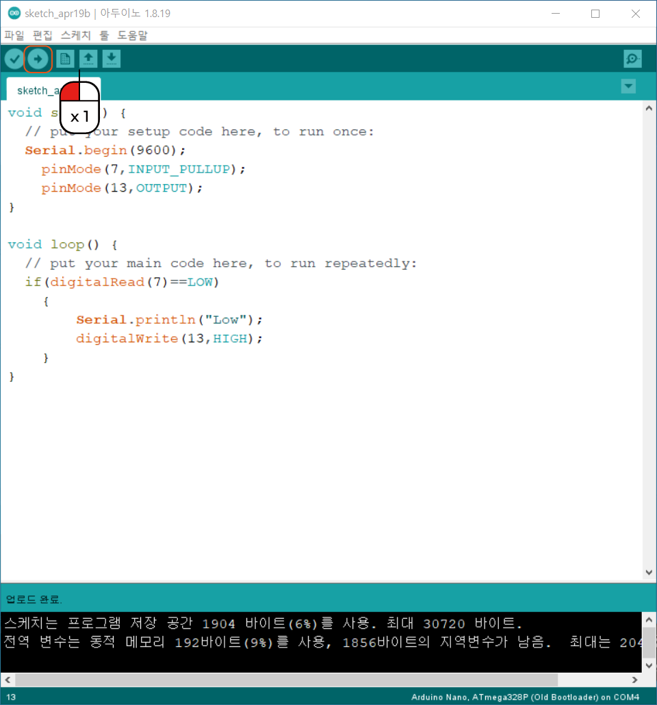

.. _tartgetL2C7S1_1:

스위치 버튼 사용
+++++++++++++++++++

.. raw:: html

    

.. role:: orangecircle
.. role:: blackcircle
.. role:: bluecircle
.. role:: skybluecircle
.. role:: yellowcircle
.. role:: subtitle
.. role:: subtitlesmall
.. role:: blackbold
.. role:: redbold

| 이제 아두이노에 대한 기초적인 것들을 배워보셨으면, 본격적으로 3D 펜에 활용되는 기능들을 구현해봅니다.
| 먼저 살펴볼 것은 버튼 입니다. 이번 챕터에서는 :blackbold:`버튼을 이용해서 LED를 껏다가 킬수있도록` 구현하는 것이 목표입니다.
|

| [실제 사진추가]

|
| 3D 펜에 버튼은 총 4개가 있습니다. 앞쪽 2개(A,B) 뒤쪽 2개(C,D) 입니다.
| 이 버튼은 각각 아두이노에 연결되어 있습니다. 
|

|
| 위와 같이 A,B,C,D 버튼은 각각 아두이노 디지털 핀의 D8,D7,D11,D12에 연결되어 있습니다. 그렇다면, 이제 버튼이 눌릴 때 마다 신호를 받게 하는 코드를 작성해볼 겁니다.
|

|
| :orangecircle:`●` 먼저 아두이노를 실행하고, 메뉴에서 파일 - 새 파일을 선택합니다.
|

.. code-block:: c++

   void setup() {
     // put your setup code here, to run once:

   }

   void loop() {
     // put your main code here, to run repeatedly:

   }

| 약간의 코드가 작성된 채로 나옵니다. 먼저 setup 함수에 '디지털 핀 8을 INPUT으로 사용한다'와'디지털 13번핀(LED)을 OUTPUT으로 사용한다'라는 코드를 작성합니다.
| 버튼이 눌렸을 때의 신호를 인지해야하기 때문에 INPUT으로 설정합니다.
|
| ※ 1개의 버튼을 먼저 예시로 들겠습니다.
|

.. code-block:: c++

   void setup() {
    // put your setup code here, to run once:
    pinMode(8,INPUT_PULLUP);
    pinMode(13,OUTPUT);
   }

| 이처럼 pinMode를 사용하여 작성되면, 각 핀의 상태 설정이 완료됩니다.
| INPUT 대신 INPUT_PULLUP 작성된 이유가 궁금할 겁니다. 단순히 INPUT을 하게 되면, 간혹 좋지 못한 신호를 얻을 수 있습니다. 이걸 노이즈라고 합니다. 이 부분은 레벨2에서는 INPUT_PULLUP이 여기에선 더 좋다고만 알고 계시면 됩니다.
| pinMode 함수에 대한 기억이 잘 나지 않는 다면, :ref:`여기 <targetL2C5S1_5>` 로 이동합니다.
|
| :blackbold:`※ 작성 시 대소문자 구별에 주의하세요. 모든 코드는 대소문자 구별을 합니다.`
|
| 다음으로는 무한히 반복되는 loop 함수에서 버튼이 눌렸을 때, LED 를 켜고 끄는 코드를 작성해보겠습니다.
|

.. code-block:: c++

   void loop() {
    // put your main code here, to run repeatedly:
    if(digitalRead(8)==LOW)
    {
        digitalWrite(13,HIGH);
    }
   }

|
| digitalRead 함수는 디지털핀의 상태를 읽어오는 기능을 합니다. 3D 펜에서 스위치 버튼은 누르게 되면 각 핀에 0V(LOW)로 인식됩니다.
| 즉 :blackbold:`if(digitalRead(8) == LOW)` 를 해석하면 :blackbold:`디지털 8번핀이 눌리면` 과 동일합니다. 즉 디지털 8번 버튼을 누르면 LED를 켜라 라는 코드입니다.
|

.. _targetL2C7S1_4:

|
| :orangecircle:`●` 작성된 코드를 업로드 해봅니다. 업로드 버튼을 눌러줍니다.
|

|
| [버튼 사진 추가]
|
| 버튼을 누르면, 아두이노의 LED가 켜집니다. 다만 한번 켜지고 꺼지진 않습니다.
| 이제 :blackbold:`다른 버튼을 코드에 추가하여, LED가 꺼지도록` 해봅니다.
|
| 스스로 작성을 해보고, 업로드도 해봅니다. 작동이 정상적으로 되는지 확인하고, 아래 코드와 비교 해봅니다.

.. toggle::

    .. code-block:: c++

        void setup() {
            // put your setup code here, to run once:
            pinMode(8,INPUT_PULLUP);
            pinMode(7,INPUT_PULLUP);
            pinMode(13,OUTPUT);
        }

        void loop() {
            // put your main code here, to run repeatedly:
            if(digitalRead(8)==LOW)
            {
                digitalWrite(13,HIGH);
            }
            else if(digitalRead(7)==LOW)
            {
                digitalWrite(13,LOW);
            }
        }