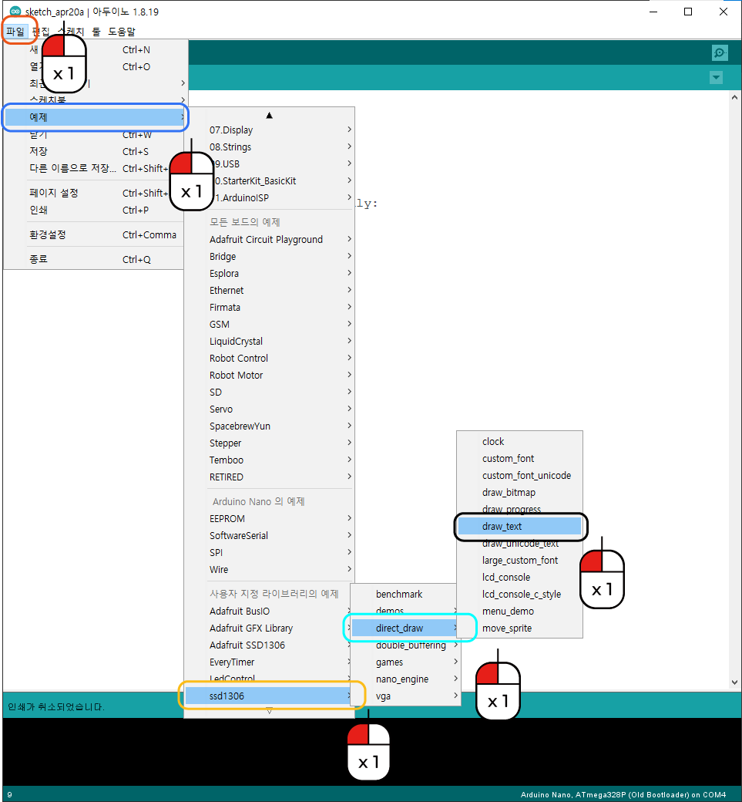

디스플레이 문자 표시
^^^^^^^^^^^^^^^^^^^^^^^^^^^^^^^^^^^^

.. raw:: html

    

.. role:: orangecircle
.. role:: blackcircle
.. role:: bluecircle
.. role:: skybluecircle
.. role:: yellowcircle
.. role:: subtitle
.. role:: subtitlesmall
.. role:: blackbold
.. role:: redbold

| 디스플레이에 대한 라이브러리를 설치하였습니다. 
| 3D펜에 온도를 표시하거나, 현재의 속도를 표시를 해야하므로 디스플레이를 다루는 것이 필요합니다.
| :blackbold:`라이브러리를 이용하여 디스플레이에 원하는 문자를 출력` 해보도록 구현하는 것이 목표입니다.

| 이 디스플레이 라이브러리를 사용하기전에 예제를 먼저 살펴보겠습니다.
|

|
| :orangecircle:`●` 메뉴 중 파일을 클릭합니다.
| :bluecircle:`●` 예제를 클릭합니다.
| :yellowcircle:`●` SSD1306을 클릭합니다.
| :skybluecircle:`●` direct_draw를 클릭합니다.
| :blackcircle:`●` draw_text를 클릭합니다.
| 

.. code-block:: c++
    :linenos:

    #include "ssd1306.h" // 라이브러리 포함

    void setup()
    {
        /* Replace the line below with ssd1306_128x32_i2c_init() if you need to use 128x32 display */
        ssd1306_128x64_i2c_init();
        ssd1306_fillScreen(0x00);
        ssd1306_setFixedFont(ssd1306xled_font6x8);
        ssd1306_printFixed (0,  8, "Line 1. Normal text", STYLE_NORMAL);
        ssd1306_printFixed (0, 16, "Line 2. Bold text", STYLE_BOLD);
        ssd1306_printFixed (0, 24, "Line 3. Italic text", STYLE_ITALIC);
        ssd1306_printFixedN (0, 32, "Line 4. Double size", STYLE_BOLD, FONT_SIZE_2X);
    }

    void loop()
    {
    }

| 위의 코드 예제가 나타날 겁니다. 딱 보기만 해도 영어가 많지만 겁먹지 마시고 하나하나 살펴봅니다.
| 일단 특징으로는 1줄에 ssd1306 라이브러리를 포함하는 코드를 작성됩니다.
| 라이브러리를 사용을 하려면, 설치가 되어 있더라도 #include 와 함께 라이브러리를 작성해주어야 합니다.
| 
| 중간에 주석을 보면, :blackbold:`128x32 디스플레이를 사용해야 하는 경우 아래 줄을 ssd1306_128x32_i2c_init()로 바꿉니다.` 라고 되어 있습니다.
| 현재 3D 펜에 부착된 디스플레이는 128x32임으로 코드를 변경해주어야 합니다.
|
| 4줄 부터는 ssd1306에 관련된 함수입니다. 각줄 함수의 설명을 하면 다음과 같습니다.
| 4줄 : 디스플레이를 i2c 통신으로 초기화
| 5줄 : 0x00 색으로 디스플레이를 채움
| 6줄 : 폰트 크기를 설정
| 7줄 : 0, 8 좌표에 "Line 1. Normal text" 문자열을 노말스타일(STYLE_NORMAL)로 출력
| 8줄 : 0, 16 좌표에 "Line 2. Bold text" 문자열을 볼드 스타일(STYLE_BOLD)로 출력
| 9줄 : 0, 24 좌표에 "Line 3. Italic text" 문자열을 이탤릭 스타일(STYLE_ITALIC)로 출력
| 10줄 : 0, 32 좌표에 "Line 4. Double text" 문자열을 볼드 스타일(STYLE_BOLD)에 2배로 출력
|
| 디스플레이에 글자를 표시하는데 필요한 함수들을 나타내어주고 있습니다.
| 이제 코드를 아래와 같이 살짝 바꾸어서 업로드 해봅니다.

.. code-block:: c++
    :emphasize-lines: 6, 12
    :linenos:

    #include "ssd1306.h" // 라이브러리 포함

    void setup()
    {
        /* Replace the line below with ssd1306_128x32_i2c_init() if you need to use 128x32 display */
        ssd1306_128x32_i2c_init(); //32로 변경
        ssd1306_fillScreen(0x00);
        ssd1306_setFixedFont(ssd1306xled_font6x8);
        ssd1306_printFixed (0,  8, "Line 1. Normal text", STYLE_NORMAL);
        ssd1306_printFixed (0, 16, "Line 2. Bold text", STYLE_BOLD);
        ssd1306_printFixed (0, 24, "Line 3. Italic text", STYLE_ITALIC);
                                                                            //공간 문제로 삭제
    }

    void loop()
    {
    }

| [출력된 사진]

|
| 오른손 잡이 분들은 3D 펜 디스플레이 글자가 반대로 보여서 보기 힘드실 겁니다.
| 라이브러리에는 글자를 돌리는 함수가 있습니다.

.. _targetL2C10S2_1_5:

.. code-block:: c++
    :emphasize-lines: 9, 10
    :linenos:

    #include "ssd1306.h" // 라이브러리 포함

    void setup()
    {
        /* Replace the line below with ssd1306_128x32_i2c_init() if you need to use 128x32 display */
        ssd1306_128x32_i2c_init(); //32로 변경
        ssd1306_fillScreen(0x00);
        ssd1306_setFixedFont(ssd1306xled_font6x8);
        ssd1306_flipHorizontal(1);  // x 화면 대칭 회전
        ssd1306_flipVertical(1);    // y 화면 대칭 회전
        ssd1306_printFixed (0,  8, "Line 1. Normal text", STYLE_NORMAL);
        ssd1306_printFixed (0, 16, "Line 2. Bold text", STYLE_BOLD);
        ssd1306_printFixed (0, 24, "Line 3. Italic text", STYLE_ITALIC);
                                                                            //공간 문제로 삭제
    }

    void loop()
    {
    }

| 위의 9,10줄의 코드는 글자를 회전시키는 함수입니다. 작성하고 업로드 하시면, 오른손 잡이 분들에게는 편하게 보일 겁니다.
| 왼손 잡이 분들은 9,10줄을 작성하지 않으셔도 됩니다.
|

.. image:: ../../images/Lv2/Chapter_10/Step2_2.jpg
   :width: 600
   :align: center

|
| 디스플레이가 이런 문자를 표시해주는 원리를 잠시 설명드리면 예를 들어 해상도 128x32가 아니라 6x8 디스플레이가 있다고 합시다. 이 디스플레이에는 총 6x8 = 42개의 led(정확히는 oled)가 있습니다. 각 좌표의 LED를 글자모양에 맞춰 켜주면 우리가 디스플레이에서 보는 글자가 됩니다.
| 

| 다음으로는 10,8 위치에 "Cremaker" 문자를 노말스타일에, 크기를 2배로 출력되도록 설정해보세요.
| 글자를 2배 사이즈로 사용하려면, ssd1306_printFixedN를 사용해야합니다. (ssd1306_printFixed과 다릅니다.)
| 작성하고 업로드 후, 아래 코드와 비교해보세요.
| 
| ※ 안타깝게도, 한글은 지원되지 않습니다.

.. toggle::

    .. code-block:: c++
        :linenos:

        #include "ssd1306.h" // 라이브러리 포함

        void setup()
        {
            /* Replace the line below with ssd1306_128x32_i2c_init() if you need to use 128x32 display */
            ssd1306_128x32_i2c_init(); //32로 변경
            ssd1306_fillScreen(0x00);
            ssd1306_setFixedFont(ssd1306xled_font6x8);   
            ssd1306_flipHorizontal(1);  // x 화면 대칭 회전
            ssd1306_flipVertical(1);    // y 화면 대칭 회전
            ssd1306_printFixedN (10,  8, "Cremaker", STYLE_NORMAL, FONT_SIZE_2X);
        }

        void loop()
        {
        }

|
| ※ 궁금하실것 같아서 하나 적어드리면, 디스플레이는 다른 부품과 다르게 디지털 핀, 아날로그 핀을 설정하지 않고도 되는 이유는 i2c 통신이라는 것을 통해 하기 때문입니다.
| 아두이노에는 i2c 통신을 하기 위한 핀에 연결만하면, 따로 코드를 작성하지 않아도 작동됩니다.
