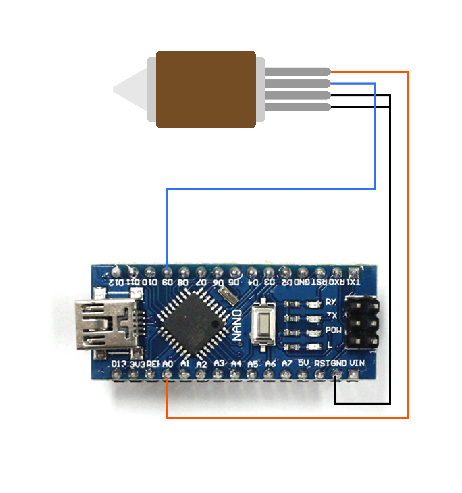
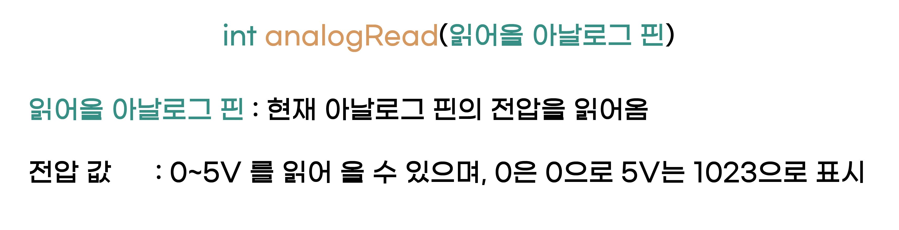

온도 측정하기
^^^^^^^^^^^^^^^^^^^^^^^^^^^^^^^^^^^^

.. raw:: html

    

.. role:: orangecircle
.. role:: blackcircle
.. role:: bluecircle
.. role:: skybluecircle
.. role:: yellowcircle
.. role:: subtitle
.. role:: subtitlesmall
.. role:: blackbold
.. role:: redbold

| 온도를 측정하는 방법은 온도 센서를 이용하는 것입니다.
| 3D 펜에 사용되는 온도 센서는 저항입니다. 정확히는 :blackbold:`온도가 변하면 저항값이 변하는 저항` 입니다.
| :blackbold:`센서의 변하는 저항값을 측정하고, 이를 통해 온도를 추측 되도록` 구현하는 것이 목표입니다.
|
| 아두이노는 아날로그 핀을 입력핀으로 설정하면, 현재 핀의 전압을 측정할 수 있습니다.
|

|
| 현재 3D 펜의 열선은 디지털 9번핀에, 온도센서는 A0에 연결되어 있습니다.
| :blackbold:`※ 위의 사진은 이해를 위해 열선과 보드사이, 온도센서와 보드사이에 몇개의 부품이 생략되었습니다.`
| 생략된것이 있더라도 작동되는 핀은 동일합니다. 
|

|
| 현재 아날로그 핀의 전압 값을 읽어 올 수 있는 함수가 :hoverxref:`analogRead <hoverxref:analogRead>` 입니다. 함수의 자료형이 int임으로 반환값이 정수입니다. 0V는 0을 반환하고, 5V는 1023을 반환합니다. 2.5V 라면 511을 반환합니다.
| ※함수의 자료형이 뭔지 기억이 안난다면, :ref:`여기 <targetL2C6S7_2_2 to paragraph>` 로 이동하세요.

|
| 온도센서가 A0에 연결되어 있음으로, 아날로그 A0 핀의 전압값을 읽어오고, 시리얼 모니터에 표시되도록 다음과 같은 코드를 작성할 수 있습니다.

.. code-block:: c++
    :emphasize-lines: 3, 8
    :linenos:

    void setup() {
        // put your setup code here, to run once:
        Serial.begin(9600);
    }

    void loop() {
        // put your main code here, to run repeatedly:
        Serial.println(analogRead(A0));
    }

|
| 작성된 코드를 :hoverxref:`업로드 <hoverxref:uploadBtn>` 하고, 시리얼 모니터를 실행합니다.
|

.. image:: ../../images/Lv2/Chapter_7/Serial_Monitor.jpg
   :width: 600
   :align: center
   
|
| 보통 1023이나 1022가 많이 나타날 것입니다. 지금은 거의 5V 가까이 값을 나타내고 있습니다.
| 예열을 시작하면, 아날로그 신호 값은 아래의 온도표처럼 실제 온도에 따라 변경됩니다. (아직 예열 부분은 구현하지 않았습니다.)
|
| 먼저 온도표를 먼저 보도록 하겠습니다.

+-----------+--------------+
| 실제 온도 | 아날로그 값  |
+===========+==============+
| 0         | 1023         |
+-----------+--------------+
| 10        | 1022         |
+-----------+--------------+
| 20        | 1020         |
+-----------+--------------+
| 30        | 1016         |
+-----------+--------------+
| 40        | 1011         |
+-----------+--------------+
| 50        | 1009         |
+-----------+--------------+
| 60        | 1006         |
+-----------+--------------+
| 70        | 1004         |
+-----------+--------------+
| 80        | 1000         | 
+-----------+--------------+
| 90        | 990          |
+-----------+--------------+
| 100       | 983          |
+-----------+--------------+
| 110       | 976          |
+-----------+--------------+
| 120       | 972          |
+-----------+--------------+
| 130       | 964          |
+-----------+--------------+
| 140       | 955          |
+-----------+--------------+
| 150       | 942          |
+-----------+--------------+
| 160       | 929          |
+-----------+--------------+
| 170       | 910          |
+-----------+--------------+
| 180       | 895          |
+-----------+--------------+
| 190       | 864          |
+-----------+--------------+
| 200       | 839          |
+-----------+--------------+
| 210       | 800          |
+-----------+--------------+
| 220       | 744          |
+-----------+--------------+

| 위의 표처럼 아날로그 핀의 신호 값이 981 이라면 실제 온도는 60도에 가깝다고 판단할 수 있습니다. 온도가 높아 질수록 아날로그 신호 값은 계속해서 낮아집니다.
| ※ 이런 온도표의 작성은 보통 온도센서 제조사에서 하거나, 실제 측정을 하여 작성합니다.
| 
| 온도를 올려보면서 아날로그 값들을 확인해봅니다. 이전 그림에서 노즐의 열선은 디지털 9번핀에 연결되어 있음을 알 수 있습니다.
| 따라서 디지털 9번핀을 출력 설정을하고, 실제 HIGH 값을 출력하는 코드를 작성해봅니다.
|

.. code-block:: c++
    :emphasize-lines: 5, 10, 11
    :linenos:

    void setup() {
        // put your setup code here, to run once:
        Serial.begin(9600);

        pinMode(9,OUTPUT);
    }

    void loop() {
        // put your main code here, to run repeatedly:   
        digitalWrite(9, HIGH); // 예열 시작
        delay(5); // 약간의 대기시간 추가
        
        Serial.println(analogRead(A0));
    }

| 위의 코드처럼 작성되지만, 위의 코드는 문제가 있습니다. 온도가 계속 상승하는 것만 있기 때문에 적절한 온도일때, 예열을 중단해주어야 합니다. 
|
| 온도가 60도 이상올라갈 경우 예열을 중단하는 코드를 작성하면 다음과 같이 작성될 수 있습니다.

.. _targetL2C9S2_2_5:

.. code-block:: c++
    :linenos:

    int tempValueA0 = 0; // A0 신호 값 저장용
    bool isHeating = false; // 온도가 목표보다 높은지 확인하는 bool 변수

    void setup() {
        // put your setup code here, to run once:
        Serial.begin(9600);

        pinMode(9,OUTPUT);
    }

    void loop() {
        // put your main code here, to run repeatedly: 
        tempValueA0 = analogRead(A0); // 아날로그 신호 값을 tempValueA0 저장

        Serial.println(tempValueA0);        

        if(tempValueA0 < 981)
        {
            digitalWrite(9, LOW); // 예열 종료
            delay(5); // 약간의 대기시간 추가

            isHeating = true;
        }
        else
        {
            digitalWrite(9, HIGH); // 예열 시작
            delay(5); // 약간의 대기시간 추가

            isHeating = false;
        }

    }

| ※예열을 하기 위해 3D 펜의 전원 플러그를 연결합니다. 열을 올리는 부분이 전력을 많이 소비하기 때문입니다.

.. image:: ../../images/Lv3/Chapter_6/Step3_1.png
   :width: 800
   :align: center

|
| 읽어온 아날로그 신호값이 981일때 온도가 60도 임으로 981값보다 아래면, 예열을 중단하고, 981값보다 크면 예열을 시작하는 코드를 추가하였습니다. 약간의 시간차를 두기 위해 :ref:`delay <targetL2C5S1_9>` 함수를 추가했습니다.
| 
| :hoverxref:`업로드 <hoverxref:uploadBtn>` 하고, 신호 값을 확인 하기 위해, 시리얼 모니터를 켜줍니다.
|

 .. image:: ../../images/Lv2/Chapter_9/Step2_3.png
   :width: 500
   :align: center

| 
| 신호 값은 점점 내려갑니다. 이때 노즐을 만지게 되면, 약간의 열기를 느낄 수 있습니다.
| 981 값 근처에서 열선(디지털 9핀)이 꺼졋다 켜졋다 반복하면서, 값이 계속 바뀌는 것을 알 수 있습니다.
| 열선에 신호를 주면 값이 살짝 달라지기 때문에, 값이 변동이 있긴합니다. 그럼에도 시간이 지날 수록 981 근처에서 머무르는 것을 볼 수 있습니다.
|
| 온도를 측정하고, 예열 후 유지하는 방법에 대해 알아보았습니다. 이 방법은 온도를 유지하는 OnOff 방식이라고 합니다. 다른 방식도 있지만, 그 방식은 레벨3에서 다루도록 하겠습니다.
|
| 그렇다면, 응용을 하여 코드를 작성해보세요.
| 1. C 버튼을 누르면 온도가 60도(신호 값 981)로 예열을 시작하고,
| 2. D 버튼을 누르면 예열을 종료하는 코드를 작성해봅니다. 
| 이번 코드는 :blackbold:`난이도가 있을 수 있습니다.`
|
| ※ 버튼에 대한 코드가 생각이 나지 않는다면 :ref:`여기 <tartgetL2C7S1_1>` 로 이동하세요.
|
| 작성하고 :hoverxref:`업로드 <hoverxref:uploadBtn>` 후, 아래 코드와 비교해봅니다.

.. toggle::
    
    .. code-block:: c++
        :linenos: 

        int tempValueA0 = 0; // A0 신호 값 저장용
        bool isPressedBtn = false; // 버튼이 눌러졌는지 확인하는 bool 변수

        void setup() {
            // put your setup code here, to run once:
            Serial.begin(9600);

            pinMode(11,INPUT_PULLUP); // C 버튼 디지털핀은 11
            pinMode(12,INPUT_PULLUP); // D 버튼 디지털핀은 12

            pinMode(9,OUTPUT);
        }

        void loop() {
            // put your main code here, to run repeatedly:
            if(!isPressedBtn) // isPressedBtn이 false일때 true를 반환하고, 아래를 실행합니다.
            {           
                digitalWrite(9, LOW); // 예열 종료
                delay(5);

                Serial.println("OFF"); // 예열이 되고 있지 않음을 시리얼 모니터에 표시

                if(digitalRead(11)==LOW)
                {
                    isPressedBtn = true;
                }
            }
            else // isPressedBtn이 true일때 아래를 실행합니다.
            {
                tempValueA0 = analogRead(A0); // 아날로그 신호 값을 tempValueA0 저장

                Serial.print("ON "); // 예열이 되고 있음을 시리얼 모니터에 표시

                Serial.println(tempValueA0); // 신호 값을 시리얼 모니터에 출력

                if(tempValueA0 < 981)
                {
                    digitalWrite(9, LOW); // 예열 종료
                    delay(5); // 약간의 대기시간 추가
                }
                else
                {
                    digitalWrite(9, HIGH); // 예열 시작
                    delay(5); // 약간의 대기시간 추가
                }

                if(digitalRead(12)==LOW)
                {
                    isPressedBtn = false;
                }
            }
        }

        | int tempValue를 선언하고 ?줄에서 analogRead(A0) 값을 저장했습니다. 
        | ?+2 줄에서 if(tempValue < 981) 대신 if(analogRead(A0) < 981)를 사용할 수도 있었지만, 함수를 호출하는 것 보다 변수에 접근하는 것이 더 연산속도가 빠르기 때문입니다.