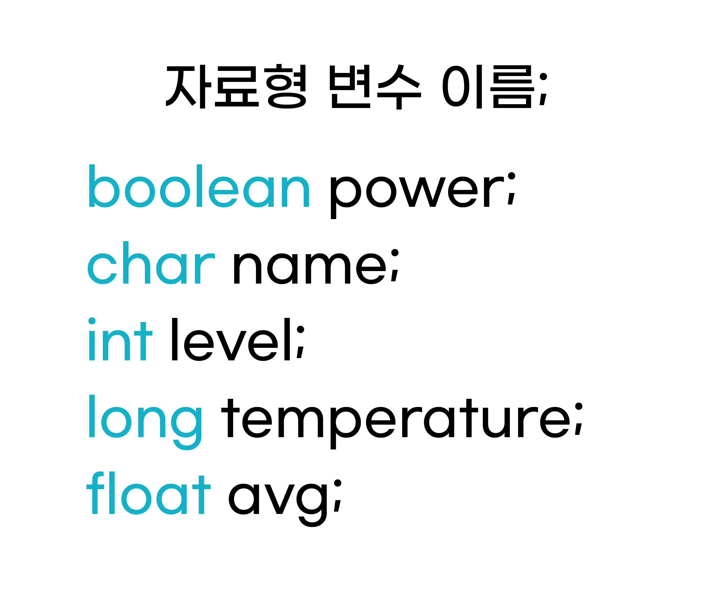
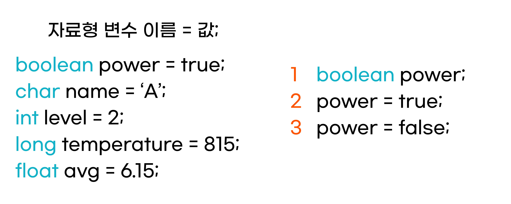

변수와 상수
^^^^^^^^^^^^^^^^^^^^^^^^^^^^^^^^^^^^

.. raw:: html

    

.. role:: orangecircle
.. role:: blackcircle
.. role:: bluecircle
.. role:: skybluecircle
.. role:: yellowcircle
.. role:: subtitle
.. role:: subtitlesmall
.. role:: blackbold
.. role:: redbold

| 프로그래밍에서 변수는 데이터들을 저장하는 공간을 의미합니다.
| 이번 단계에서는 변수를 만들고, 값을 저장하는 방법에 대해 간단히 살펴봅니다.
| 어렵지 않습니다.
|
| 
| :subtitlesmall:`변수 선언`
| 변수를 선언한다는 것은 변수를 만든다라는 뜻입니다. 
| 선언하는 방법은 다음 그림과 같습니다.
|

|
| 먼저 선언할 변수의 자료형을 먼저 선언해줘야 합니다. 이어서 변수의 이름을 정해줘야 합니다. 마지막으로 세미콜론 ; 을 붙여주면, 선언이 완료됩니다.
| 변수가 선언되면, 아두이노 보드는 이 변수가 있다는 것을 알게되고, 활용할 공간을 마련해줍니다. 
|

| 변수의 선언은 같은 자료형이면, 한번에 선언, 초기화가 가능합니다.

.. code-block:: c++
        :linenos: 

        int a, b, c;
        int d = 1, e = 2, f = 3;
        int g, h, i = 4;

| a,b,c와 같이 여러 변수를 함께 선언만 할 수 있습니다.
| d,e,f와 같이 선언과 함께 초기화도 할 수 있습니다.
| g,h,i와 같이 일부는 선언만, 일부는 초기화까지 할 수 있습니다.
|

.. _targetL3C4S2_1:

| 변수 이름을 정해주는 데에는 규칙이 있습니다.
| :blackbold:`1.` 영어, _(밑줄), 숫자만 가능.
| :blackbold:`2.` 첫 글자는 영어, _(밑줄)만 가능.
| :blackbold:`3.` 공백(띄어쓰기)는 불가능.
| :blackbold:`4.` 대, 소문자를 구별. tE 변수명과 te 변수명은 다른 것.
| :blackbold:`5.` 프로그램 용어로 사용되는 단어는 불가능.
|
|
| :subtitlesmall:`변수 초기화`
| 변수를 초기화 한다는 것은 변수 선언 후, 처음으로 변수에 값을 저장한다는 것을 의미합니다. 
| 초기화하는 방법은 다음 그림과 같습니다.

|
| 변수를 초기화 하는 방법은 선언과 동시에 진행할 수 있고, 오른편처럼 선언 후에 따로 초기화를 할 수 있습니다.
| :blackbold:`=` 기호가 수학에서는 :blackbold:`같음` 을 의미하지만, 프로그래밍에서는 오른쪽 값을 왼쪽으로 저장함을 의미합니다.
| 오른편의 2번째 줄이 변수 초기화이며, 3번째 줄은 단순 변수 값 변경입니다.
| 
| 변수 초기화와 저장에 주의사항
| :blackbold:`1.` 자료형에 맞는 값을 초기화, 저장.
| :blackbold:`2.` 자료형의 범위에 있는 값을 초기화, 저장.
| :blackbold:`3.` 저장된 변수에 새로운 값을 저장하면, 기존 값은 지워짐.
