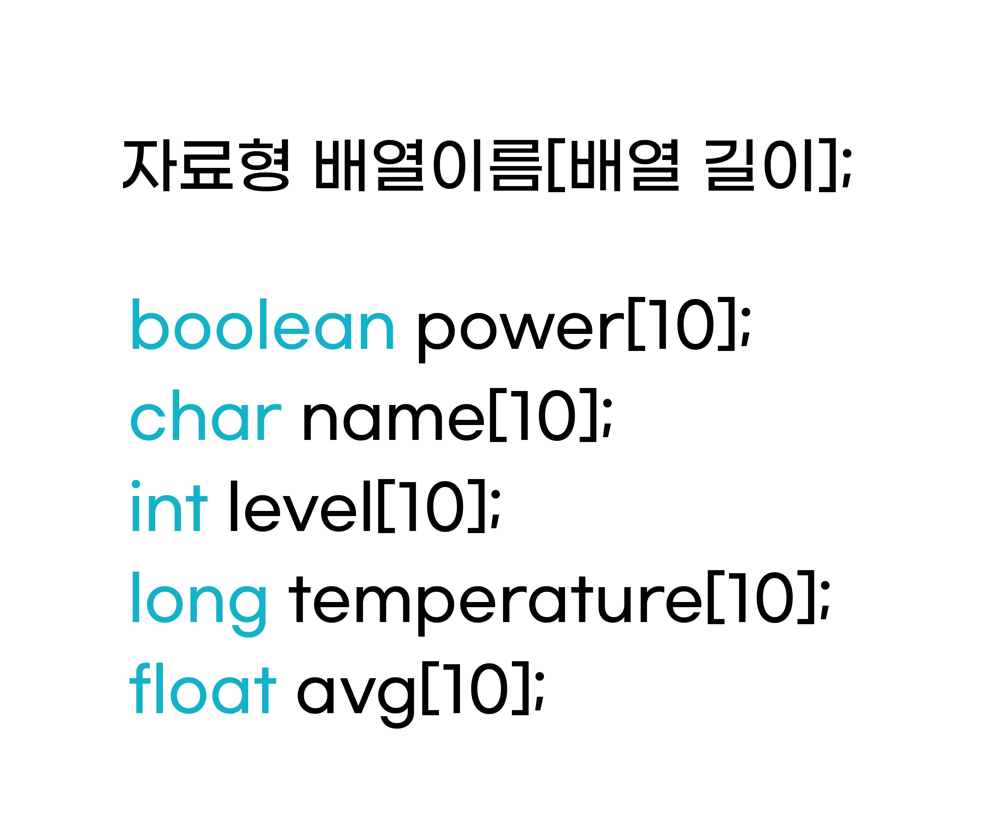
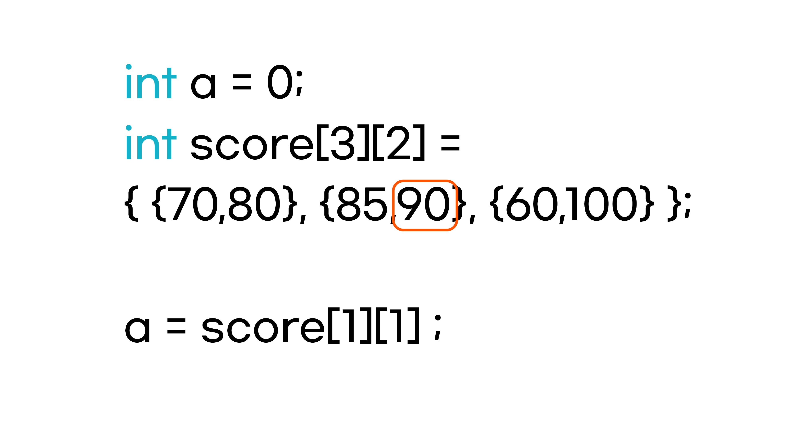

배열
^^^^^^^^^^^^^^^^^^^^^^^^^^^^^^^^^^^^

.. raw:: html

    

.. role:: orangecircle
.. role:: blackcircle
.. role:: bluecircle
.. role:: skybluecircle
.. role:: yellowcircle
.. role:: subtitle
.. role:: subtitlesmall
.. role:: blackbold
.. role:: redbold

| 배열은 여러개의 변수들을 나열한 것입니다.
| 예를 들어 학교의 반에 학생들의 수학 점수들을 1번 학생부터 끝번 학생까지 나열한 것이 배열이라 보시면 됩니다.
| 숫자나 문자들을 나열하거나, 여러 개의 값들을 반복 계산을 쉽게 하기 위해서 사용되기도 합니다.
| 
| 먼저 배열도 변수처럼 선언을 해야합니다.
| 

| :subtitlesmall:`배열의 선언`
| 배열의 선언을 하는 방법은 변수를 선언하는 것과 유사합니다.
|

|
| 배열은 변수의 선언과 비슷하지만 배열의 이름 옆에 길이를 작성해줍니다. 각각의 배열은 10개의 변수를 가진 배열이 됩니다.
| 또한 배열의 이름도 :ref:`변수의 이름 규칙 <targetL2C6S2_1>` 에 맞게 작성해야합니다.
|

| :subtitlesmall:`배열의 초기화`
| 배열의 초기화도 마찬가지로 변수의 초기화랑 유사합니다.
|

.. image:: ../../images/Lv2/Chapter_6/Step6_2.jpg
   :width: 600
   :align: center

|
| 배열의 초기화도 2가지 방식이 있습니다. 선언과 동시에 초기화, 혹은 선언 이후 초기화를 할 수 있습니다.
| 선언과 동시에 초기화를 할 경우에는 여러 항목을 동시에 할 수 있지만, 선언 이후에 초기화를 하려면, 각각 따로 따로 초기화를 진행해야합니다.
| 
| 값을 초기화, 저장하거나 값을 확인하는 것을 접근한다 합니다.
| 배열의 첫 항목은 '배열이름[0]' 으로 접근합니다. int level[3]은 3개의 int형 변수의 배열입니다.
| level[0]에 접근을 하게 되면, level 배열의 첫번째 항목에 접근이 됩니다.
| level[1]에 접근을 하게 되면, level 배열의 두번째 항목에 접근이 됩니다. 
|

.. code-block:: c++

    int a[] = { 10, 9, 8, 0, 0 };
    int b[5] = { 10, 9, 8, 0, 0 };
    int c[5] = { 10, 9, 8 };

| a,b,c 각각 배열은 모두 같은 값들이 초기화 됩니다. a는 배열의 길이가 없어도, 초기화된 값의 갯수만큼 길이가 정해집니다. 
| 또한 c는 배열의 길이가 5지만 3개의 값만 저장하였습니다. 이 경우에는 나머지 항목은 모두 0으로 저장 됩니다. 따라서 3개의 배열은 모두 같습니다.
|
| 아래 코드에서는 a에 어떤 값이 저장될지 생각해보세요.
|

.. code-block:: c++

    int a;
    int b[5] = { 10, 9, 8, 7, 6 };

    for(int i = 0;i<5;i++)
    {
        a += b[i];
    }    

| 정답

.. toggle::

    | a 변수에는 40 이 저장되었습니다.

|
| :subtitlesmall:`2차원 배열`
| 배열은 응용이 될 수 있습니다. 예를 들어 :blackbold:`3명의 학생을 순서대로 영어, 수학 점수를 함께 배열로 나타내고 싶다` 면 배열로 어떻게 나타내야 할까요?
|

.. image:: ../../images/Lv2/Chapter_6/Step6_3.jpg
   :width: 700
   :align: center

|
| 2차원 배열을 이용하는 방법이 있습니다. 물론 2차 말고도 3,4~ 이어질 수 있습니다만, 아주 큰 차원의 배열을 다룰 일이 드뭅니다.
| 2차원 배열에 접근하는 방법도 1차원 배열과 동일합니다.

|
| int 형 변수 a에 score 변수에 있는 2번쨰 학생의 수학 점수(90점)를 저장하고 싶다면, 두번째 배열의, 두번째 항목에 접근해야 합니다.
| 접근하려면 첫번째 항목이 숫자 0 으로 시작되니 score[1][1]와 같이 접근해야 90 이라는 숫자에 접근할 수 있습니다.
|
| 아래 코드에서는 a에 어떤 값이 저장될지 생각해보세요.
|

.. code-block:: c++

    float a = 0;
    int score[4][2] = { {75, 52}, {72, 80}, {80, 90}, {60, 100} };
    
    for(int i = 0; i<4 ; i++)
    {
        a += score[i][1];
    }

    a /= 4;

| 정답

.. toggle::

    | a 변수에는 80.5 가 저장되었습니다.

