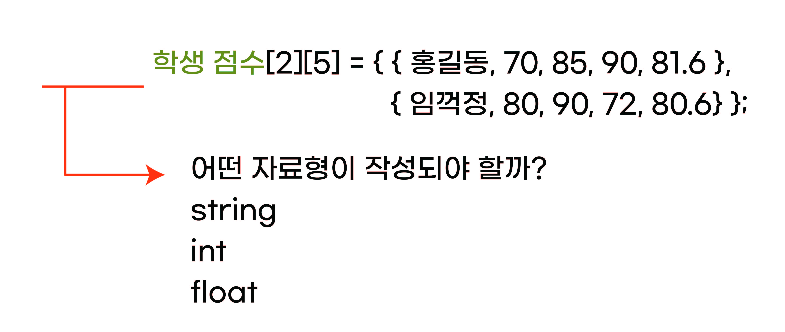
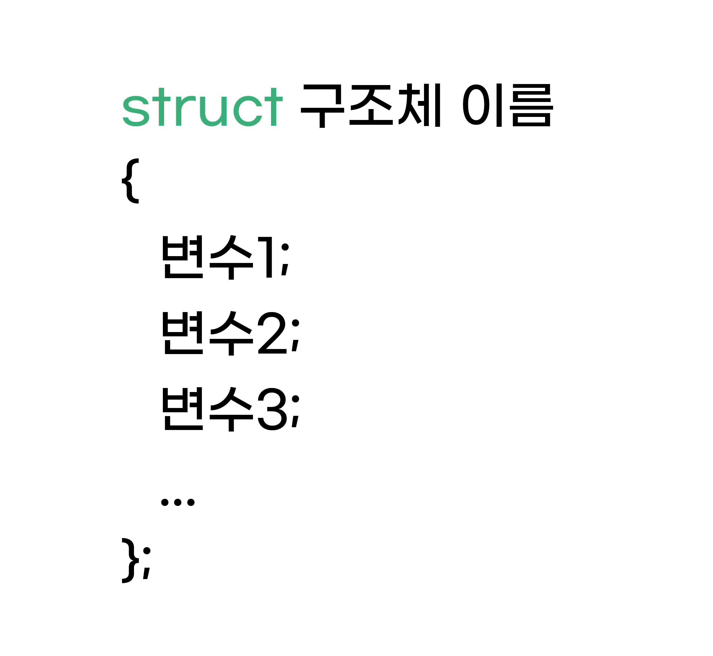

구조체
^^^^^^^^^^^^^^^^^^^^^^^^^^^^^^^^^^^^

.. raw:: html

    

.. role:: orangecircle
.. role:: blackcircle
.. role:: bluecircle
.. role:: skybluecircle
.. role:: yellowcircle
.. role:: subtitle
.. role:: subtitlesmall
.. role:: blackbold
.. role:: redbold

| 구조체에 대해서 이해하기전에, 이전에 2차원 배열에 대해서 배웠습니다. 2차원 배열의 특징은 배열의 각 항목이 같은 자료형이라는 것을 기억해주세요.
| 구조체에 대한 사용과 배열과 구조체가 다른점에 대해서 이해하는 것이 목표입니다.
| 

.. code-block:: c++

   int score[4][2] = { {75, 52}, {72, 80}, {80, 90}, {60, 100} };

| 그런데 간혹, 자료형이 다른 것들을 한번에 묶어서 관리하고 싶은 경우가 있습니다. 예를 들면 표와 같은 것입니다.

.. list-table:: :subtitlesmall:`학생 점수`
    :widths: 5 5 5 5 5
    :header-rows: 1
    :align: center

    * - 이름
      - 국어 점수
      - 수학 점수
      - 영어 점수
      - 평균
    * - 홍길동
      - 70
      - 85
      - 90
      - 81.6
    * - 임꺽정
      - 80
      - 90
      - 72
      - 80.6

| 이와 같은 자료들을 다루고 싶은 경우에 배열과 같이 나타내려면 어떻게 해야할까요?
|

|
| 안타깝게도 서로 다른 자료형의 변수들을 하나의 배열로 묶을 순 없습니다.
| 이때 사용되는 것이 구조체 입니다. 
|

|
| 구조체는 위와 같이 선언됩니다.
| 일반 변수들은 자료형(int, char...)이 오는 자리에 struct 단어가 옵니다. 그리고 구조체 이름이 작성이 됩니다.
| 이어서 구조체 내부에 포함될 변수들을 차례대로 작성해줍니다. 예를 들면 아래와 같습니다.

.. code-block:: c++
  :linenos:
  
  // 구조체 선언
  struct student
  {
    string name;
    int KoreanScore;
    int mathScore;
    int EnglishScore;
    float avg;
  }
  
|
| 구조체를 만들었지만, 바로 사용할 수 없습니다. '구조체 변수 선언' 을 또 해주어야 합니다.
| int와 같은 자료형 변수가 여러개의 변수를 만들 수 있듯이, 구조체 형태를 가진 변수들도 여러 개를 만들 수 있습니다. 
| 구조체를 선언하는 방법은 아래와 같습니다.
|

.. image:: ../../images/Lv3/Chapter_5/Step7_3.jpg
   :width: 500
   :align: center

.. code-block:: c++
  :linenos:
  
  // 학생 구조체 선언
  struct student
  {
    string name;
    int KoreanScore;
    int mathScore;
    int EnglishScore;
    float avg;
  }
  
  // 홍길동이라는 이름의 학생 구조체 변수 선언
  struct student honggildong; 

| :blackbold:`구조체 선언` 은 구조체가 어떤 구조로 되어 있는지 선언하는 것이고, :blackbold:`구조체 변수 선언` 은 실제 사용되는 구조체의 변수를 선언하는 것입니다.
|
| 그렇다면 구조체 변수가 선언과 동시에 초기화 하는 방법은 다음과 같습니다.
|

.. code-block:: c++

  // 구조체 변수 선언과 초기화
  struct student honggildong = { "홍길동", 70, 85, 90, 81.6 };

|
| 구조체 내부에 있는 자료형 변수들을 :blackbold:`멤버` 라고 합니다. 현재 student 구조체는 멤버가 5개 있습니다. 멤버 or 멤버 변수라고도 합니다.
| 이 변수들의 값을 변경하려면, 각 멤버에 접근을 해야하는데, 이 접근을 참조라고 합니다. 참조에는 참조 연산자(.)를 사용합니다. 키보드에서 마침표와 같습니다.
| 

.. code-block:: c++

  // 구조체 변수 선언과 초기화
  struct student honggildong = { "홍길동", 70, 85, 90, 81.6 };

  // 구조체 멤버 참조
  honggildong.KoreanScore = 80;

| 위 코드에서는 구조체 변수 이름이 honggildong인 구조체의 KoreanScore 멤버의 값을 80으로 저장하는 코드입니다.
| honggildong 뒤에 . 연산자를 사용하여 구조체 내부의 멤버에 접근할 수 있습니다. 

|
| 이 단계 첫부분에 배열과 비교하면서 구조체의 특징을 알려드렸습니다.
| 이번에 알아볼 것은 구조체 배열입니다. 구조체 자체가 배열이 처럼 되는 것으로 2차원 배열과 유사합니다.
| 예시를 보면서 설명드리겠습니다.

.. code-block:: c++

  // 학생 구조체 2개 나열된 구조체 배열
  struct student firstGrade[2] = {{ "홍길동", 70, 85, 90, 81.6 }, { "임꺽정", 80, 90, 72, 80.6 }};

|
| 학생 구조체 배열이 선언, 초기화가 되었습니다. 2차원 배열과 유사하지 않나요? 구조체에 있는 멤버의 자료형만 다를 뿐, 모양은 2차원 배열과 유사합니다.
| 배열의 형태를 띄기 때문에 항목에 접근하는 것도 유사합니다.

| 그렇다면 위의 임꺽정 학생의 국어점수를 90점으로 바꾸려면 어떻게 접근, 참조하고 대입해야 할까요? 어렵진 않습니다. 생각해보고 아래 코드를 확인해보세요.

.. toggle::

  .. code-block:: c++
    
    //임꺽정 학생의 국어 점수 변경
    firstGrade[1].KoreanScore = 90;