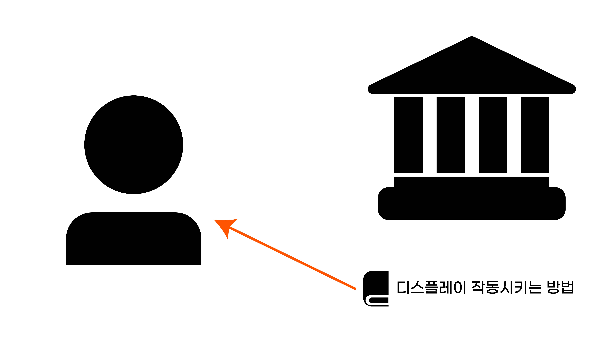
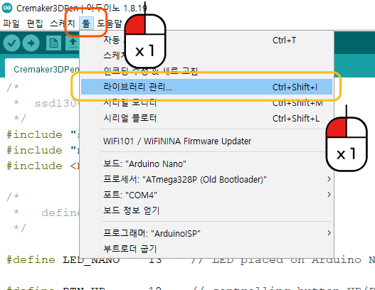
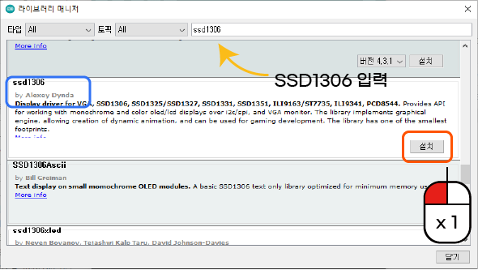

라이브러리 설치
^^^^^^^^^^^^^^^^^^^^^^^^^^^^^^^^^^^^

.. raw:: html

    

.. role:: orangecircle
.. role:: blackcircle
.. role:: bluecircle
.. role:: skybluecircle
.. role:: yellowcircle
.. role:: subtitle
.. role:: subtitlesmall
.. role:: blackbold
.. role:: redbold

| 코딩을 하면, 라이브러리라는 말을 많이 듣게 될 겁니다. 말그대로 도서관에서 책을 빌려쓰듯이, 누군가 만들어놓은 코드들을 사용할 수 있게 해주는 것이 라이브러리입니다.
| :blackbold:`라이브러리에 대한 이해를 하고, 3D 펜에 필요한 라이브러리를 설치하는 것` 이 목표입니다.
|

|
| 프로그래밍에서는 라이브러리는 누가 작성해 놓은 것을 쉽게 사용할 수 있도록 하는 것입니다. 실제 도서관에서는 방문하여 책을 빌리는 것처럼, 라이브러리도 사용하려면 준비해야할 것이 있습니다.
| 

|
| :orangecircle:`●` 메뉴 중 툴-라이브러리 관리를 클릭합니다.
| :blackcircle:`●` 디스플레이를 켜고 조절하는 코드들을 다운로드 해볼 겁니다.
|
|

|
| :yellowcircle:`●` 검색창에 SSD1306 을 입력합니다.
| :bluecircle:`●` 검색 결과에서 SSD1306 이름이고, by Alexey Dynda 로 표시된 부분을 찾아줍니다.
| :orangecircle:`●` 오른편의 설치 버튼을 눌러줍니다.
| :blackcircle:`●` 디스플레이 관련 코드가 설치되었습니다. 설치는 어렵지 않았습니다.
|
|