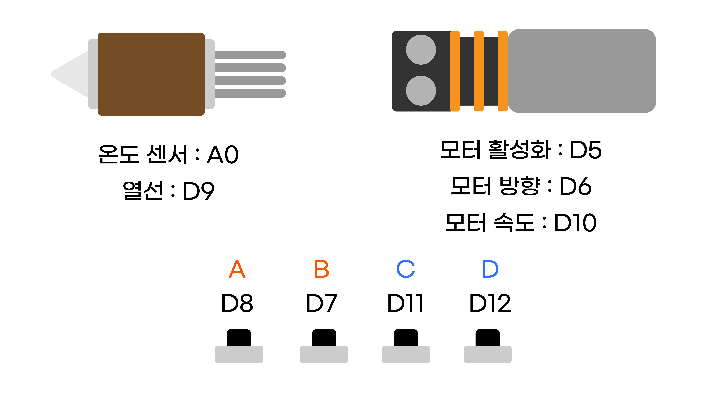

초기 설정 코드
^^^^^^^^^^^^^^^^^^^^^^^^^^^^^^^^^^^^

.. raw:: html

    

.. role:: orangecircle
.. role:: blackcircle
.. role:: bluecircle
.. role:: skybluecircle
.. role:: yellowcircle
.. role:: subtitle
.. role:: subtitlesmall
.. role:: blackbold
.. role:: redbold

| 여기서 부터는 최종 코드를 작성해볼 예정입니다. 이전에 배웠던 코드들을 사용할 계획이며, 작성하다가 원리가 기억이 나지 않는다면, 이전 단계를 다시 확인하고 오시는 것을 추천드립니다.   
|
| 이제 실전으로 최종 코드를 작성하기 위해, 먼저 각종 핀을 정리부터 하도록 하겠습니다.
| :blackbold:`setup 함수에 사용될 부품의 핀과 라이브러리를 포함하도록` 구현하는 것이 목표입니다.

|
| 이때까지 살펴봤던 핀 입니다. 모터, 버튼, 열선, 온도센서가 있습니다.
| 
| 이 디지털 핀들을 setup 함수에 작성해줍니다.

.. code-block:: c++
        :linenos: 

        void setup() 
        {
            pinMode(8,INPUT_PULLUP);  // A 버튼 
            pinMode(7,INPUT_PULLUP);  // B 버튼 
            pinMode(11,INPUT_PULLUP); // C 버튼 
            pinMode(12,INPUT_PULLUP); // D 버튼 

            pinMode(5,OUTPUT);        // 모터 활성화 핀
            pinMode(6,OUTPUT);        // 모터 방향 핀
            pinMode(10,OUTPUT);       // 모터 속도 핀

            pinMode(9,OUTPUT);        // 열선

            digitalWrite(5, HIGH);    // 모터 활성화
        }

        void loop() 
        {

        }

| 사용되는 디지털 핀들을 모두 작성하였습니다. 라이브러리를 포함하는 코드를 작성하고 초기 설정은 마무리 합니다.
| 코드를 작성함에 있어서 주석을 작성해주는 습관을 들이면, 나중에 코드를 다시 확인할 때 시간을 아껴줍니다.

.. code-block:: c++
        :linenos: 

        #include "ssd1306.h" // 라이브러리 포함

        void setup() 
        {
            pinMode(8,INPUT_PULLUP);  // A 버튼 
            pinMode(7,INPUT_PULLUP);  // B 버튼 
            pinMode(11,INPUT_PULLUP); // C 버튼 
            pinMode(12,INPUT_PULLUP); // D 버튼 

            pinMode(5,OUTPUT);        // 모터 활성화 핀
            pinMode(6,OUTPUT);        // 모터 방향 핀
            pinMode(10,OUTPUT);       // 모터 속도 핀

            pinMode(9,OUTPUT);        // 열선

            digitalWrite(5, HIGH);    // 모터 활성화
        }

        void loop() 
        {

        }

| 이어서 디스플레이를 사용해야 함으로 디스플레이에 대한 초기 코드를 setup에 작성합니다.
| 작성에 필요한 코드의 설명을 보려면 :ref:`여기 <targetL3C10S2_1_5>` 로 이동하여 확인하세요.

.. code-block:: c++
        :linenos: 

        #include "ssd1306.h" // 라이브러리 포함

        void setup() 
        {
            pinMode(8,INPUT_PULLUP);   // A 버튼 
            pinMode(7,INPUT_PULLUP);   // B 버튼 
            pinMode(11,INPUT_PULLUP);  // C 버튼 
            pinMode(12,INPUT_PULLUP);  // D 버튼 

            pinMode(5,OUTPUT);         // 모터 활성화 핀
            pinMode(6,OUTPUT);         // 모터 방향 핀
            pinMode(10,OUTPUT);        // 모터 속도 핀

            pinMode(9,OUTPUT);         // 열선

            digitalWrite(5, HIGH);     // 모터 활성화

            ssd1306_128x32_i2c_init(); // 32로 변경
            ssd1306_fillScreen(0x00);  // 화면 초기화
            ssd1306_setFixedFont(ssd1306xled_font6x8); // 폰트 설정
            ssd1306_flipHorizontal(1); // x 화면 대칭 회전
            ssd1306_flipVertical(1);   // y 화면 대칭 회전
        }

        void loop() 
        {

        }

| 여기에서 전처리문을 이용하여, 코드가 이해되기 쉽도록 변경해줍니다.
| 전처리문을 사용하는것은 필수가 아니지만, 코드가 길어질 수록 유용하게 사용됩니다.
| 따라서 적절하게 사용하는 습관을 가져주시면 좋습니다.

.. code-block:: c++
        :linenos: 

        #include "ssd1306.h" // 라이브러리 포함

        #define BTN_A       8     // A버튼
        #define BTN_B       7     // B버튼
        #define BTN_C       11    // C버튼
        #define BTN_D       12    // D버튼

        #define MOTOR_EN    5     // 모터 활성화 핀
        #define MOTOR_DIR   6     // 모터 방향 핀
        #define MOTOR_SPEED 10    // 모터 속도 핀

        #define HEATER_EN   9     // 열선 핀

        #define TEMP_IN     A0    // 온도 읽는 핀

        void setup() 
        {
            pinMode(BTN_A, INPUT_PULLUP);  
            pinMode(BTN_B, INPUT_PULLUP);  
            pinMode(BTN_C, INPUT_PULLUP);  
            pinMode(BTN_D, INPUT_PULLUP);  

            pinMode(MOTOR_EN, OUTPUT);         
            pinMode(MOTOR_DIR, OUTPUT); 
            pinMode(MOTOR_SPEED, OUTPUT);        

            pinMode(HEATER_EN, OUTPUT); 

            digitalWrite(MOTOR_EN, HIGH); // 모터 활성화

            ssd1306_128x32_i2c_init(); // 32로 변경
            ssd1306_fillScreen(0x00);  // 화면 초기화
            ssd1306_setFixedFont(ssd1306xled_font6x8); // 폰트 설정
            ssd1306_flipHorizontal(1); // x 화면 대칭 회전
            ssd1306_flipVertical(1);   // y 화면 대칭 회전
        }

        void loop() 
        {

        }

|
| 이후의 전처리문이 사용될 부분이 있으면, 언급없이 사용하도록 하겠습니다. 전처리문은 모든 이름을 대문자로 쓰는 관습이 있기 때문에 구별이 어렵지 않을겁니다.
| ※ 작성된 것을 지우지 말고 다음 단계로 이동합니다.