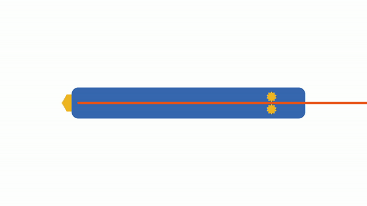
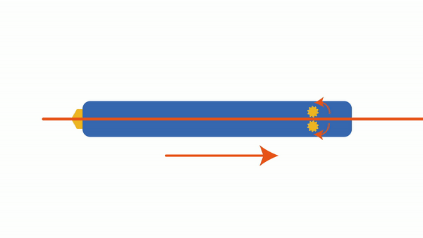

모터 작동
^^^^^^^^^^^^^^^^^^^^^^^^^^^^^^^^^^^^

.. raw:: html

    

.. role:: orangecircle
.. role:: blackcircle
.. role:: bluecircle
.. role:: skybluecircle
.. role:: yellowcircle
.. role:: subtitle
.. role:: subtitlesmall
.. role:: blackbold
.. role:: redbold

| 이제 실제로 모터를 작동하는 코드를 추가해보려 합니다. 모터는 온도가 예열된 상태에서만 작동해야합니다. 버튼을 눌러도 온도가 높지 않다면, 출력이 되지 않게끔 해야 합니다. 
| 따라서 여기에서는 :blackbold:`온도에 따라 모터가 작동되도록` 코드를 구현하는 것이 목표입니다.
|
| 모터 작동 코드를 추가하기전에 현재온도가 목표온도에 근접했는지 확인할 수 있는 코드를 작성해주어야 합니다. 보통 상태를 확인하는 코드는 bool 변수를 사용하면 좋습니다.
| 
| ※ 전체코드를 계속해서 보여주는 것은 코드가 길기 때문에 작성된 코드에서 추가될 부분만 설명드리겠습니다.
|

.. code-block:: c++
        :linenos:

        // 모터로 재료를 밀어낼 준비가 된 상태인지 확인하는 bool 변수 선언
        bool isReadyToExt = false;

        // 현재 상태가 모터를 작동시킬수 있는지 확인하는 함수
        void checkForReadyToExt() 
        {
            if(curTemp > setTemperature - 5)
            {
                isReadyToExt = true;
            }
            else
            {
                isReadyToExt = false;
            }
        }

| 현재온도가 목표온도에서 5도 차이내에 있다면, 모터를 작동시킬 수 있도록 isReadyToExt 변수를 true로 변경해줍니다.
| 현재온도가 목표온도보다 높은 경우에는 모터가 작동하는데 문제가 없기 때문에, 온도가 낮은 경우만 고려하였습니다.
|
| 하지만 고려해야할 것이 하나 더 있습니다. 어떤 것이 문제가 있을지 한번 생각해보시고 아래 버튼을 눌러 수정된 코드를 확인해보세요.
|

.. toggle::

    .. code-block:: c++
        :linenos:

        // 모터로 재료를 밀어낼 준비가 된 상태인지 확인하는 bool 변수 선언
        bool isReadyToExt = false;

        // 현재 상태가 모터를 작동시킬수 있는지 확인하는 함수
        void checkForReadyToExt() 
        {
            // 설정온도가 0 이라면, isReadyToExt 변수를 false로 저장
            if(setTemperature == 0)
            {
                isReadyToExt = false;
                return;
            }

            if(curTemp > setTemperature - 5)
            {
                isReadyToExt = true;
            }
            else
            {
                isReadyToExt = false;
            }
        }

    | 문제는 설정온도가 0 이면, 현재온도보다 항상 낮은 상태가 되니 isReadyToExt 변수가 true 로 저장될 것입니다.
    | 그렇다면 예열이 되지 않은 상태에서도 모터가 움직이게 됩니다.

| 위 함수에서 저장되는 isReadyToExt 변수를 사용하여 모터 작동코드를 작성하면 아래와 같습니다.

.. code-block:: c++
        :linenos:

        // 방향을 알기 위한 true, false를 전처리문으로 선언
        #define EXT_DIR true
        #define REV_DIR false

        /*
         * 방향과 속도를 정하여 모터를 작동시키는 함수, 0이면 정지, 255면 최대속도로 통일
         */
        void workMotor(int speed, bool dir)
        {   
            // 모터를 작동시킬 준비가 되지 않았다면, 함수를 종료
            if(!isReadyToExt)
            {
                return;
            }

            if(dir==EXT_DIR)
            {
                digitalWrite(6, HIGH);
                analogWrite(10, 255-speed); // HIGH일 경우 스피드를 반전
            }
            else if(dir==REV_DIR)
            {
                digitalWrite(6, LOW);
                analogWrite(10,speed);
            }
        }

| 모터를 작동하는 함수 앞에 isReadyToExt 의 변수를 확인하는 코드를 추가하여, 온도상태에 따라 모터를 작동시키거나 함수를 종료합니다.
|
| 3D 펜에서 재료를 밀어내거나 제거하는 모터의 동작은 다음과 같이 진행됩니다.
|

|
| 재료를 밀어내는데에는 밀어내다가 버튼을 손에서 떼면, 살짝 뒤로 당겨줍니다. 이는 필라멘트 재료의 특성 때문에 흘러내림을 방지하기 위함입니다. 이 동작을 :blackbold:`리트렉션` 이라고 합니다.
|
| 아래는 재료를 제거하는 동작입니다.
|

|
| 제거하는 동작에는 모터가 오랫동안 회전하여 재료를 전체 다 제거합니다. 또한 이 긴 시간동안 모터만 작동시키게 할 수는 없습니다. 온도도 확인해야하고, 디스플레이에 표시도 해야되기 때문입니다.
| 
| 그렇기 때문에, 현재 상태파악하고 모터를 작업시킬 함수가 하나 더 필요합니다.
|

.. code-block:: c++
        :linenos:

        // 동작 상태를 나타낼 수 있는 숫자를 표시
        #define STOP    0 // 모터 정지
        #define EXTRUDE 1 // 재료 토출
        #define REVERSE 2 // 재료 제거
        #define RETRACT 3 // 재료 리트렉션

        // 동작 상태를 확인할 수 있는 변수 선언
        int stateAction = 0;

        // 시간을 카운트 할 수 있는 변수 선언 
        int timeWork = 0;

        /*
         * 상태 값에 따라 각각의 모터 동작 수행
         */
        void workAction()
        {
            switch (stateAction)
            {
                case STOP:
                    workMotor(0, EXT_DIR);
                    break;

                case EXTRUDE:
                    workMotor(255, EXT_DIR);
                    break;

                case REVERSE:
                    timeWork--;
                    workMotor(255, REV_DIR);
                    break;

                case RETRACT:
                    timeWork--;
                    workMotor(255,REV_DIR);
                    break;
            }
        }

| setMotorSpeed 는 기존에 선언된 것으로 재료리스트의 속도 값이 저장되는 변수입니다.
| 동작상태가 여러개이다 보니, bool 변수 대신 int 변수를 사용했습니다. 또한 전처리문으로 코드를 파악하기 쉽도록 하였습니다.
|
| timeWork 변수는 시간을 측정하는데 사용합니다. 예를 들어 아래와 같은 코드가 있다면, timeWork이 0이 되기 까지 1초가 걸립니다.

.. code-block:: c++
    :linenos:

    int timeWork = 20;
    long time = millis();

    void setup()
    {

    }

    void loop()
    {
        if(millis() - time > 50)
        {
            timeWork--;            
        }
    }

| 이와 같은 원리로 timeWork의 변수를 선언하였습니다.
|
| 기존 코드에서 workMotor, workAction, isReadyToExt 함수를 추가하여 코드를 작성해봅니다.
| 1. A 버튼을 누른 상태면, 모터가 필라멘트 토출되는 방향으로 회전.
| 2. A 버튼을 누른 상태에서 떼면, 모터가 필라멘트 제거되는 방향으로 1초 동안 회전.
| 3. B 버튼을 누르면, 모터가 필라멘트 제거되는 방향으로 10초동안 회전.
| 4. A,B 버튼을 누르지 않으면, 모터는 정지 하도록 합니다.
|
| 작성후 아래의 코드와 비교해봅니다.

.. toggle::

    .. code-block:: c++
        :linenos:

        #include "ssd1306.h" // 라이브러리 포함

        #define BTN_A           8      // A버튼
        #define BTN_B           7      // B버튼
        #define BTN_C           11     // C버튼
        #define BTN_D           12     // D버튼

        #define MOTOR_EN        5      // 모터 활성화 핀
        #define MOTOR_DIR       6      // 모터 방향 핀
        #define MOTOR_SPEED     10     // 모터 속도 핀

        #define HEATER_EN       9      // 열선 핀

        #define TEMP_IN         A0     // 온도 읽는 핀

        #define VALUE_TEMPTB    0      // 온도 테이블의 신호 값 인덱스
        #define CELSIUS_TEMPTB  1      // 온도 테이블의 온도 값 인덱스        

        #define MATERIAL_COUNT  3      // material 구조체 배열의 갯수

        // 동작 상태를 나타낼 수 있는 숫자를 표시
        #define STOP            0 // 모터 정지
        #define EXTRUDE         1 // 재료 토출
        #define REVERSE         2 // 재료 제거
        #define RETRACT         3 // 재료 리트렉션

        // 모터 방향을 알기 위한 true, false를 전처리문으로 선언
        #define EXT_DIR         true
        #define REV_DIR         false

        String strToShow;              // 디스플레이에 보여줄 문자열을 저장하는 변수

        bool isHeating = false; // 온도가 목표보다 높은지 확인하는 bool 변수
        bool isNeedUpdateScreen = true;      // 업데이트가 필요한지 확인하는 bool 변수 생성
        bool isPressedA_BTN, isPressedB_BTN, isPressedC_BTN, isPressedD_BTN; // 버튼이 눌러져 있는지 확인하는 bool 변수 생성
        bool isReadyToExt = false; // 모터로 재료를 밀어낼 준비가 된 상태인지 확인하는 bool 변수 선언

        int stateAction = 0; // 동작 상태를 확인할 수 있는 변수 선언        
        int timeWork = 0; // 시간을 카운트 할 수 있는 변수 선언 
        int curTemp = 0; // 현재온도

        long timeInterval  = millis(); // 50ms 에 1회씩 작동하기 위한 시간 변수

        int material_index = 0;        // 재료 구조체 배열의 위치를 가리키는 인덱스
        int setTemperature = 0;        // 설정된 온도     

        // 온도, 속도, 재료명을 포함한 구조체 선언
        struct setting {
            int temperature;
            char* materialName;
        };

        struct setting materials[] = {{0, "OFF"}, {60, "PCL"}, {200, "PLA"}};

        /*
         *  온도 테이블 배열
         *  첫번째 항목은 신호 값, 두번째 항목은 온도 값
         */
        int temptable[23][2] = {
            {1023,0},
            {1022,10},
            {1020,20},
            {1016,30},
            {1011,40},
            {1009,50},
            {1006,60},
            {1004,70},
            {1000,80},
            {990,90},
            {983,100},
            {976,110},
            {972,120},
            {964,130},
            {955,140},
            {942,150},
            {929,160},
            {910,170},
            {895,180},
            {864,190},
            {839,200},
            {800,210},
            {744,220}
        };

        /*
         * 입력받은 문자를 디스플레이 좌표에 표시         
         */
        void showTextToScreen(int x, int y, String text)
        {
            text = text + "\n";
            char ch[10];
            text.toCharArray(ch,text.length());
            ssd1306_printFixedN(x, y, ch, STYLE_NORMAL, FONT_SIZE_2X);
        }

        /* 
         * 현재 상태가 모터를 작동시킬수 있는지 확인하는 함수
         */
        void checkForReadyToExt() 
        {
            // 설정온도가 0 이라면, isReadyToExt 변수를 false로 저장
            if(setTemperature == 0)
            {
                isReadyToExt = false;
                return;
            }

            if(curTemp > setTemperature - 5)
            {
                isReadyToExt = true;
            }
            else
            {
                isReadyToExt = false;
            }
        }

        /*
         * 방향과 속도를 정하여 모터를 작동시키는 함수, 0이면 정지, 255면 최대속도로 통일
         */
        void workMotor(int speed, bool dir)
        {   
            // 모터를 작동시킬 준비가 되지 않았다면, 함수를 종료
            if(!isReadyToExt)
            {
                return;
            }

            if(dir==EXT_DIR)
            {
                digitalWrite(6, HIGH);
                analogWrite(10, 255-speed); // HIGH일 경우 스피드를 반전
            }
            else if(dir==REV_DIR)
            {
                digitalWrite(6, LOW);
                analogWrite(10,speed);
            }
        }

        /*
         * 상태 값에 따라 각각의 모터 동작 수행
         */
        void workAction()
        {
            switch (stateAction)
            {
                case STOP:
                    workMotor(0, EXT_DIR);
                    break;

                case EXTRUDE:
                    workMotor(255, EXT_DIR);
                    break;

                case REVERSE:
                    timeWork--;
                    workMotor(255, REV_DIR);
                    if(timeWork == 0)
                    {
                        stateAction = STOP;
                    }
                    break;

                case RETRACT:
                    timeWork--;
                    workMotor(255,REV_DIR);
                    if(timeWork == 0)
                    {
                        stateAction = STOP;
                    }
                    break;
            }
        }

        /*
         * 온도를 읽고, 정확한 온도로 계산 후 결과 값을 화면에 표시하고 반환하는 함수
         * VALUE_TEMPTB = 0, CELSIUS_TEMPTB = 1 으로 온도표의 각 항목을 지시함
         */
        int getTemperature()
        {  
            float ratioTemp;
            float tempADU = analogRead(A0);
            int result;
            
            for(int i=1; i<23; i++){
                if(tempADU >= temptable[i][VALUE_TEMPTB])
                {      
                    ratioTemp = (tempADU - temptable[i][VALUE_TEMPTB])/(temptable[i-1][VALUE_TEMPTB] - temptable[i][VALUE_TEMPTB]);

                    result = temptable[i][CELSIUS_TEMPTB] - ratioTemp*(temptable[i][CELSIUS_TEMPTB] - temptable[i-1][CELSIUS_TEMPTB]);

                    if(result < 10)
                    {
                        strToShow = "00" + String(result);
                    }
                    else if(result < 100)
                    {
                        strToShow = "0" + String(result);
                    }
                    else
                    {
                        strToShow = String(result);
                    }

                    showTextToScreen(0,16,strToShow);
                            
                    return result;
                }
            }

            return ;
        }

        float Kp=36, Ki=2.5, Kd=0.625, dT = 0.05;
        int16_t error, previousError = 0; // 오차 변수
        float integral, derivaitve = 0;   // 적분 미분 변수

        /*
        * pid 계산을 하고, 결과값을 HEATER_EN 핀에 적용
        */
        void getPIDoutput(int targetTemp, int actualValue)
        {            
            float outputValue;
            
            //설정온도에 도달하기 10도 전일때부터 PID 제어 시작            
             if(curTemp < setTemperature - 10)
            {
                outputValue = 255;
            }
            else
            {
                // 에러 값 저장 
                error      = targetTemp - actualValue;

                // 적분 값 저장
                integral   = integral + (float)error*dT;

                // 미분 값 저장
                derivaitve = ((float)error - (float)previousError)/dT;
                previousError = error;

                // PID 계산
                outputValue = Kp*error + Ki*integral + Kd*derivaitve;

                // output 값이 0~255 범위를 벗어나면 최대, 최소 값을 대신 저장
                if(outputValue > 255)
                {
                    outputValue = 255;
                }
                else if(outputValue <0)
                {
                    outputValue = 0;
                }

                // outputValue 가 0 혹은 OFF 라면 예열이 되지 않음으로, isHeating 변수를 false로 저장
                if(outputValue == 0 || material_index == 0)
                {
                    isHeating = false;
                }
                else
                {
                    isHeating = true;
                }
            }
            // 계산된 결과값을 디지털 9번핀에 analogWrite 로 입력
            analogWrite(HEATER_EN,outputValue);
        }

        /*
         * 버튼이 눌러졌는지 확인하고, 해당버튼에 맞는 코드 실행
         */
        void checkBtnPressed()
        {
            // A버튼이 눌리고, B버튼이 눌리지 않았을 경우 실행
            if(!digitalRead(BTN_A) && digitalRead(BTN_B))
            {
                // A 버튼이 눌러져 있으면(isPressedA_BTN 가 true), 아래 코드 건너뜀
                if(!isPressedA_BTN)
                {
                    stateAction = EXTRUDE;
                }
            }
            // B버튼이 눌리고, A버튼이 눌리지 않았을 경우 실행
            else if(digitalRead(BTN_A) && !digitalRead(BTN_B))
            {
                // B 버튼이 눌러져 있으면(isPressedB_BTN 가 true), 아래 코드 건너뜀
                if(!isPressedB_BTN)
                {
                    // 동작 상태를 필라멘트 제거로 변경하고, 
                    // 시간을 10초 동안 작동하도록 timeWork 변수에 값 저장
                    stateAction = REVERSE;
                    timeWork = 200;
                }
            }
            else
            {
                // A, B 버튼 모두 눌리지 않을 경우, 변수 값 변경
                isPressedA_BTN = false;
                isPressedB_BTN = false;

                // 동작 상태를 리렉션으로 변경하고, 
                // 시간을 1초 동안 작동하도록 timeWork 변수에 값 저장
                if(stateAction == EXTRUDE)
                {
                    stateAction = RETRACT;
                    timeWork = 20;
                }
            }

            // C버튼이 눌리고, D버튼이 눌리지 않았을 경우 실행
            if(!digitalRead(BTN_C) && digitalRead(BTN_D))
            {
                // C 버튼이 눌러져 있으면(isPressedC_BTN 가 true), 아래 코드 건너뜀
                if(!isPressedC_BTN)
                {
                    // 구조체 배열의 인덱스로 사용될 변수 값 1 증가
                    material_index++;
                    if(material_index > MATERIAL_COUNT-1)
                    {
                        material_index = 0;
                    }        

                    // 디스플레이 업데이트를 할 수 있도록 변수 변경
                    isNeedUpdateScreen = true;

                    // 버튼 상태 변수 변경
                    isPressedC_BTN = true;

                    // 적분 값 리셋
                    integral = 0;
                }
            }
            // D버튼이 눌리고, C버튼이 눌리지 않았을 경우 실행
            else if(digitalRead(BTN_C) && !digitalRead(BTN_D))
            {
                // D 버튼이 눌러져 있으면(isPressedD_BTN 가 true), 아래 코드 건너뜀
                if(!isPressedD_BTN)
                {
                    // 구조체 배열의 인덱스로 사용될 변수 값 1 감소
                    material_index--;
                    if(material_index < 0)
                    {
                        material_index = MATERIAL_COUNT-1;
                    }

                    // 디스플레이 업데이트를 할 수 있도록 변수 변경
                    isNeedUpdateScreen = true;

                    // 버튼 상태 변수 변경
                    isPressedD_BTN = true;

                    // 적분 값 리셋
                    integral = 0;
                }
            }
            else
            {
                // C, D 버튼 모두 눌리지 않을 경우, 변수 값 변경
                isPressedC_BTN = false;
                isPressedD_BTN = false;
            }
            
        }

        /*
         * 화면에 표시될 재료명, 목표속도, 목표온도를 업데이트
         */
        void updateMaterial(int index)
        {   
            // isNeedUpdate 변수가 false 이면 함수를 종료함
            if(!isNeedUpdateScreen) return;

            // 목표 온도, 속도 항목에 현재 인덱스의 구조체 값을 저장
            setTemperature = materials[index].temperature;

            // 화면 클리어
            ssd1306_clearScreen();

            // 화면에 목표 온도, 재료 명, 속도를 표시
            // 재료명은 좌표 0,0 에 표시
            // 목표 속도는 좌표 80, 0 에 표시
            // 목표 온도는 좌표 52, 16 에 표시
            strToShow = materials[index].materialName;
            showTextToScreen(0,0, strToShow);

            strToShow = "/" + String(setTemperature);
            showTextToScreen(52,16,strToShow);

            // 화면을 계속해서 업데이트 하지 않도록 방지하는 bool 변수 변경
            isNeedUpdateScreen = false;
        }

        void setup() 
        {
            pinMode(BTN_A, INPUT_PULLUP);  
            pinMode(BTN_B, INPUT_PULLUP);  
            pinMode(BTN_C, INPUT_PULLUP);  
            pinMode(BTN_D, INPUT_PULLUP);  

            pinMode(MOTOR_EN, OUTPUT);         
            pinMode(MOTOR_DIR, OUTPUT); 
            pinMode(MOTOR_SPEED, OUTPUT);        

            pinMode(HEATER_EN, OUTPUT); 

            digitalWrite(MOTOR_EN, HIGH); // 모터 활성화

            ssd1306_128x32_i2c_init(); // 32로 변경
            ssd1306_fillScreen(0x00);  // 화면 초기화
            ssd1306_setFixedFont(ssd1306xled_font6x8); // 폰트 설정
            ssd1306_flipHorizontal(1); // x 화면 대칭 회전
            ssd1306_flipVertical(1);   // y 화면 대칭 회전
        }

        void loop() 
        {
            if(millis() - timeInterval > 50)
            {
                curTemp = getTemperature();
                updateMaterial(material_index);
                checkBtnPressed();
                getPIDoutput(setTemperature, curTemp);
                checkForReadyToExt();
                workAction();

                timeInterval = millis();
            }
        }