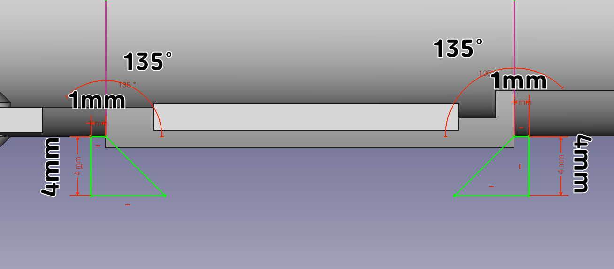

메인 케이스 상단 디자인
^^^^^^^^^^^^^^^^^^^^^^^^^^^^^^^^^^^^

.. raw:: html

    

.. role:: orangecircle
.. role:: blackcircle
.. role:: bluecircle
.. role:: redcircle
.. role:: skybluecircle
.. role:: yellowcircle
.. role:: subtitle
.. role:: subtitlesmall
.. role:: blackbold
.. role:: redbold

.. image:: ../../images/Lv3/Chapter_Modeling/FreeCad_EX3_1.jpg
   :width: 800
   :align: center

|
| 세 번째로 진행해볼 부품은 3D 펜의 메인 케이스중 상단부품입니다.
| 디자인은 위와 같습니다. 두 번째 모델링 보다는 살짝 복잡하지만 그래도 하지 못할 수준은 아닙니다.
| 시작해보겠습니다.
| 

| :subtitle:`Step.1`

| FreeCad 프로그램을 실행해줍니다.
|

.. image:: ../../images/Lv3/Chapter_Modeling/FreeCad_Box_1.png
   :width: 800
   :align: center

| 
| :orangecircle:`●` :blackbold:`새로 만들기` 버튼을 눌러줍니다.
| 

| :subtitle:`Step.2`

.. image:: ../../images/Lv3/Chapter_Modeling/FreeCad_Box_2.png
   :width: 800
   :align: center

|
| :orangecircle:`●` 화면이 바뀌면 상단의 :blackbold:`Start` 버튼을 :blackbold:`Part Design` 으로 변경해줍니다.
|

| :subtitle:`Step.3`

.. image:: ../../images/Lv3/Chapter_Modeling/FreeCad_EX3_2.png
   :width: 800
   :align: center

|
| :blackcircle:`●` XY 평면에 위와 같은 스케치를 작성해 줍니다.
| :blackcircle:`●` x,y,z 축과 만나는 선을 그릴 때는 먼저 선을 다른 곳에 그리고, '점을 선에 일치' 버튼으로 붙여줍니다.
| :blackcircle:`●` 작성 후 스케치를 빠져나옵니다.
|

| :subtitle:`Step.4`

.. image:: ../../images/Lv3/Chapter_Modeling/FreeCad_EX3_3.png
   :width: 800
   :align: center

|
| :orangecircle:`●` 회전 버튼을 눌러줍니다.
| :yellowcircle:`●` 축 항목을 '절대좌표계 Y축' 으로 변경해줍니다.
| :yellowcircle:`●` 각도 항목을 180°으로 입력해줍니다.
| :bluecircle:`●` 모형을 잘 볼 수 있도록 Reverse 항목을 체크해제 해줍니다.
| :skybluecircle:`●` 확인 버튼을 눌러줍니다.
|

| :subtitle:`Step.5`

.. image:: ../../images/Lv3/Chapter_Modeling/FreeCad_EX3_4.png
   :width: 800
   :align: center

|
| :blackcircle:`●` 다시 한번 더 XY 평면에 위와 같은 스케치를 작성해 줍니다.
| :blackcircle:`●` 왼편, 오른편은 서로 대칭입니다.
| :blackcircle:`●` 작성 후 스케치를 빠져나옵니다.
|

| :subtitle:`Step.6`

.. image:: ../../images/Lv3/Chapter_Modeling/FreeCad_EX3_5.png
   :width: 800
   :align: center

|
| :orangecircle:`●` :hoverxref:`돌출 컷 <hoverxref:extrudeCut>` 버튼을 눌러줍니다.
| :yellowcircle:`●` Length를 3.2mm 로 입력합니다.
| :bluecircle:`●` 확인 버튼을 눌러줍니다.
|

| :subtitle:`Step.7`

|
| :blackcircle:`●` XY 평면에 위와 같은 스케치를 작성해 줍니다.
| :blackcircle:`●` x,y,z 축에 선을 그릴 때는 먼저 선을 다른 곳에 그리고, '점을 선에 일치' 버튼으로 붙여줍니다.
| :blackcircle:`●` 작성 후 스케치를 빠져나옵니다.
|

| :subtitle:`Step.8`

.. image:: ../../images/Lv3/Chapter_Modeling/FreeCad_EX3_7.png
   :width: 800
   :align: center

|
| :orangecircle:`●` :hoverxref:`돌출 컷 <hoverxref:extrudeCut>` 버튼을 눌러줍니다.
| :yellowcircle:`●` Type 항목을 '관통'으로 변경해줍니다.
| :bluecircle:`●` 확인 버튼을 눌러줍니다.
|

| 여기까지는 노즐이 들어가는 부분과 열을 빼낼 수 있는 구멍을 만들었습니다.
| 이제 긴 통을 만들어 보도록 하겠습니다.
| 

| :subtitle:`Step.9`

.. image:: ../../images/Lv3/Chapter_Modeling/FreeCad_EX3_8.png
   :width: 800
   :align: center

|
| :blackcircle:`●` XZ 평면에 위와 같은 스케치를 작성해 줍니다.
| :blackcircle:`●` 스케치 그리기 전 View section 기능을 사용해줍니다.
| :blackcircle:`●` 지름이 22.6mm, 25mm 원 2개를 그려줍니다.
|

| :subtitle:`Step.10`

.. image:: ../../images/Lv3/Chapter_Modeling/FreeCad_EX3_9.png
   :width: 800
   :align: center

|
| :blackcircle:`●` 지름이 22.6mm 원에 지름이 1.2mm 원을 그림과 같이 그려줍니다.
| :blackcircle:`●` 대칭을 이용하여 반대편에도 그려줍니다.
|

| :subtitle:`Step.11`

.. image:: ../../images/Lv3/Chapter_Modeling/FreeCad_EX3_10.png
   :width: 800
   :align: center

|
| :orangecircle:`●` `:hoverxref:잘라내기 <hoverxref:trim>` 버튼을 눌러줍니다.
| :blackcircle:`●` 필요없는 부분을 그림과 같이 제거해줍니다.
| :blackcircle:`●` 닫기 버튼을 눌러 스케치를 빠져나옵니다.
|

| :subtitle:`Step.12`

.. image:: ../../images/Lv3/Chapter_Modeling/FreeCad_EX3_11.png
   :width: 800
   :align: center

|
| :orangecircle:`●` :hoverxref:`돌출 <hoverxref:extrude>` 버튼을 눌러줍니다.
| :yellowcircle:`●` Length를 72.5mm 로 입력합니다.
| :bluecircle:`●` 방향이 반대라면 Reversed 항목을 눌러줍니다.
| :skybluecircle:`●` 확인 버튼을 눌러줍니다.
|

| :subtitle:`Step.13`

.. image:: ../../images/Lv3/Chapter_Modeling/FreeCad_EX3_12.png
   :width: 800
   :align: center

|
| :blackcircle:`●` 다시 XZ 평면에 위와 같은 스케치를 작성해 줍니다.
| :blackcircle:`●` 스케치 그리기 전 View section 기능을 사용해줍니다.
| :orangecircle:`●` 이전에 만든 원과 접하도록 스케치를 작성해줍니다.
| :blackcircle:`●` 돌출 컷을 할 용도이기 때문에 치수는 큰 상관이 없습니다.
| :blackcircle:`●` 닫기 버튼을 눌러 스케치를 빠져나옵니다.
|

| :subtitle:`Step.14`

.. image:: ../../images/Lv3/Chapter_Modeling/FreeCad_EX3_13.png
   :width: 800
   :align: center

|
| :orangecircle:`●` :hoverxref:`돌출 컷 <hoverxref:extrudeCut>` 버튼을 눌러줍니다.
| :yellowcircle:`●` Length를 72.5mm 로 입력해 줍니다.
| :bluecircle:`●` 확인 버튼을 눌러줍니다.
|

|
| 조립시 L293D 부품이 살짝 튀어 올라와 있습니다. 지금 모양으로는 공간이 없기 때문에
| 이 부품이 들어갈 공간을 만들어 보겠습니다.
|

| :subtitle:`Step.15`

.. image:: ../../images/Lv3/Chapter_Modeling/FreeCad_EX3_14.png
   :width: 800
   :align: center

|
| :blackcircle:`●` 다시 XZ 평면에 위와 같은 스케치를 작성해 줍니다.
| :blackcircle:`●` 스케치 그리기 전 View section 기능을 사용해줍니다.
| :bluecircle:`●` 큰 원과 작은 원은 파란 원에서 접합니다.
| :yellowcircle:`●` 아래 직선과 큰 원은 직선의 끝점에서 원과 만납니다.
|

| :subtitle:`Step.16`

.. image:: ../../images/Lv3/Chapter_Modeling/FreeCad_EX3_15.png
   :width: 800
   :align: center

|
| :blackcircle:`●` 위 그림과 같은 원을 만들어줍니다.
| :bluecircle:`●` 지름 25mm 원과 파란 원 부분에서 접하도록 합니다.
| :yellowcircle:`●` 미리 그려놓은 직선의 끝점에서 원이 만나도록 합니다.
|

| :subtitle:`Step.17`

.. image:: ../../images/Lv3/Chapter_Modeling/FreeCad_EX3_16.png
   :width: 800
   :align: center

|
| :blackcircle:`●` 잘라내기 기능으로 위 사진처럼 만들어줍니다.
|

| :subtitle:`Step.18`

.. image:: ../../images/Lv3/Chapter_Modeling/FreeCad_EX3_17.png
   :width: 800
   :align: center

|
| :orangecircle:`●` 선 버튼을 눌러줍니다.
| :yellowcircle:`●` 직선을 그려줍니다.
|

| :subtitle:`Step.19`

.. image:: ../../images/Lv3/Chapter_Modeling/FreeCad_EX3_18.png
   :width: 800
   :align: center

|
| :orangecircle:`●` 선 버튼을 눌러줍니다.
| :yellowcircle:`●` 직선을 그려줍니다.
| :blackcircle:`●` 닫기 버튼을 눌러 스케치를 빠져나옵니다.
|

| :subtitle:`Step.20`

|
| :orangecircle:`●` :hoverxref:`돌출 <hoverxref:extrude>` 버튼을 눌러줍니다.
| :redcircle:`●` Type 항목을 '2개의 치수 이용' 으로 변경해줍니다.
| :yellowcircle:`●` Length는 57.75mm 를 입력합니다.
| :yellowcircle:`●` 2nd Length는 -30.25mm를 입력합니다.
| :bluecircle:`●` 방향이 다르다면, Reversed 항목을 체크해줍니다.
| :skybluecircle:`●` 확인 버튼을 눌러줍니다.
|

| :subtitle:`Step.21`

.. image:: ../../images/Lv3/Chapter_Modeling/FreeCad_EX3_20.png
   :width: 800
   :align: center

|
| :blackcircle:`●` 다시 XZ 평면에 위와 같은 스케치를 작성해 줍니다.
| :blackcircle:`●` 스케치 그리기 전 View section 기능을 사용해줍니다.
| :blackcircle:`●` 닫기 버튼을 눌러 스케치를 빠져나옵니다.
|

| :subtitle:`Step.22`

.. image:: ../../images/Lv3/Chapter_Modeling/FreeCad_EX3_21.png
   :width: 800
   :align: center

|
| :orangecircle:`●` :hoverxref:`돌출 <hoverxref:extrude>` 버튼을 눌러줍니다.
| :redcircle:`●` Type 항목을 '2개의 치수 이용' 으로 변경해줍니다.
| :yellowcircle:`●` Length는 54mm 를 입력합니다.
| :yellowcircle:`●` 2nd Length는 2mm를 입력합니다.
| :bluecircle:`●` 방향이 다르다면, Reversed 항목을 체크해줍니다.
| :skybluecircle:`●` 확인 버튼을 눌러줍니다.
|

| :subtitle:`Step.23`

|
| :blackcircle:`●` 다시 XZ 평면에 위와 같은 스케치를 작성해 줍니다.
| :blackcircle:`●` 스케치 그리기 전 View section 기능을 사용해줍니다.
| :blackcircle:`●` 닫기 버튼을 눌러 스케치를 빠져나옵니다.
|

| :subtitle:`Step.24`

.. image:: ../../images/Lv3/Chapter_Modeling/FreeCad_EX3_23.png
   :width: 800
   :align: center

|
| :orangecircle:`●` :hoverxref:`돌출 컷 <hoverxref:extrudeCut>` 버튼을 눌러줍니다.
| :redcircle:`●` Type 항목을 '2개의 치수 이용' 으로 변경해줍니다.
| :yellowcircle:`●` Length는 54mm 를 입력합니다.
| :yellowcircle:`●` 2nd Length는 -33.5mm를 입력합니다.
| :bluecircle:`●` 방향이 다르다면, Reversed 항목을 체크해줍니다.
| :skybluecircle:`●` 확인 버튼을 눌러줍니다.
|

|
| 사각홈이 생겼습니다. 이 홈에는 L293D가 들어갈 수 있습니다.
| 이 부품의 또 다른 역할 중 하나는 모터를 고정시키는 일입니다.
| 3D 펜에는 모터가 있어서 이 모터를 고정해야되는 윗 부분을 모델링 해야 합니다.
| 간단한 부분이기에 이어서 진행해 보겠습니다.
|
|

| :subtitle:`Step.25`

.. image:: ../../images/Lv3/Chapter_Modeling/FreeCad_EX3_24.png
   :width: 800
   :align: center

|
| :blackcircle:`●` 다시 XZ 평면에 위와 같은 스케치를 작성해 줍니다.
| :blackcircle:`●` 스케치 그리기 전 View section 기능을 사용해줍니다.
| :blackcircle:`●` 닫기 버튼을 눌러 스케치를 빠져나옵니다.
|

| :subtitle:`Step.26`

.. image:: ../../images/Lv3/Chapter_Modeling/FreeCad_EX3_25.png
   :width: 800
   :align: center

|
| :orangecircle:`●` :hoverxref:`돌출 <hoverxref:extrude>` 버튼을 눌러줍니다.
| :redcircle:`●` Type 항목을 '2개의 치수 이용' 으로 변경해줍니다.
| :yellowcircle:`●` Length는 72.5mm 를 입력합니다.
| :yellowcircle:`●` 2nd Length는 -56.5mm를 입력합니다.
| :bluecircle:`●` 방향이 다르다면, Reversed 항목을 체크해줍니다.
| :skybluecircle:`●` 확인 버튼을 눌러줍니다.
|

|
| 모터를 고정시켜주는 부분은 생각보다 간단했습니다.
| 이제 케이스 중간쯤에 있는 버튼 부분을 만들어 줄 차례입니다.
|

|

| :subtitle:`Step.27`

|
| :blackcircle:`●` Step22에서 돌출로 생성된 면에 평면을 만들어줍니다.
| :blackcircle:`●` 확인 버튼을 눌러줍니다.
|

| :subtitle:`Step.28`

|
| :blackcircle:`●` 만들어진 평면에 위와 같은 스케치를 작성해 줍니다.
| :blackcircle:`●` 닫기 버튼을 눌러 스케치를 빠져나옵니다.
|

| :subtitle:`Step.29`

.. image:: ../../images/Lv3/Chapter_Modeling/FreeCad_EX3_28.png
   :width: 800
   :align: center

|
| :orangecircle:`●` :hoverxref:`돌출 컷 <hoverxref:extrudeCut>` 버튼을 눌러줍니다.
| :yellowcircle:`●` Length를 10mm로 입력합니다.
| :bluecircle:`●` 확인 버튼을 눌러줍니다.
|

| :subtitle:`Step.30`

.. image:: ../../images/Lv3/Chapter_Modeling/FreeCad_EX3_29.png
   :width: 800
   :align: center

|
| :blackcircle:`●` 다시 만들어진 평면에 위와 같은 스케치를 작성해 줍니다.
| :blackcircle:`●` 닫기 버튼을 눌러 스케치를 빠져나옵니다.
|

| :subtitle:`Step.31`

.. image:: ../../images/Lv3/Chapter_Modeling/FreeCad_EX3_30.png
   :width: 800
   :align: center

|
| :orangecircle:`●` :hoverxref:`돌출 <hoverxref:extrude>` 버튼을 눌러줍니다.
| :redcircle:`●` Type 항목을 '2개의 치수 이용' 으로 변경해줍니다.
| :yellowcircle:`●` Length는 1.5mm 를 입력합니다.
| :yellowcircle:`●` 2nd Length는 3mm를 입력합니다.
| :skybluecircle:`●` 확인 버튼을 눌러줍니다.
| 

| :subtitle:`Step.32`

|
| :bluecircle:`●` 작업 편의를 위해 평면을 숨겨줍니다.
| :orangecircle:`●` 생성된 평면을 선택합니다.
| :yellowcircle:`●` 보기 - 표시 여부 - 선택영역 숨기기를 선택해줍니다.
|

| :subtitle:`Step.33`

.. image:: ../../images/Lv3/Chapter_Modeling/FreeCad_EX3_32.png
   :width: 800
   :align: center

|
| :orangecircle:`●` `:hoverxref:선형 패턴 <hoverxref:linearPattern>` 버튼을 눌러줍니다.
| :yellowcircle:`●` 왼쪽창에서 피처(Feature) 선택에서 최근에 작성한 2개의 작업을 선택해줍니다.
| :blackcircle:`●` 연속 선택은 ctrl 키를 누른 상태에서 클릭합니다.
| :bluecircle:`●` 확인 버튼을 눌러줍니다.
|

| :subtitle:`Step.34`

.. image:: ../../images/Lv3/Chapter_Modeling/FreeCad_EX3_33.png
   :width: 800
   :align: center

|
| :yellowcircle:`●` 방향 항목을 '절대좌표계 Y축'으로 변경해줍니다.
| :orangecircle:`●` 거리 항목을 10mm로 입력해줍니다.
| :bluecircle:`●` 확인 버튼을 눌러줍니다.
|

| :subtitle:`Step.35`

.. image:: ../../images/Lv3/Chapter_Modeling/FreeCad_EX3_34.png
   :width: 800
   :align: center

|
| :bluecircle:`●` step.32에서 생성된 윗면 모서리 2개를 클릭해줍니다.
| :blackcircle:`●` 두 개 선택시 ctrl 키를 누른 상태에서 클릭합니다.
| :orangecircle:`●` `:hoverxref:모따기 <hoverxref:chamfer>` 버튼을 눌러줍니다.
| :yellowcircle:`●` 크기를 1.2mm 로 입력합니다.
| :skybluecircle:`●` 확인 버튼을 눌러줍니다.
|

| :subtitle:`Step.36`

|
| :bluecircle:`●` step.32에서 생성된 아랫면 모서리 2개를 클릭해줍니다.
| :blackcircle:`●` 두 개 선택시 ctrl 키를 누른 상태에서 클릭합니다.
| :orangecircle:`●` `:hoverxref:모따기 <hoverxref:chamfer>` 버튼을 눌러줍니다.
| :yellowcircle:`●` 크기를 1mm 로 입력합니다.
| :skybluecircle:`●` 확인 버튼을 눌러줍니다.
|

| 버튼 부분이 완료되었습니다. 이제 마무리로 모형의 모서리들을 뾰족하지 않게 하기 위해 모따기를 해주도록 하겠습니다.
|

| :subtitle:`Step.37`

|
| :bluecircle:`●` 모형의 앞 부분의 아랫 모서리를 클릭합니다.
| :orangecircle:`●` `:hoverxref:모따기 <hoverxref:chamfer>` 버튼을 눌러줍니다.
| :yellowcircle:`●` 크기를 0.5mm 로 입력합니다.
| :skybluecircle:`●` 확인 버튼을 눌러줍니다.
|

| :subtitle:`Step.38`

.. image:: ../../images/Lv3/Chapter_Modeling/FreeCad_EX3_37.png
   :width: 800
   :align: center

|
| :bluecircle:`●` 모형의 뒷 부분의 윗 모서리 2개를 클릭합니다.
| :blackcircle:`●` 두 개 선택시 ctrl 키를 누른 상태에서 클릭합니다.
| :orangecircle:`●` `:hoverxref:모따기 <hoverxref:chamfer>` 버튼을 눌러줍니다.
| :yellowcircle:`●` 크기를 1.5mm 로 입력합니다.
| :skybluecircle:`●` 확인 버튼을 눌러줍니다.
|

| 이제 마지막 부분이 남아 있습니다. 모따기를 적용하기 어려운 부분이 있습니다.

| 사진 추가

| L293D의 공간을 마련하기 위해 만들어 준 부분의 모서리입니다.
| `:hoverxref:그루브 <hoverxref:groove>` 라는 기능을 이용해서 모따기 처럼 효과를 주도록 하겠습니다.

|
| :subtitle:`Step.39`

.. image:: ../../images/Lv3/Chapter_Modeling/FreeCad_EX3_38.png
   :width: 800
   :align: center

|
| :blackcircle:`●` 이번에는 YZ 평면에 스케치를 생성해줍니다.
| :blackcircle:`●` 스케치 그리기 전 View section 기능을 사용해줍니다.
| :orangecircle:`●` `:hoverxref:외부 Geometry <hoverxref:externalGeometry>` 버튼을 눌러줍니다.
| :bluecircle:`●` 그림과 같이 세로로 길게 된 부분을 클릭해줍니다.
|

|
| :subtitle:`Step.40`

.. image:: ../../images/Lv3/Chapter_Modeling/FreeCad_EX3_39.png
   :width: 800
   :align: center

|
| :blackcircle:`●` step.39에서 생성한 보조선 끝점을 기준으로 그림과 같이 스케치를 작성해줍니다.
|

|
| :subtitle:`Step.41`

|
| :blackcircle:`●` 반대편도 동일하게 작성해줍니다.
| :blackcircle:`●` 닫기 버튼을 눌러 스케치를 빠져나옵니다.
|

|
| :subtitle:`Step.42`

|
| :blackcircle:`●` `:hoverxref:그루브 <hoverxref:groove>` 는 회전과 유사하지만, 부피를 생성하는것이 아닌 제거합니다.
| :orangecircle:`●` 그루브 버튼을 눌러줍니다.
| :yellowcircle:`●` 축 항목을 '절대좌표계 Y축' 으로 변경해줍니다.
| :blackcircle:`●` 스케치 모양을 y축으로 회전시키면서 만나는 부분을 제거해줍니다.
|

|
| :subtitle:`Step.43`

|
| :orangecircle:`●` 만일 뒷부분이 제대로 제거가 안되었을 수 있습니다.
| :yellowcircle:`●` 왼쪽 항목중 Reversed 항목을 체크해줍니다.
| :bluecircle:`●` 마무리 되면, 확인 버튼을 눌러줍니다.
|

|
| 3번째 3D 펜 부품도 모델링을 끝냈습니다. 이번 부품은 역할이 많았습니다.
| 커버의 역할을 하면서도, 버튼을 누를 수 있게 해야하고, 모터를 고정되도록 모델링을 해야했습니다.
| 다음 부품은 마지막 부품입니다. 같이 진행해보겠습니다.
| 

