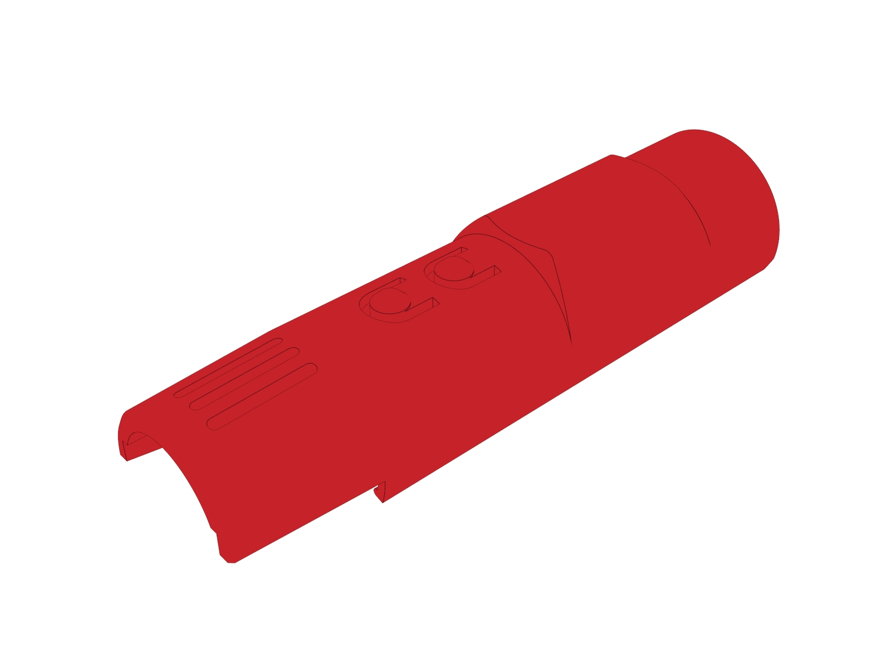
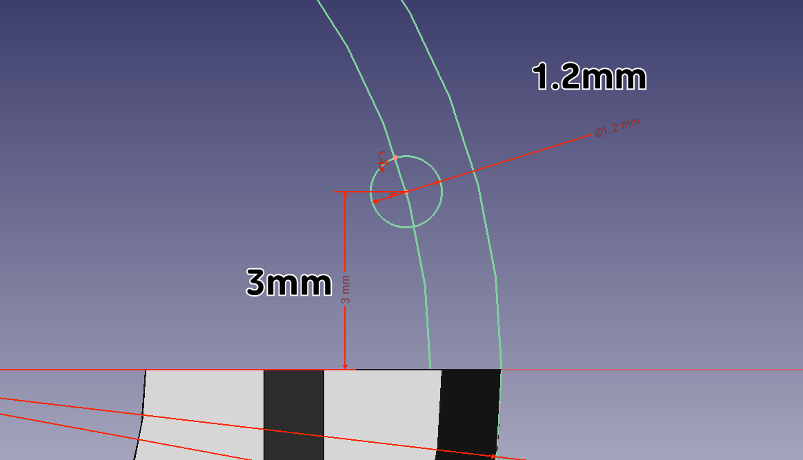

메인 케이스 상단 디자인
^^^^^^^^^^^^^^^^^^^^^^^^^^^^^^^^^^^^

.. raw:: html

    

.. role:: orangecircle
.. role:: blackcircle
.. role:: bluecircle
.. role:: redcircle
.. role:: skybluecircle
.. role:: yellowcircle
.. role:: subtitle
.. role:: subtitlesmall
.. role:: blackbold
.. role:: redbold

|
| 세 번째로 진행해볼 부품은 3D 펜의 메인 케이스중 상단부품입니다.
| 디자인은 위와 같습니다. 두 번째 모델링 보다는 살짝 복잡하지만 그래도 하지 못할 수준은 아닙니다.
| 시작해보겠습니다.
| 

| :subtitle:`Step.1`

| FreeCad 프로그램을 실행해줍니다.
|

.. image:: ../../images/Lv3/Chapter_Modeling/FreeCad_Box_1.png
   :width: 800
   :align: center

| 
| :orangecircle:`●` :blackbold:`새로 만들기` 버튼을 눌러줍니다.
| 

| :subtitle:`Step.2`

.. image:: ../../images/Lv3/Chapter_Modeling/FreeCad_Box_2.png
   :width: 800
   :align: center

|
| :orangecircle:`●` 화면이 바뀌면 상단의 :blackbold:`Start` 버튼을 :blackbold:`Part Design` 으로 변경해줍니다.
|

| :subtitle:`Step.3`

.. image:: ../../images/Lv3/Chapter_Modeling/FreeCad_EX3_2.png
   :width: 800
   :align: center

|
| :blackcircle:`●` XY 평면에 위와 같은 스케치를 작성해 줍니다.
| :blackcircle:`●` x,y,z 축에 선을 그릴 때는 먼저 선을 다른 곳에 그리고, '점을 선에 일치' 버튼으로 붙여줍니다.
| :blackcircle:`●` 작성 후 스케치를 빠져나옵니다.
|

| :subtitle:`Step.4`

.. image:: ../../images/Lv3/Chapter_Modeling/FreeCad_EX3_3.png
   :width: 800
   :align: center

|
| :orangecircle:`●` 회전 버튼을 눌러줍니다.
| :yellowcircle:`●` 축 항목을 '절대좌표계 Y축' 으로 변경해줍니다.
| :yellowcircle:`●` 각도 항목을 180°으로 입력해줍니다.
| :bluecircle:`●` 모형을 잘 볼 수 있도록 Reverse 항목을 체크해제 해줍니다.
| :skybluecircle:`●` 확인 버튼을 눌러줍니다.
|

| :subtitle:`Step.5`

|
| :blackcircle:`●` 다시 한번 더 XY 평면에 위와 같은 스케치를 작성해 줍니다.
| :blackcircle:`●` 왼편, 오른편은 서로 대칭입니다.
| :blackcircle:`●` 작성 후 스케치를 빠져나옵니다.
|

| :subtitle:`Step.6`

.. image:: ../../images/Lv3/Chapter_Modeling/FreeCad_EX3_5.png
   :width: 800
   :align: center

|
| :orangecircle:`●` 돌출 컷 버튼을 눌러줍니다.
| :yellowcircle:`●` Length를 3.2mm 로 입력합니다.
| :bluecircle:`●` 확인 버튼을 눌러줍니다.
|

| :subtitle:`Step.7`

.. image:: ../../images/Lv3/Chapter_Modeling/FreeCad_EX3_6.png
   :width: 800
   :align: center

|
| :blackcircle:`●` XY 평면에 위와 같은 스케치를 작성해 줍니다.
| :blackcircle:`●` x,y,z 축에 선을 그릴 때는 먼저 선을 다른 곳에 그리고, '점을 선에 일치' 버튼으로 붙여줍니다.
| :blackcircle:`●` 작성 후 스케치를 빠져나옵니다.
|

| :subtitle:`Step.8`

|
| :orangecircle:`●` 돌출 컷 버튼을 눌러줍니다.
| :yellowcircle:`●` Type 항목을 '관통'으로 변경해줍니다.
| :bluecircle:`●` 확인 버튼을 눌러줍니다.
|

| 여기까지는 노즐이 들어가는 부분과 열을 빼낼 수 있는 구멍을 만들었습니다.
| 이제 긴 통을 만들어 보도록 하겠습니다.
| 

| :subtitle:`Step.9`

|
| :blackcircle:`●` XZ 평면에 위와 같은 스케치를 작성해 줍니다.
| :blackcircle:`●` 스케치 그리기 전 View section 기능을 사용해줍니다.
| :blackcircle:`●` 지름이 22.6mm, 25mm 원 2개를 그려줍니다.
|

| :subtitle:`Step.10`

|
| :blackcircle:`●` 지름이 22.6mm 원에 지름이 1.2mm 원을 그림과 같이 그려줍니다.
| :blackcircle:`●` 대칭을 이용하여 반대편에도 그려줍니다.
|

| :subtitle:`Step.11`

.. image:: ../../images/Lv3/Chapter_Modeling/FreeCad_EX3_10.png
   :width: 800
   :align: center

|
| :orangecircle:`●` 잘라내기 버튼을 눌러줍니다.
| :blackcircle:`●` 필요없는 부분을 그림과 같이 제거해줍니다.
| :blackcircle:`●` 닫기 버튼을 눌러 스케치를 빠져나옵니다.
|

| :subtitle:`Step.12`

|
| :orangecircle:`●` 돌출 버튼을 눌러줍니다.
| :yellowcircle:`●` Length를 72.5mm 로 입력합니다.
| :bluecircle:`●` 방향이 반대라면 Reversed 항목을 눌러줍니다.
| :skybluecircle:`●` 확인 버튼을 눌러줍니다.
|

| :subtitle:`Step.13`

.. image:: ../../images/Lv3/Chapter_Modeling/FreeCad_EX3_12.png
   :width: 800
   :align: center

|
| :blackcircle:`●` 다시 XZ 평면에 위와 같은 스케치를 작성해 줍니다.
| :blackcircle:`●` 스케치 그리기 전 View section 기능을 사용해줍니다.
| :orangecircle:`●` 이전에 만든 원과 접하도록 스케치를 작성해줍니다.
| :blackcircle:`●` 돌출 컷을 할 용도이기 때문에 치수는 큰 상관이 없습니다.
| :blackcircle:`●` 닫기 버튼을 눌러 스케치를 빠져나옵니다.
|

| :subtitle:`Step.14`

.. image:: ../../images/Lv3/Chapter_Modeling/FreeCad_EX3_13.png
   :width: 800
   :align: center

|
| :orangecircle:`●` 돌출 컷 버튼을 눌러줍니다.
| :yellowcircle:`●` Length를 72.5mm 로 입력해 줍니다.
| :bluecircle:`●` 확인 버튼을 눌러줍니다.
|

|
| 조립시 L293D 부품이 살짝 튀어 올라와 있습니다. 지금 모양으로는 공간이 없기 때문에
| 이 부품이 들어갈 공간을 만들어 보겠습니다.
|

| :subtitle:`Step.15`

.. image:: ../../images/Lv3/Chapter_Modeling/FreeCad_EX3_14.png
   :width: 800
   :align: center

|
| :blackcircle:`●` 다시 XZ 평면에 위와 같은 스케치를 작성해 줍니다.
| :blackcircle:`●` 스케치 그리기 전 View section 기능을 사용해줍니다.
| :bluecircle:`●` 큰 원과 작은 원은 파란 원에서 접합니다.
| :yellowcircle:`●` 아래 직선과 큰 원은 직선의 끝점에서 원과 만납니다.
|

| :subtitle:`Step.16`

.. image:: ../../images/Lv3/Chapter_Modeling/FreeCad_EX3_15.png
   :width: 800
   :align: center

|
| :blackcircle:`●` 위 그림과 같은 원을 만들어줍니다.
| :bluecircle:`●` 지름 25mm 원과 파란 원 부분에서 접하도록 합니다.
| :yellowcircle:`●` 미리 그려놓은 직선의 끝점에서 원이 만나도록 합니다.
|

| :subtitle:`Step.17`

|
| :blackcircle:`●` 잘라내기 기능으로 위 사진처럼 만들어줍니다.
|

| :subtitle:`Step.18`

.. image:: ../../images/Lv3/Chapter_Modeling/FreeCad_EX3_17.png
   :width: 800
   :align: center

|
| :orangecircle:`●` 선 버튼을 눌러줍니다.
| :yellowcircle:`●` 직선을 그려줍니다.
|

| :subtitle:`Step.19`

|
| :orangecircle:`●` 선 버튼을 눌러줍니다.
| :yellowcircle:`●` 직선을 그려줍니다.
| :blackcircle:`●` 닫기 버튼을 눌러 스케치를 빠져나옵니다.
|

| :subtitle:`Step.20`

.. .. image:: ../../images/Lv3/Chapter_Modeling/FreeCad_EX3_19.png
..    :width: 800
..    :align: center

.. |
.. | :orangecircle:`●` 선 버튼을 눌러줍니다.
.. | :yellowcircle:`●` 직선을 그려줍니다.
.. |
