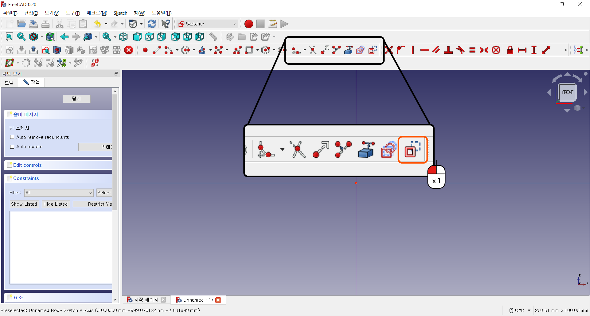
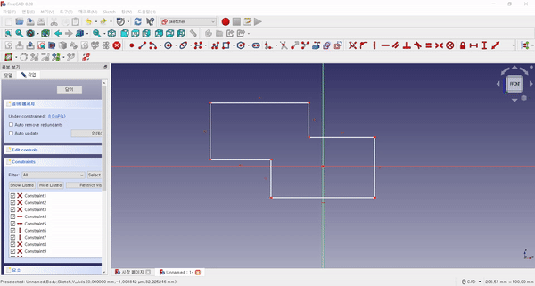

스케치 편집 기능
^^^^^^^^^^^^^^^^^^^^^^^^^^^^^^^^^^^^

.. raw:: html

    

.. role:: orangecircle
.. role:: blackcircle
.. role:: bluecircle
.. role:: skybluecircle
.. role:: yellowcircle
.. role:: subtitle
.. role:: subtitlesmall
.. role:: blackbold
.. role:: redbold

| 이제는 그려진 도형을 이리저리 수정하고 다듬는 기능을 알아봅니다.
| 

|
| 편집 기능의 첫 번째는 :blackbold:`모깍기(Fillet)` 입니다. 모서리를 깍는다는 말인데 파트 디자인에서도 사용됩니다.
| 여기에서는 사각형을 기준으로 설명 드리겠습니다.
|

|
| 2개의 직선을 연속으로 클릭해주면, 꼭지점이 둥글게 변경됩니다.
|

|
| 두번째 기능으로는 :blackbold:`잘라내기(Trim)` 입니다.
| 교차된 선들 중에 필요없는 선들을 제거하는 기능입니다.
|

.. image:: ../../images/Lv3/Chapter_Modeling/FreeCad_Sketch_17.gif
   :width: 800
   :align: center

|
| 잘라내기 기능을 선택하고 교차된 선중 제거할 선을 클릭하면, 선이 제거됩니다.
|

|
| 세번째 기능으로는 :blackbold:`Geometry 타입 변경` 입니다.
| 이 기능은 그려진 선을 실제 사용할 선이 아니라 참조만할 선으로 변경해주는 겁니다.
| 보조선이라고 이해하시면 됩니다.
| 

|
| 이 기능은 그려진 선을 먼저 선택하고, :blackbold:`Geometry 타입 변경` 버튼을 눌러줍니다.
| 눌러주면, 선의 색상이 파란색으로 변하게 됩니다. 이 선은 보조선으로 인식합니다.
|