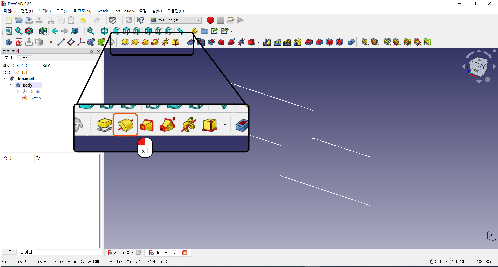
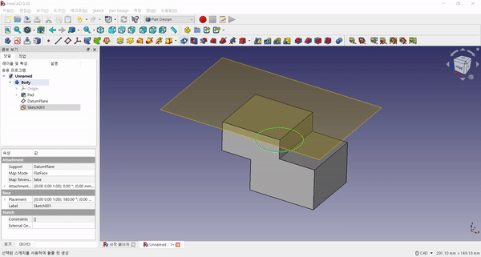

파트 디자인 
^^^^^^^^^^^^^^^^^^^^^^^^^^^^^^^^^^^^

.. raw:: html

    

.. role:: orangecircle
.. role:: blackcircle
.. role:: bluecircle
.. role:: skybluecircle
.. role:: yellowcircle
.. role:: subtitle
.. role:: subtitlesmall
.. role:: blackbold
.. role:: redbold

| 파트디자인에서는 만들어진 스케치를 이용하여, 3차원 도형을 만드는 작업을 합니다.
| 
| 스케치의 모양으로 부피를 생성하거나, 부피를 줄이는 것이 가능합니다.
| 여러 파트디자인의 기능들을 알아보도록 하겠습니다.
|

| :subtitle:`돌출`

|
| 첫번째 기능으로는 :blackbold:`돌출` 입니다.
| 상자 만들기에서 사용했던 기능입니다.
| 이 기능에 대해서 좀 더 알아보도록 하겠습니다.
| 

| 
| 스케치를 만들고 :blackbold:`돌출` 을 클릭하면, 스케치 모양 대로 부피가 생성됩니다.
| 여기에서 옆에 나오는 창에서 좀 더 세세한 설정을 할 수 있습니다.
| 

|
| 돌출의 설정으로는 타입(Type)가 있습니다. 이 타입에는 여러가지가 있습니다.
| 먼저 치수 입력하는 방식(Dimension)은 아래 길이(Length)에 입력된 값 만큼 돌출시켜줍니다.
| 끝까지(To Last)는 현재 적용이 안됩니다. 이후 배울 :blackbold:`돌출 컷` 에서 사용가능합니다.
| 또한 첫 번째 만나는 면까지, 곡면까지 등등이 있습니다만. 가장 많이 사용하는 것이 Dimension 방식입니다.
|
| 돌출의 두번째 설정으로는 Direction/edge 가 있습니다. 방향을 설정할 수 있는 부분입니다.
|

.. image:: ../../images/Lv3/Chapter_Modeling/FreeCad_PartDesign_4.png
   :width: 800
   :align: center

.. raw:: html

    <center-text-for-figure>일반 돌출(왼), 설정된 방향으로 돌출(오)</center-text-for-figure>  

|
| :blackbold:`select reference` 를 선택하고 미리 그려진 선을 클릭하면, 위와 같이 방향이 다르게 돌출됩니다.
|
| :blackbold:`symmetric to plane` 항목은 돌출의 방향을 스케치 평면을 기준으로 양방향으로 돌출됩니다.
| 
| :blackbold:`reversed` 항목은 돌출의 방향을 반대로 해줍니다.
|
| 각각의 항목들을 클릭해보면서 결과물이 어떻게 달라지는지 확인해보세요.

|
| 돌출 뿐만 아니라 다른 작업을 하다보면, 에러가 나타날 수 있습니다. 그럴 경우에는 스케치에 문제가 있을 가능성이 있습니다.
| 스케치를 다시 작성해보세요. 특히 스케치를 작업할 때 잘라내기(Trim) 기능을 많이 사용했을 수록 아주 작은 부분에서 선 곂침이나 꼬임이 있을 수 있습니다.
| 무료 프로그램이라 이런 기능이 완벽하지 않은 모습입니다. 
|
|

| :subtitle:`회전`

|
| 두번째 기능은 :blackbold:`회전` 입니다. 회전이라는 번역이 적절하진 않지만, 이후 만들어진 물체를 회전시키는 것과 혼동될 수 있으니 유의해주세요.
| 

.. image:: ../../images/Lv3/Chapter_Modeling/FreeCad_PartDesign_6.jpg
   :width: 800
   :align: center

|
| 회전 기능을 사용하기전에 스케치를 살짝 수정합니다. 
| 스케치가 없다면, 새로 그려주세요.
| 스케치의 도형을 초록, 파란(혹은 빨간)선에 곂치지 않게 이동시켜줍니다.
| 이동 후 스케치를 닫아줍니다.
|

|
| 그려진 스케치에 회전을 누르게 되면, 스케치 모양이 회전하면서 그려지는 도형을 만듭니다.
| 이 때문에 회전을 하려면, 스케치와 회전할 축이 필요합니다.
| 여기에서는 회전 축을 X축, Y축으로 설정하였습니다.
|

.. image:: ../../images/Lv3/Chapter_Modeling/FreeCad_PartDesign_8.png
   :width: 500
   :align: center

|
| 왼편의 창에는 회전할 축을 선택할 수 있는 항목과 회전할 각도가 있습니다.
| 각도는 기본적으로 360도 이며, 변경하게 되면, 변경한 만큼만 회전된 도형을 만듭니다.
|
|
| :subtitle:`평면`

|
| 세번째로 알아볼 기능은 평면입니다.
| 기본적으로 있는 xy, yz, xz 평면 이외에 다른 평면을 만들어주는 기능입니다.
| 평면의 기능들은 여러가지가 있지만 여기에서는 다 다루지 않고, 자주 사용할 기능만 알려드리겠습니다.
|

| 기본적으로 평면을 만들려면 미리 만든 물체가 있으면 좋습니다.
|

| 
| 이런 도형의 윗면을 포함하는 평면을 만들려고 한다면, 평면 버튼을 클릭하고, 도형의 윗면을 클릭하면 평면이 만들어 집니다.
| 이후 왼편의 :blackbold:`확인` 버튼을 눌러줍니다.
| 
|
| :subtitle:`돌출 컷`

|
| 돌출 컷은 돌출과 방식은 유사하지만, 부피를 생성하는 것이 아닌 제거합니다.
| 사용하려면, 만들어진 도형과 스케치가 있어야 합니다.
| ※스케치 사용시 선이 파란색이면 :blackbold:`Geometry 타입 변경` 을 사용해서 흰색선으로 변경해 줍니다.
|

|
| 돌출 컷을 사용하면, 스케치의 모양대로 부피가 제거되는 것을 확인할 수 있습니다.
| 

| :subtitle:`필렛`

|
| 필렛은 모형의 모서리를 둥그렇게 만들어주는 기능입니다.
| 

.. image:: ../../images/Lv3/Chapter_Modeling/FreeCad_PartDesign_14.gif
   :width: 800
   :align: center

|
| 둥그렇게 해줄 모서리를 선택합니다. 이후 `:hoverxref:필렛 <hoverxref:fillet>` 버튼을 누르면, 1mm 만큼 둥글어집니다.
| 왼편의 창에서 치수를 변경하여, 원하는 크기만큼 변경시켜 줍니다.
|

| :subtitle:`모따기`

.. image:: ../../images/Lv3/Chapter_Modeling/FreeCad_PartDesign_15.png
   :width: 800
   :align: center

|
| 모따기는 필렛과 비슷하지만, 둥그런 모양이 아닌 각진 모양으로 만들어 줍니다.
|

|
| 다듬어줄 모서리를 선택합니다. 이후 모따기 버튼을 누르면 1mm 만큼 각져집니다.
| 왼편의 창에서 치수를 변경하여, 원하는 크기만큼 변경시켜 줍니다.
|

| :subtitle:`숨기기`

| 파트 디자인에서 작업을 하다보면, 평면이나 스케치등을 잠시 숨겨둬야 모형이 잘보일 때가 있습니다.
| 이때 숨기기 기능을 활용할 수 있습니다.
|

.. image:: ../../images/Lv3/Chapter_Modeling/FreeCad_PartDesign_17.jpg
   :width: 800
   :align: center

|
| 숨기기는 방법은 많지만, 메뉴 중 보기 - 표시 여부 - 선택영역 숨기기 을 이용하는 방식을 주로 사용할 계획입니다.
| 아직은 선택한 부분이 없기 때문에 버튼이 비활성화 되어 있습니다. 
|

|
| 평면을 숨기려면, 숨길 평면을 선택합니다.
| 이에서 메뉴로 이동하여 보기 - 표시 여부 - 선택영역 숨기기 를 클릭하면, 평면이 숨겨집니다.
|
