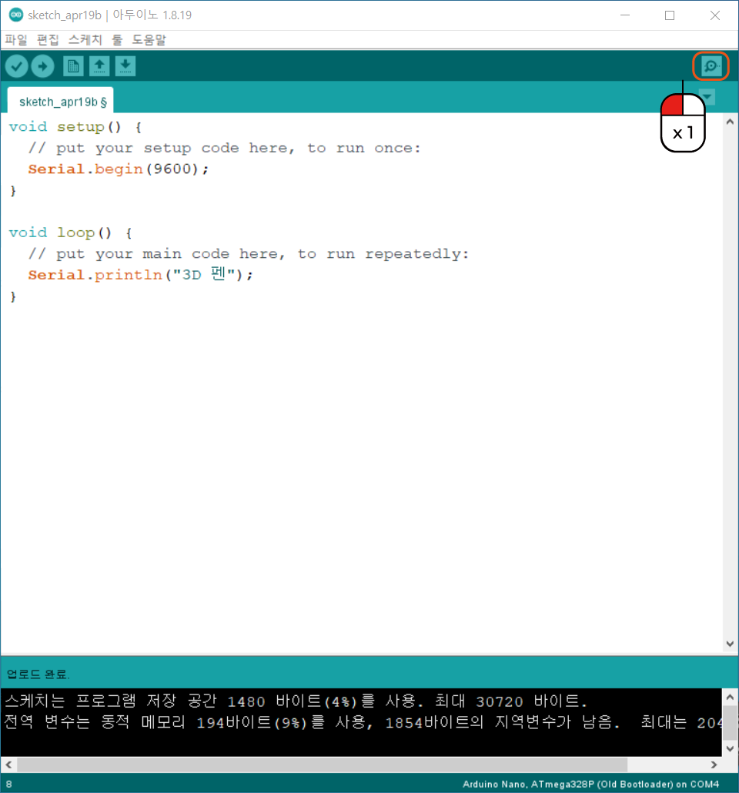
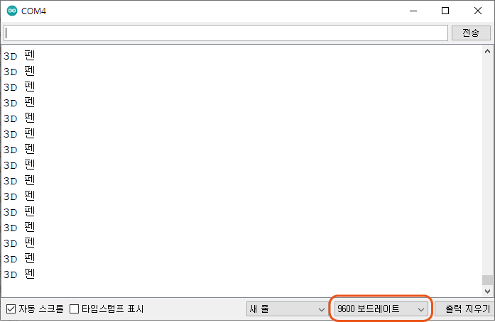

시리얼 통신
^^^^^^^^^^^^^^^^^^^^^^^^^^^^^^^^^^^^

.. raw:: html

    

.. role:: orangecircle
.. role:: blackcircle
.. role:: bluecircle
.. role:: skybluecircle
.. role:: yellowcircle
.. role:: subtitle
.. role:: subtitlesmall
.. role:: blackbold
.. role:: redbold

| 온도 관련된 작업을 하기에 앞서서, 보드의 현재 상태를 알 수 있는 시리얼 통신에 대해서 간략히 설명하겠습니다.
| 아두이노에서 시리얼 통신은 컴퓨터와 보드간에 통신을 의미합니다. 따라서 컴퓨터에 연결되어 있어야 합니다.
| :blackbold:`시리얼 통신으로 원하는 변수값이나 문자를 시리얼 모니터에 출력되도록` 구현하는 것이 목표입니다.
|
| 시리얼 통신은 먼저 통신속도를 설정해야 합니다. 통신속도는 한번만 설정하면 되므로 setup 함수에 작성합니다.

.. code-block:: c++
    :emphasize-lines: 3

    void setup() {
        // put your setup code here, to run once:
        Serial.begin(9600);
    }

    void loop() {
        // put your main code here, to run repeatedly:

    }

| 보통 9600 속도를 설정합니다. 기타 다른 속도들도 있습니다만 여기에서는 9600을 기준으로 합니다.
| 속도 설정 함수는 Serial.begin 으로 매개변수로 9600을 설정합니다.
| ※매개변수에 대해 까먹으신 분들은 :ref:`여기 <targetL3C6S7_1>` 로 이동합니다.

.. code-block:: c++
    :emphasize-lines: 8

    void setup() {
        // put your setup code here, to run once:
        Serial.begin(9600);
    }

    void loop() {
        // put your main code here, to run repeatedly:
        Serial.println("3D 펜");
    }

| Serial.println 함수를 사용하여 시리얼 모니터에 출력하고자 하는 값을 정합니다. 문자라면 " " 와 같이 따옴표를 적어줘야 합니다.
| 작성이 다 되었으면, 업로드를 합니다.
|

|
| :orangecircle:`●` 업로드가 완료되면, 오른편 상단의 시리얼 모니터 버튼을 클릭합니다.
|

|
| :blackcircle:`●` 시리얼 모니터에 :blackbold:`3D 펜` 이 계속해서 출력되는 것을 볼 수 있습니다.
| :orangecircle:`●` 시리얼 모니터에 아무것도 표시가 안되서나 이상한 문자가 표시되면, 아래쪽에 :blackbold:`9600 보드레이트` 라고 설정되어 있는지 확인합니다.
|

| 0부터 1씩 증가하는 숫자가 시리얼 모니터에 출력되도록 코드를 작성해봅니다.
| 실제로 업로드 후 아래 코드랑 비교해봅니다.

.. toggle::
    
    .. code-block:: c++
        :emphasize-lines: 8

        int num = 0;

        void setup() {
            // put your setup code here, to run once:
            Serial.begin(9600);
        }

        void loop() {
            // put your main code here, to run repeatedly:
            num  = num + 1;
            Serial.println(num);
        }