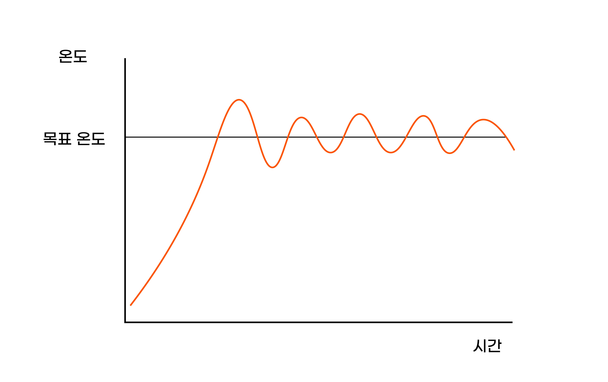
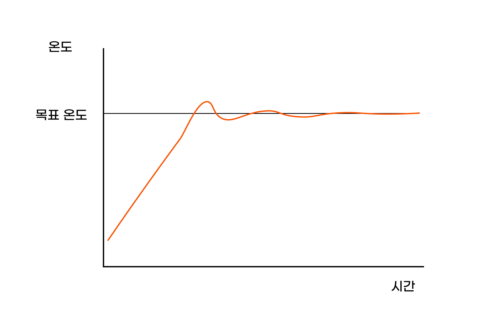
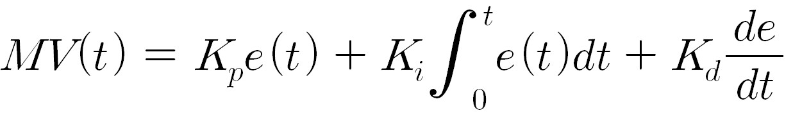
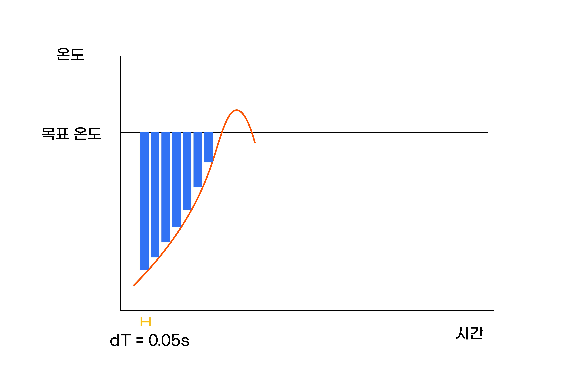
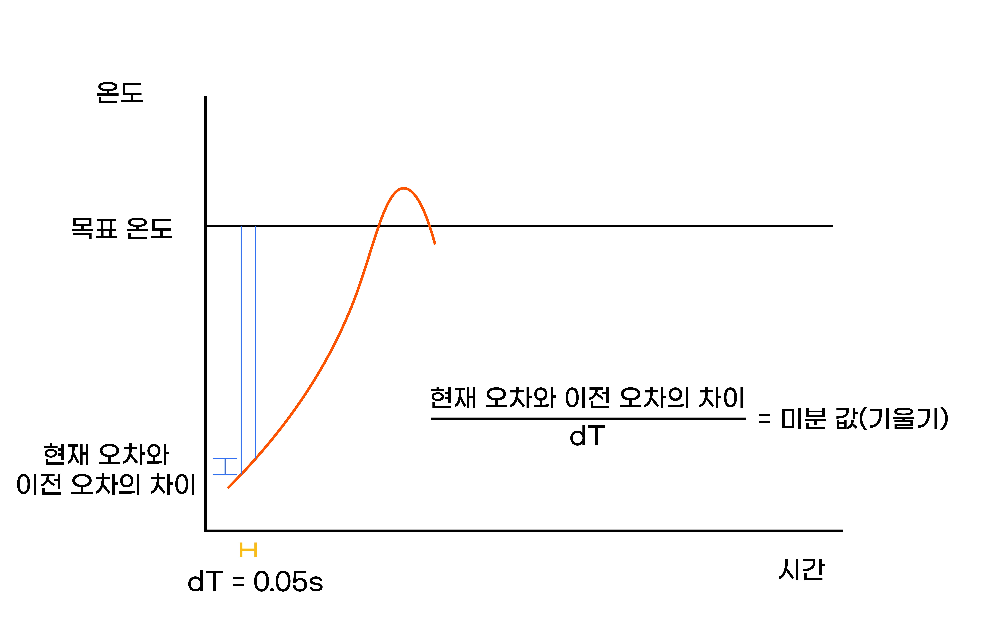

.. _targetL3C9S4_0:

예열
^^^^^^^^^^^^^^^^^^^^^^^^^^^^^^^^^^^^

.. raw:: html

    

.. role:: orangecircle
.. role:: blackcircle
.. role:: bluecircle
.. role:: skybluecircle
.. role:: yellowcircle
.. role:: subtitle
.. role:: subtitlesmall
.. role:: blackbold
.. role:: redbold

| 이번 단계는 예열에 대해서 좀 더 자세하게 알아보도록 하겠습니다. 이전의 코드에서 예열을 하는 핵심 코드는 아래 코드입니다.

.. code-block:: c++
    :linenos:

    digitalWrite(9, HIGH);
    
| 노즐 열선과 연결된 디지털 9번핀을 HIGH 로 설정하게 되면, 모스펫을 통해 전류가 공급되어, 온도가 올라갑니다.
| 그리고 목표온도에 도달하면, LOW 로 변경하여 전류를 차단합니다. 이런 방식에는 문제가 하나 있습니다.
|

|
| OnOff 방식은 목표 온도에 도달해야만 Off가 됨으로 목표 온도에 도달이 어렵고, 출렁이는 것이 반복 됩니다.
| 보통 온도에 근접하려면, 목표온도에 도달하기 전에 Off가 되어야 근접하게 도달합니다. 
| 이런 문제를 해결하는 제어가 있습니다.
| 
| PID 제어라고 보통은 목표치에 도달을 부드럽게 해주는 제어방식입니다.
| P는 비례, I는 적분, D는 미분을 뜻하며, 아래의 그림과 같이 부드럽게 올라갈 수 있도록 해줍니다.
|

|
| PID 제어는 주변에서 많이 사용됩니다. 에어컨, 히터의 온도유지, 전기레인지의 온도 유지, 가습기의 습도 유지, 드론의 균형유지등이 있습니다.
| 아래는 PID 제어의 수식입니다.
|

|
| 적분이 있고 미분도 있고, 식 자체가 어렵게 느껴질 수 있습니다. 하지만 이걸 이해하는것은 지금 3D 펜을 만드는덴 필요하지 않습니다. 우리는 어떻게 사용하는지만 알고 있으면 됩니다.
| 사용 법은 Kp, Ki, Kd 값을 조절하는 것입니다. 자세한 설명보다 그림을 보도록 하겠습니다.
|

.. image:: ../../images/Lv3/Chapter_9/Step4_4.gif
   :width: 600
   :align: center

| ※ 위 영상이미지의 출처는 https://ko.wikipedia.org/wiki/PID_%EC%A0%9C%EC%96%B4%EA%B8%B0 입니다.
|
| 위 이미지 처럼 Kp와 Ki, Kd 값이 변경됨에 따라 목표 온도에 도달하고, 도달 후의 그래프가 달라집니다.
| 이렇게 동작하는 부분을 코드로 작성해보려 합니다.
| 미분과 적분에 대해 배운적이 없거나 이해가 어려우신 분들은 아래 단계는 훑어보고 넘어가셔도 됩니다.

.. code-block:: c++
    :linenos:

    float Kp=36, Ki=2.5, Kd=0.625, dT = 0.05;
    int16_t error, previousError = 0; // 오차 변수
    float integral, derivaitve = 0;   // 적분 미분 변수

    void getPIDoutput(int targetTemp, int actualValue)
    {        
        float outputValue;
    }

| 먼저 getPIDoutput 이라는 함수를 만들어 줍니다. 함수의 :hoverxref:`매개변수 <hoverxref:parameters>` 는 targetTemp(목표온도), curTemp(현재온도) 로 되어 있습니다.
| 다양한 변수도 생성했습니다. Error는 오류라는 뜻이 아니고 여기에서는 오차라는 뜻으로 사용됩니다. 목표온도와 현재온도의 차이라고 보시면 됩니다.
| 
| integral은 적분 값을 저장하는 변수, derivaitve는 미분 값을 저장하는 변수입니다.
| PID 값은 각각 15,1,1 로 설정한 상태이며, dT는 적분, 미분을 위한 변수입니다.

.. code-block:: c++
    :linenos:

    float Kp=36, Ki=2.5, Kd=0.625, dT = 0.05;
    int16_t error, previousError = 0; // 오차 변수
    float integral, derivaitve = 0;   // 적분 미분 변수

    void getPIDoutput(int targetTemp, int actualValue)
    {        
        float outputValue;
        
        // 에러 값 저장 
        error = targetTemp - actualValue;

        // 적분 값 저장
        integral = sumError + (float)error*dT;
    }

| 적분 값은 측정의 한계로 인해 근사적으로 계산됩니다. 
|

|
| 위와 같이 목표온도-설정온도의 차이를 dT 만큼 곱하면, 그림 상의 파란색 사각형 하나의 면적으로 계산되어서 옵니다.
| 그렇다면 dT가 왜 0.05초 인가? 라고 궁금할 수 있을 겁니다. 이후 최종 코드에서 함수를 0.05초마다 한 번씩 실행되도록 코드를 작성할 것이기 때문에 미리 0.05로 설정하였습니다.

.. code-block:: c++
    :linenos:

    float Kp=36, Ki=2.5, Kd=0.625, dT = 0.05;
    int16_t error, previousError = 0; // 오차 변수
    float integral, derivaitve = 0;   // 적분 미분 변수

    void getPIDoutput(int targetTemp, int actualValue)
    {        
        float outputValue;
        
        // 에러 값 저장 
        error      = targetTemp - actualValue;

        // 적분 값 저장
        integral   = sumError + (float)error*dT;

        // 미분 값 저장
        derivaitve = (error - previousError)/dT;
        previousError = error;
    }

| 미분 값은 이전 오차와 현재 오차간의 차이를 기울기 형태로 나타냅니다. 기울기를 측정하면 이전 오차 변수(previousError)에 현재 오차 값을 저장합니다.
|

|
| 현재 오차(설정온도와 현재온도간의 차이)와 이전 오차간의 차이를 알면, 미분값을 근사적으로 계산할 수 있습니다.

.. code-block:: c++
    :linenos:

    float Kp=36, Ki=2.5, Kd=0.625, dT = 0.05;
    int16_t error, previousError = 0; // 오차 변수
    float integral, derivaitve = 0;   // 적분 미분 변수

    void getPIDoutput(int targetTemp, int actualValue)
    {        
        float outputValue;
        
        // 에러 값 저장 
        error      = targetTemp - actualValue;

        // 적분 값 저장
        integral   = integral + (float)error*dT;

        // 미분 값 저장
        derivaitve = ((float)error - (float)previousError)/dT;
        previousError = error;

        // PID 계산
        outputValue = Kp*error + Ki*integral + Kp*derivaitve;

        // output 값이 0~255 범위를 벗어나면 최대, 최소 값을 대신 저장
        if(outputValue > 255)
        {
            outputValue = 255;
        }
        else if(outputValue <0)
        {
            outputValue = 0;
        }
        
        // 계산된 결과값을 디지털 9번핀에 analogWrite 로 입력
        analogWrite(9,outputValue);
    }

|
| 최종적으로 계산되어 반환되는 outputValue 를 노즐 열선과 연결된 디지털 9번핀(D9)에 :hoverxref:`analogWrite <hoverxref:analogWrite>` 함수로 입력해주면 됩니다.
| 디지털 핀에 :hoverxref:`analogWrite <hoverxref:analogWrite>` 함수가 사용가능한 이유는 PWM 핀이기 때문입니다.

.. code-block:: c++
        :linenos:

        int tempValueA0 = 0; // A0 신호 값 저장용
        int curTemp = 0;
        int targetTemp = 0;
        int presetIndex = 0;
        bool isHeating = false; // 예열 상태를 확인하는 확인하는 bool 변수

                         // 기본, PCL, PLA
        int presetTemp[3] = { 0,  60,  200 };

        int temptable[23][2] = 
        {
            {1023,0},
            {1022,10},
            {1020,20},
            {1016,30},
            {1011,40},
            {1009,50},
            {1006,60},
            {1004,70},
            {1000,80},
            {990,90},
            {983,100},
            {976,110},
            {972,120},
            {964,130},
            {955,140},
            {942,150},
            {929,160},
            {910,170},
            {895,180},
            {864,190},
            {839,200},
            {800,210},
            {744,220}
        }; // 온도테이블

        void setup() {
            // put your setup code here, to run once:
            Serial.begin(9600);

            pinMode(11,INPUT_PULLUP);
            pinMode(12,INPUT_PULLUP);

            pinMode(9,OUTPUT);
        }

        float Kp=36, Ki=2.5, Kd=0.625, dT = 0.05;
        int16_t error, previousError = 0; // 오차 변수
        float integral, derivaitve = 0;   // 적분 미분 변수

        // pid 계산을 하고, 결과값을 HEATER_EN 핀에 적용
        void getPIDoutput(int targetTemp, int actualValue)
        {            
            float outputValue;

            //설정온도에 도달하기 10도 전일때부터 PID 제어 시작
            if(curTemp < setTemperature - 10)
            {
              outputValue = 255;
            }
            else
            {
                // 에러 값 저장 
                error      = targetTemp - actualValue;

                // 적분 값 저장
                integral   = integral + (float)error*dT;

                // 미분 값 저장
                derivaitve = ((float)error - (float)previousError)/dT;
                previousError = error;

                // PID 계산
                outputValue = Kp*error + Ki*integral + Kp*derivaitve;

                // output 값이 0~255 범위를 벗어나면 최대, 최소 값을 대신 저장
                if(outputValue > 255)
                {
                    outputValue = 255;
                }
                else if(outputValue <0)
                {
                    outputValue = 0;
                }

                // outputValue 가 0 혹은 OFF 라면 예열이 되지 않음으로, isHeating 변수를 false로 저장
                if(outputValue == 0 || material_index == 0)
                {
                    isHeating = false;
                }
                else
                {
                    isHeating = true;
                }
            }
            // 계산된 결과값을 디지털 9번핀에 analogWrite 로 입력
            analogWrite(9,outputValue);
        }

        // 신호 값을 보정하여 온도 값을 추측해내는 계산 함수
        int tempCali(int valueA0)
        {
            float ratioTemp;

            for(int i = 0; i<23; i++)
            {
                if(temptable[i][0] <= valueA0) 
                {
                    ratioTemp = ((float)valueA0 - temptable[i][0])/(temptable[i-1][0] - temptable[i][0]);

                    return temptable[i][1] - ratioTemp*(temptable[i][1] - temptable[i-1][1]);
                }

            }
        }

        void loop() {
            // put your main code here, to run repeatedly: 
            curTemp = tempCali(analogRead(A0)); // 온도 보상 함수 호출

            Serial.print("신호 값 : ");        
            Serial.print(analogRead(A0));        
            Serial.print(", 현재 온도 값 : ");
            Serial.print(curTemp);   
            Serial.print(", 설정 온도 값 : ");
            Serial.println(targetTemp);

            getPIDoutput(targetTemp, curTemp);

            if(digitalRead(11)==LOW)
            {
                presetIndex++;
                targetTemp = presetTemp[presetIndex];

                if(presetIndex>2)
                {
                  presetIndex = 0;
                }

                // 적분값 리셋
                integral = 0;
                delay(100);
            }
            else if(digitalRead(12)==LOW)
            {
                presetIndex--;
                targetTemp = presetTemp[presetIndex];

                if(presetIndex<0)
                {
                  presetIndex = 2;
                }

                // 적분값 리셋
                integral = 0;
                delay(100);
            }

        }

        | getPIDoutput 함수에서 isHeating 의 변수를 변경시켜주는 코드를 추가하였습니다. 신호 값을 읽는 부분에서 현재 예열중인지 아닌지를 아는 것이 중요하기 떄문입니다.