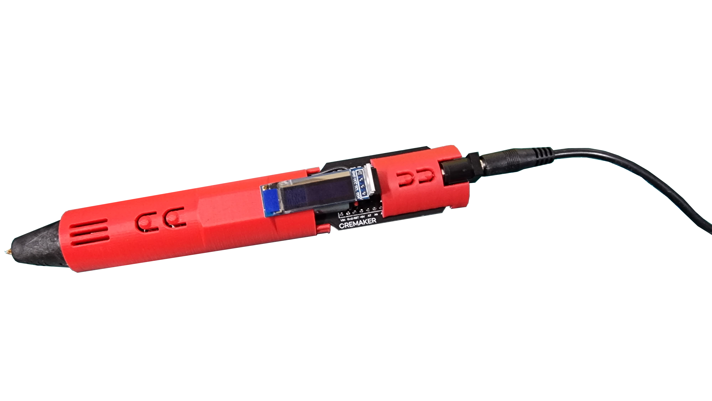
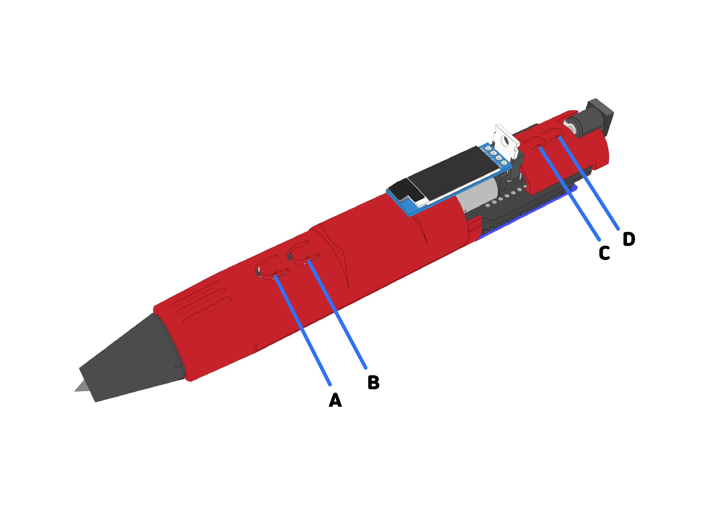
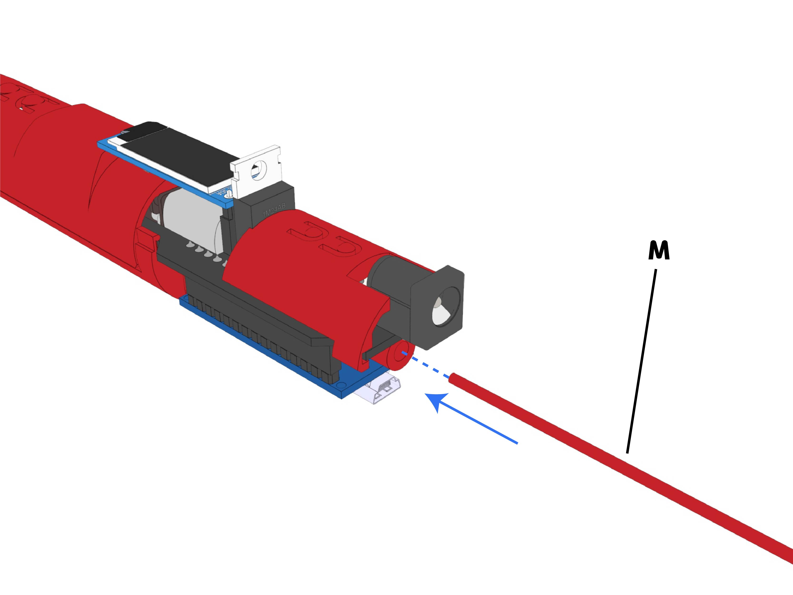
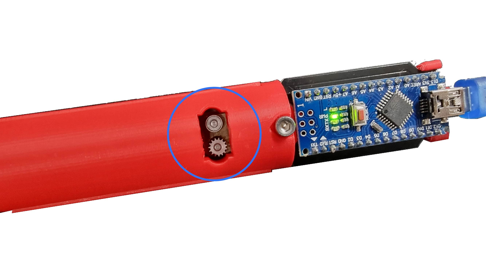

.. _targetUseManual:

사용 매뉴얼
===============================================

.. raw:: html

    

.. role:: orangecircle
.. role:: blackcircle
.. role:: bluecircle
.. role:: skybluecircle
.. role:: yellowcircle
.. role:: subtitle
.. role:: subtitlesmall
.. role:: blackbold
.. role:: redbold

|
| :subtitle:`Step.1`

| 사용을 하려면, 전원을 먼저 연결합니다.

|
| :subtitle:`Step.2`

.. image:: images/Manual/Filament.png
   :width: 600
   :align: center

| 필라멘트를 준비해줍니다.
| 필라멘트는 끝을 뾰족하게 잘라줍니다.
| 뾰족하지 않으면, 삽입 중 걸릴 수 있습니다.

|
| :subtitle:`Step.3`

| C,D 버튼 중 하나를 눌러 예열을 시작해줍니다. 
| 재료에 맞게 설정해줍니다.
| 온도가 올라간 상태에서는 뜨거우니 노즐 주변을 주의하세요.!

|
| :subtitle:`Step.4`

| 예열이 완료되면, 필라멘트를 삽입해줍니다. 삽입한 상태에서 필라멘트를 연결하려면, A버튼을 꾹 눌러줍니다. 누르고 있으면 필라멘트가 당겨짐을 느낄 수 있습니다. 잠시 후 필라멘트가 노즐에서 나옵니다.
| 제거를 하기 위해서는 B버튼을 한번 눌러주면 계속해서 필라멘트를 제거합니다.
| 삽입시 아래에서 필라멘트가 잘 삽입되는지 확인해줍니다.

|
| :subtitle:`Step.5`

.. image:: images/Lv1/Chapter_1/use_3Dpen.gif
   :width: 600
   :align: center

| 이제 3D펜을 즐기시면 됩니다.
| ※위 이미지는 배속 이미지입니다.
